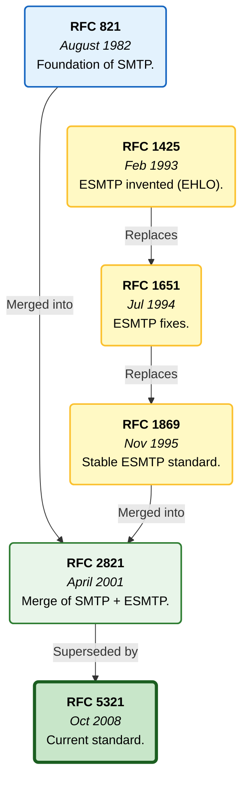
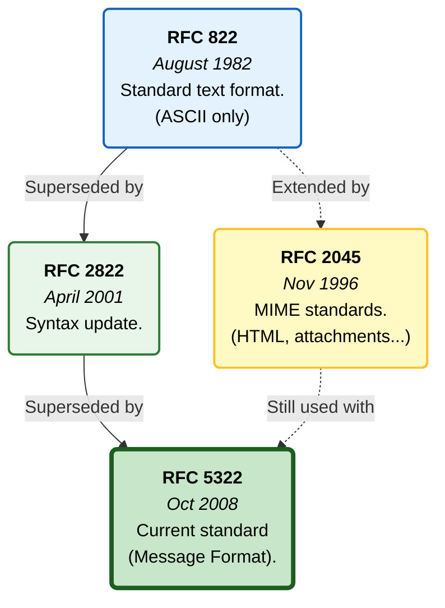
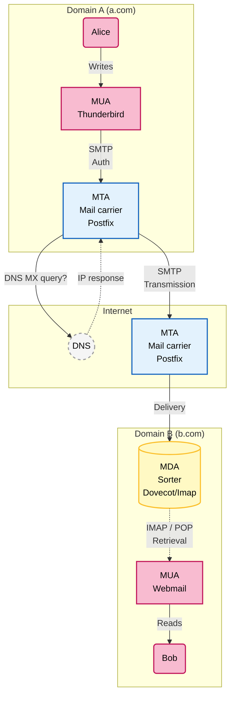



## Introduction

### Purpose and audience

There are three types of users of the email system:
- Mailbox users
- Domain administrators
- Email infrastructure maintainers

This series of articles is aimed at domain administrators who need to configure email mailboxes in a way that prevents identity spoofing.

### Prerequisites

To get the most out of this article and secure your domain, you need to:
1.  **Access and Environment**
  - Have administrator access to your domain's DNS zone (at your registrar or hosting provider).
  - Have a terminal (Linux/macOS) available to perform DNS queries.
2.  **Technical Knowledge**
  - Understanding of DNS:
    - Know how to edit a DNS zone.
    - Know the record types: A, AAAA, TXT, CNAME, MX and PTR.
    - Understand the concepts of TTL (Time To Live) and DNS propagation (update delays).
  - Networking (IP):
    - Tell IPv4 and IPv6 apart.
    - Understand CIDR notation (e.g. 198.51.100.0/24), frequently used in SPF rules to authorize entire address ranges.
  - Have a basic notion of asymmetric cryptography (private key / public key), useful for understanding how DKIM signing works.

## Concepts specific to email

Throughout this series of articles, we consider an email leaving domain `a.com` (the sending domain) bound for domain `b.com` (the receiving domain). E.g. `alice@a.com` to `bob@b.com`.  
In the article, we talk about an **ESP**. An ESP (Email Service Provider) is a company or platform that provides services to help individuals or, more commonly, businesses manage and send bulk email campaigns (email marketing, newsletters, etc.) or transactional emails.  
A transactional email (also called a service/system email) is an automated, non-promotional message sent to a user following a specific action that the user initiated on a website or in an application (e.g. the email you receive when you click "forgot password").

### The mail-sending protocol: SMTP

SMTP (Simple Mail Transfer Protocol) is the standard protocol used to send and relay email over the internet. This protocol is used only to "push" the message from your computer to the server, then from server to server. It is not used to retrieve your emails so you can read them. For that, other protocols are used (such as IMAP or POP), which act as the key to open your mailbox and read the mail that has arrived.

Originally defined by [RFC 821 (1982)](https://www.rfc-editor.org/rfc/rfc821) and then updated by [RFC 5321 (2008)](https://www.rfc-editor.org/rfc/rfc5321), the SMTP protocol was designed at a time when the Internet was a network of trust. Security was not a priority.  
The following diagram shows the various RFCs that shaped the SMTP protocol:

### Structure of an email

An email is a string of characters formatted according to specific standards (primarily [RFC 5322 (2008)](https://www.rfc-editor.org/rfc/rfc5322)), containing a header and a message body.  
The header contains, in particular, the `Return-Path` (the address for error/bounce notifications, not visible to the user) and the `From` (the address displayed to the user), but also other crucial fields such as `To` (the displayed recipient) and `Subject` (the message subject shown to the user), as well as invisible technical fields such as `Message-ID` and authentication fields such as `DKIM-Signature` that we will see later. The `Message-ID` is an email's globally unique identifier, independent of the server that hosts it.

The following diagram shows the various RFCs that shaped the structure of an email:

An email can be broken down into three technical components:

#### The Envelope - SMTP protocol

This is the part used by servers to transport the email. It is generally not visible to the end user. It is defined by the SMTP protocol commands (`MAIL FROM:` and `RCPT TO:`). It contains:
- The envelope sender address (`MAIL FROM`): this is the address used for the `Return-Path` in the header (once the email has been received). It is essential for the SPF mechanisms and for bounce handling.
- The envelope recipient address (`RCPT TO`): the actual address where the email is to be delivered.

#### The Header - [RFC 5322](https://www.rfc-editor.org/rfc/rfc5322)

This is a set of structured fields at the beginning of the message.  
It contains, in particular, the fields:
- `From` (the displayed sender address)
- `Return-Path` (which is filled with the envelope's `MAIL FROM` address)
- `To`, `Cc`, `Bcc`, `Subject`, `Date`.  
    It also contains the security information added by the receiving server to indicate the result of the SPF, DKIM and DMARC checks.

#### The Body

This is the actual content of the email, often formatted as plain text (text/plain) and/or HTML (text/html).  
It is structured according to the **MIME** standard (Multipurpose Internet Mail Extensions, [RFC 2045](https://www.rfc-editor.org/rfc/rfc2045)), which makes it possible to include attachments and HTML.

#### The journey of an email

To understand the journey of an email, it is useful to know the software actors involved:
1. MUA (Mail User Agent) - The Email Client  
   This is the interface a human uses to read and write emails.  
   **Examples:** Mozilla Thunderbird, Microsoft Outlook, the Mail app on iPhone, or a web interface such as Roundcube or Gmail (Webmail).  
   **Role:** It formats the message and sends it to the first link in the chain (the MSA/MTA) via SMTP.
2. MTA (Mail Transfer Agent) - The Mail Carrier / The Relay Server  
   This is the server software that transports the email from one machine to another via the SMTP protocol.  
   **Examples:** Postfix, Sendmail, Microsoft Exchange Server.  
   **Role:** It receives the message from the MUA, consults DNS (MX records) to find out where to send it, and passes it to the recipient's MTA (or to an intermediate relay). It is the MTA that often performs the SPF checks.
3. MDA (Mail Delivery Agent) - The Sorter / The Final Deliverer  
   This is the software that receives the final message from the MTA and drops it into the user's mailbox on the server.  
   **Examples:** Dovecot, Procmail.  
   **Role:** It stores the message on disk so that it can be retrieved later by the MUA (via the IMAP or POP protocols). It is often at this stage that anti-spam filters (such as SpamAssassin) analyze the final content.

**The typical journey:**  
MUA (Sender) ➔ MTA (Sending server) ➔ Internet ➔ MTA (Receiving server) ➔ MDA (Storage) ➔ MUA (Recipient)

## The postal analogy

Although metaphors have their limits, they help keep a high-level view without getting lost in technical detail. Here are the security protocols we are going to cover and their respective metaphors:
1.  SMTP is the mail carrier and the delivery truck: it picks up your letter (the email) from your outgoing mailbox and carries it to the recipient's post office.
2.  FCrDNS validates the truck that carries the envelope. It is the check that the license plate (IP) really matches the truck's registration papers (the server's domain name). We make sure the truck has not been stolen.
3.  If FCrDNS validates the truck, SPF validates the envelope and the sender's address (the `Return-Path`). The company sending the message (domain `a.com`) has published a list. If the truck arriving at `b.com` is not on the list, the envelope is refused.
4.  DKIM is a kind of digital wax seal on the envelope. Note, however, that DKIM does not guarantee that the message has not been read, only that it has not been modified. Another metaphor is a police evidence seal, because everyone can see what is inside, but no one can modify it without leaving traces. The obvious limit of this metaphor is that we don't send our letters in the police's plastic evidence bags!
5.  DMARC checks the consistency between the message and the envelope:
  a.  It opens the envelope.
  b.  It looks at the header on the letterhead (the `From:` that the recipient will read).
  c.  It compares that header with the outside evidence: either with the address on the back of the envelope (the `Return-Path` validated by SPF), or with the logo on the wax seal (the DKIM signature).
