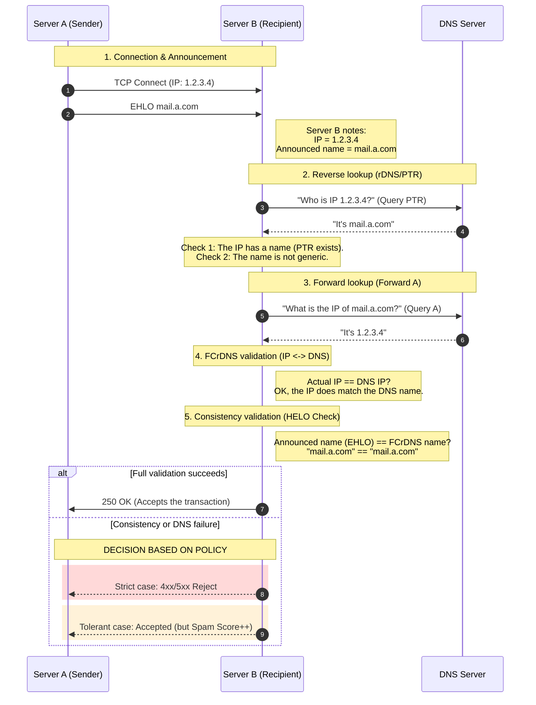



## How it works

This technique emerged as a best practice in the 1990s.

**The security principle:** The robustness of this technique relies on the need to control both the IP infrastructure (the hosting side) and the DNS zone (the domain side). An attacker who holds only one of the two accesses will not be able to pass the test.

**Reminders:**

- **The FQDN** (Fully Qualified Domain Name) is the complete, absolute address of a machine on the Internet (e.g. `mail.a.com`). The FQDN is configured in the **DNS** zone (e.g. `a.com`), which is managed by the **domain owner**.
- **rDNS** is the reverse process, which makes it possible to find the domain name associated with an IP address. The record is called a `PTR` (Pointer Record). It is stored in the `in-addr.arpa` zone (IPv4) or `ip6.arpa` zone (IPv6). The **rDNS** zones `in-addr.arpa` for IPv4 and `ip6.arpa` are managed by delegation by the **IP address providers** (hosting providers, ISPs).

### Phase 1: The connection and the announcement

1.  **Connection**: The mail server of `a.com` connects to the mail server of `b.com`.
2.  **Announcement (HELO/EHLO)**: It introduces itself: `EHLO pf-1010.whm.fr-par.scw.cloud`
3.  **IP capture**: The `b.com` server accepts the connection. It physically sees where the data packets come from.  
    It notes the calling IP: `203.0.113.187`.

### Phase 2: Reverse lookup (the "Reverse")

1.  **`PTR` lookup**: The `b.com` server queries DNS (the `in-addr.arpa` zone, since this is an IPv4):  
    "What is the name associated with the IP `203.0.113.187`?" (a `PTR` query)  
    Reverse response: DNS replies:  
    "This IP belongs to the machine name `pf-1010.whm.fr-par.scw.cloud`."  
    (First good sign: the name found matches the name announced in the EHLO at step 2. But that is not enough — DNS could have been tampered with.)

### Phase 3: Generic PTR check (non-genericity verification)

The `b.com` server checks that the hostname does not look like a dynamic residential IP.  
This check, which is an additional quality rule, is called the **Generic PTR Check** and is not strictly part of the `FCrDNS` verification.  
e.g. Case of a custom hostname

```bash
$ host 203.0.113.187
*187.113.0.203.in-addr.arpa domain name pointer pf-1010.whm.fr-par.scw.cloud.
```

e.g. Case of a generic hostname

```bash
$ host 198.51.100.251
251.100.51.198.in-addr.arpa domain name pointer 198-51-100-251.subs.proxad.net.
```

Suspicious clues (Regular expressions (Regex)):
- Presence of the IP in the name.
- Residential keywords: `dynamic`, `dsl`, `fiber`, `pool`, `dhcp`, `cable`, `dialup`, etc.
- Lack of a custom domain: ending with the ISP's domain (`orange.fr`, `free.fr`) instead of a custom domain.

### Phase 4: Forward lookup (the "Forward")

The **FCrDNS** (Forward-confirmed reverse DNS) method closes the verification loop.

1.  **Forward lookup (the "Forward"):** The `b.com` server takes the name found in the `PTR` and queries standard DNS:  
    "What is the official IP address of `pf-1010.whm.fr-par.scw.cloud`?" (an `A` query)
2.  **Forward response**: Scaleway's DNS (`scw.cloud`) replies:  
    "This machine's IP is `203.0.113.187`."
3.  **Final comparison**: The `b.com` server compares the IP it has in front of it (Phase 1 - step 3) with the official IP that DNS has just given it (Phase 4 - step 2).  
    `203.0.113.187` (actual IP) == `203.0.113.187` (DNS IP)  
    Result: This machine really is who it claims to be. The infrastructure is consistent. If the two match, this guarantees that the `PTR` entry has not been forged and that the domain owner has explicitly authorized this IP to use this name.

### Phase 5: The "HELO" consistency check
In addition to verifying the IP, modern servers perform a check on the name announced by the server when it introduces itself (the EHLO my.server.com command). If FCrDNS validates that the IP `1.2.3.4` really matches the name `mail.a.com`, but the server introduces itself by saying EHLO `i.am.google.com`, the receiving server will detect this inconsistency. Although technically distinct from FCrDNS, this test (often called the **HELO check**) rounds out the infrastructure validation: the server must have a valid IP, a valid DNS name, and announce itself with that same name.

### Summary



### Protection against "amateur" spammers

The main benefit of **FCrDNS** is that it blocks bulk sending from non-professional infrastructures (infected PCs that form botnets).  
Historically, spammers often used misconfigured servers or infected machines on consumer access networks (DSL, cable) that had no PTR configured or that had generic PTRs. A valid PTR was proof that a responsible administrator controlled the IP address.  
**FCrDNS** is the first barrier. It is a binary test: if the PTR is absent or generic, the reputation is bad.

## Limitation

FCrDNS validates the server (the machine), but not the sender's identity. It does not guarantee that the server is allowed to send mail for domain `a.com`, nor that the message has not been modified. FCrDNS is solely a measure of **infrastructure reputation** in order to fight against botnets.

This is what made the adoption of complementary protocols mandatory:
- Sender Policy Framework (SPF)
- DomainKeys Identified Mail (DKIM)
- Domain-based Message Authentication (DMARC)
