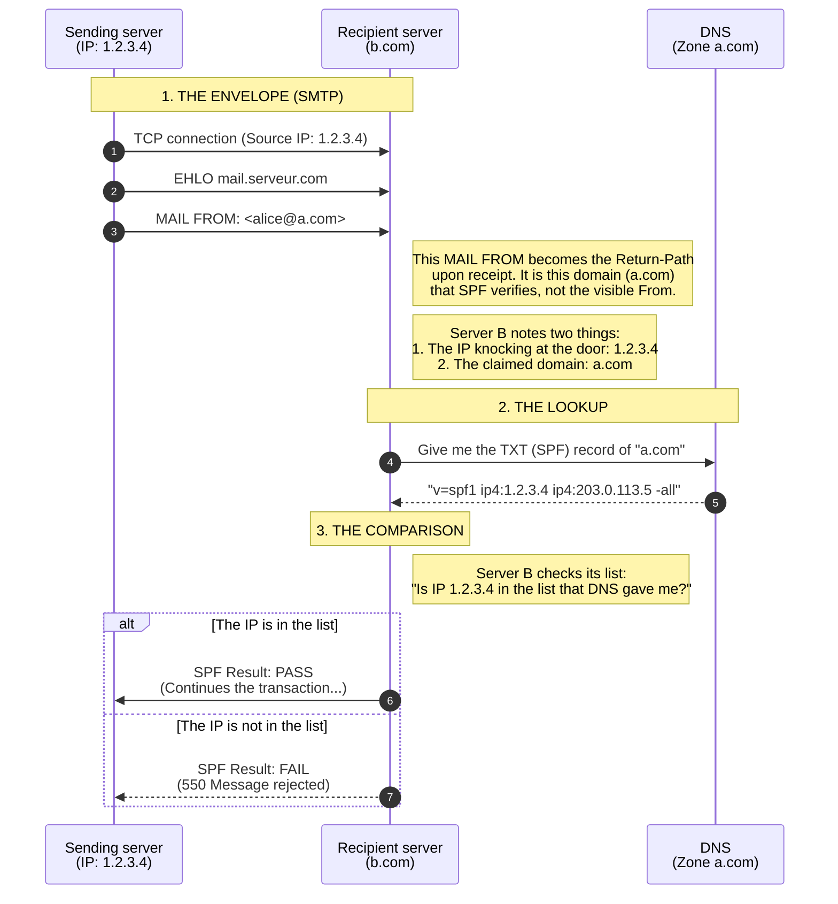



## How it works

Standardized in 2006 ([RFC 4408](https://www.rfc-editor.org/rfc/rfc4408)), updated in 2014 ([RFC 7208](https://www.rfc-editor.org/rfc/rfc7208)).

SPF acts as a trust directory. The owner of domain `a.com` publishes in its DNS (a `TXT` record) the list of IPs authorized to send email on its behalf.  
When an email arrives, the receiving server checks the sending IP against this list. Note: SPF verifies the domain announced in the envelope's `MAIL FROM` command — the very one that will be copied into the `Return-Path` upon receipt —, and **not** the `From` (the header visible to the user).

> **Reminder — `MAIL FROM` and `Return-Path` are the same address, at two different moments.**  
> As detailed in [article 1/9](../01-architecture-concepts/#the-envelope---smtp-protocol), the `MAIL FROM` is the *envelope* sender address, announced during the SMTP transaction (the transport). Once the message is received, the recipient server copies this value into a header field named `Return-Path`. It is therefore **one and the same address**, seen at two moments: we speak of `MAIL FROM` during delivery, and of `Return-Path` once the email is stored. Neither of them is the `From` displayed in your mail client — and it is precisely this gap between the address SPF checks and the visible address that makes spoofing possible (see the [limits](#limits) below).
>
> *Special case:* when the `MAIL FROM` is empty — as with bounce messages, which use a null envelope sender (`<>`) — SPF has no envelope domain to check and instead falls back to the domain announced in the sending server's `HELO`/`EHLO` command.

## Limits

SPF has two major weaknesses:
1.  **Sophisticated ESP delegation and the alignment problem**: If `a.com` uses an ESP such as Mailjet, the email will have a `Return-Path` at `mailjet.com` (to handle bounces) and a `From` at `a.com`. SPF will validate Mailjet's IP for the `mailjet.com` domain. SPF passes, but it does not validate that the visible sender (`a.com`) is legitimate, which sometimes leaves room for a visual forgery seen by the user. We will see later that DMARC addresses this problem.
2.  **Forwarding**: If an email is automatically forwarded from mailbox A to mailbox B, the sending IP changes (it becomes that of the forwarding server), but the `Return-Path` often remains that of the original sender. Since the forwarding server's IP is not in the sender's SPF list, SPF fails (unless a specific rewriting mechanism such as SRS is used).
3.  **Message integrity**: While SPF makes it possible to verify that an email was legitimately sent by `a.com`, it does not make it possible to validate that the message was not modified during forwarding. You will need to rely on DKIM to confirm that the message was not altered, as we will see later.
4. **The technical constraint: the 10 DNS query limit:** To prevent SPF verification from being used as a denial-of-service (DoS) attack vector against DNS infrastructures, the evaluation of an SPF record must not generate more than 10 additional DNS queries. 

### Sophisticated ESP delegation and the alignment problem

The problem arises when the owner of a domain (`a.com`) delegates the sending of its emails to an Email Service Provider (ESP) such as Mailjet.

#### The classic SPF mechanism

SPF works by checking whether the sending IP address is authorized by the `Return-Path` domain (the envelope domain):
- Sender: `alice@a.com`
- IP address: The IP belongs to Mailjet.
- `Return-Path`: In a standard configuration, the ESP uses its own domain to handle bounces (e.g. `bounce-id@mailjet.com`).

The receiving server (`b.com`) performs the SPF check:
- It looks at the `Return-Path`: `mailjet.com`.
- It consults the SPF record of `mailjet.com`.
- It finds that the IP is indeed in the list of IPs authorized by `mailjet.com`.
- SPF result: `PASS`.

#### The failure to authenticate the end user

The problem is that SPF has validated Mailjet's legitimacy, but has proved nothing about the legitimacy of the sender: `a.com`:
- The receiving server knows that Mailjet sent the email.
- The receiving server does not verify that the user who set the `From` to `alice@a.com` is actually legitimate to send an email from `a.com`.

#### The workaround for the problem

This is where SPF alone shows its limits in terms of anti-spoofing:  
A malicious individual (a spammer) could:
- Use Mailjet's infrastructure with their own account or a hijacked account.
- Set the From field to `president@whitehouse.gov`.
- The `Return-Path` will remain `bounce-id@bnc3.mailjet.com`.
- SPF check: The email passes, because the IP is authorized by the `mailjet.com` domain.
- Conclusion: SPF alone makes it possible to validate the sending path (the ESP), but does not guarantee that the visible domain (`From`) was used legitimately, because there is a misalignment between the `From` domain (`whitehouse.gov`) and the domain verified by SPF (`mailjet.com`).  
    SPF is therefore blind to this sophisticated delegation: it merely sees that the `Return-Path` is properly managed.  
    It is precisely to remedy this lack of alignment of the visible domain (`From`) that the **DMARC** protocol was created. DMARC requires that the `Return-Path` domain (verified by SPF) be aligned with the `From` domain (or that the DKIM signature domain be aligned with the `From` domain, as we will see later).

### SPF does not survive email forwarding

Email forwarding is SPF's Achilles' heel.  
Suppose Alice (`a.com`) sends an email to Bob (`b.com`).  
Bob has set up an automatic redirection from his work mailbox to his personal mailbox (`c.com`).  
Bob's server receives the email (SPF valid: Alice's IP is OK).  
Bob's server forwards the email to `c.com`.  
The problem: From the point of view of the `c.com` server, the email comes from the IP address of Bob's server (`b.com`), but the sender address (`Return-Path`) still indicates `a.com`.  
The `c.com` server will check SPF. Two scenarios arise:
**1. Without rewriting:** This is the native behavior of the SPF protocol. The server checks whether Bob's IP (`b.com`) is authorized to send email for Alice's domain (`a.com`). The answer is NO, SPF fails.
**2. With SRS (Sender Rewriting Scheme):** Bob's server rewrites the technical envelope so that SPF passes. However, this changes the verified domain (which becomes b.com) and breaks alignment with the visible domain (a.com). We say that **SPF alignment fails**. This misalignment can be a problem for validating the authenticity of an email, which we will address in the section devoted to [DMARC](/en/antispoofing-e-mail/06-dmarc-domain-based-message-authentication-reporting-and-conformance/).

SRS was invented to prevent legitimate emails from being rejected (bounced) during forwarding. Most large hosting providers (OVH, Gmail, Outlook) apply SRS. It "repairs" the transport layer (SMTP) at the expense of SPF alignment.

### The technical constraint: the 10 DNS query limit

To prevent SPF verification from being used as a denial-of-service (DoS) attack vector against DNS infrastructures, [RFC 7208 imposes a strict limit: the evaluation of an SPF record must not generate more than 10 additional DNS queries.](https://datatracker.ietf.org/doc/html/rfc7208#section-4.6.4) 

Each mechanism that asks the receiving server to query DNS counts as 1: this includes `include`, `a`, `mx`, `ptr` and `exists`. Note that this is recursive: if you use an `include:spf.protection.outlook.com` and Microsoft itself uses an `include` in its record, that counts as 2 queries. On the other hand, the `ip4` and `ip6` mechanisms are "free" because they do not require a DNS query.

**The danger:** If you accumulate too many providers (e.g. Google + Salesforce + Mailjet + Zendesk), you will exceed this limit. The result will be an immediate `PermError`, causing your emails to be rejected or classified as spam, even if the sending IP was technically authorized.

## A few useful URLs
- https://easydmarc.com/tools/spf-lookup : Checks the SPF syntax, counts the number of DNS lookups, and details the SPF recursively.
