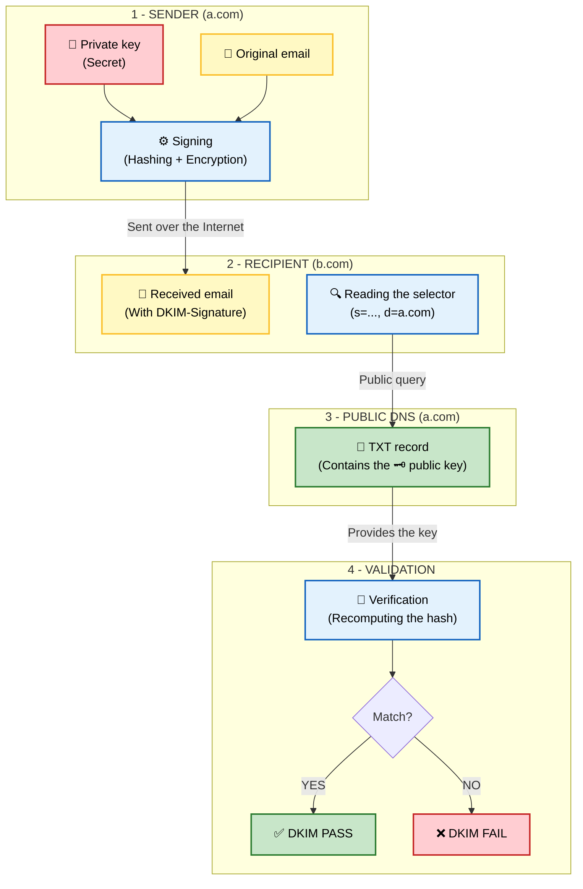



## How it works: the police evidence seal

Standardized in 2007 ([RFC 4871](https://www.rfc-editor.org/rfc/rfc4871)), updated in 2011 ([RFC 6376](https://www.rfc-editor.org/rfc/rfc6376)).

Whereas SPF protects the envelope (the sending server), DKIM (DomainKeys Identified Mail) protects the message itself. It is the digital equivalent of a police evidence seal:
- **Transparency (no confidentiality)**: Anyone can look through the seal and see exactly what it contains (the text of the email).
- **Tamper-evident seal (integrity)**: If someone tries to open the bag to replace the item inside or to change a word on a document, they have to tear the plastic. The recipient will immediately see that the bag was forced open (i.e. the DKIM signature fails).
- **Official label (authentication)**: The bag bears the logo of the police station or the bank (the sending domain).

DKIM uses asymmetric cryptography (private key / public key):
1.  **Signing (sending server)**: The outgoing server (or the ESP) selects certain header fields and the message body. The list of signed header fields is found in the `h=` tag of the email's `DKIM-Signature` header field. The standard recommends signing at a minimum the header fields: `h=From:To:Subject:Date:Message-ID`. The message body is first hashed and this hash is placed in the `bh=` tag: we say that the `DKIM-Signature` header field is prepared for signing. Finally, the header fields listed in the `h=` tag as well as the `DKIM-Signature` header field are signed with a private key and then placed in the `b=` tag.
2.  **Verification (receiving server)**: The recipient server reads the DKIM header. In it, it finds the "selector" and the signing domain (`d=a.com`). It then queries that domain's DNS to retrieve the public key.
3.  **Validation**: With the public key, it decrypts the signature and recomputes the hash of the received message. If the two match, this proves two things:
- Authenticity: The domain owner does hold the private key.
- Integrity: The message was not modified by a single byte along the way.

## Resistance to forwarding

Unlike SPF, DKIM survives email forwarding: indeed, the signature is attached to the message body and the headers, so as long as the forwarding server does not modify the content (which it should not do), the signature remains valid, even if the sending IP address changes.

## Limits

#### DKIM does not guarantee the authenticity of the visible sender in the `From` header field

As with SPF, an attacker can sign an email with their own domain (`attaquant.com`) while displaying `banque.com` in the `From` field. DKIM will say "Valid signature for `attaquant.com`", but the user will see "Bank" in their email client. Once again, there is still a lack of alignment, which will be addressed by DMARC.

#### The Replay attack and its mitigation
One limit of DKIM is the Replay Attack. A hacker can intercept a legitimate email (DKIM-signed) sent by your CEO, and resend it as-is to millions of people. Since the message is not modified, the DKIM signature remains mathematically valid. Although DMARC helps, the real defense lies in the advanced configuration of DKIM:
- Expiration (`x=`): It is possible to add an `x=` tag in the signature to say "This signature is valid for only 24h".
	- The timestamp (`t=`): Indicates the signing time. Modern servers can refuse signatures that are too old.
