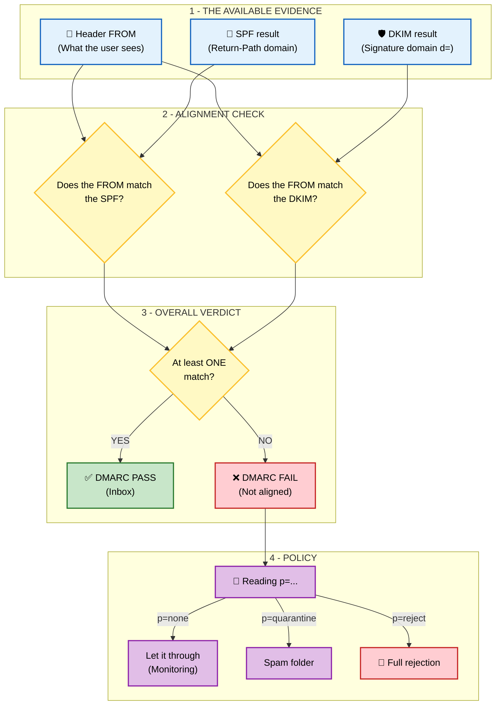



## The Conductor

Published in 2015 ([RFC 7489](https://www.rfc-editor.org/rfc/rfc7489)).

So far, we have seen that:
- SPF validates the IP but verifies the `Return-Path`, not the `From`.
- DKIM validates the content and verifies the signature domain (`d=`). It does not verify the `From`.

**DMARC (Domain-based Message Authentication, Reporting, and Conformance)** does not offer a new technical authentication method, but a policy layer that builds on SPF and DKIM to solve the **alignment** problem.

DMARC uses the results of SPF and DKIM and adds a simple rule: **For the email to be valid, the domain visible to the user (the `From`) must be "aligned" (identical) with at least one of the two authenticated protocols (either the SPF domain or the DKIM domain).**

## The 3 pillars of DMARC

1. **Alignment (Identifier Alignment):** DMARC checks whether the `From` domain matches either the domain validated by SPF (that of the `Return-Path`) or the DKIM signature domain (the `d=` tag of the `DKIM-Signature` header field). This match is called "alignment". This is what prevents a spammer from using, for example, Mailjet's infrastructure (SPF valid for Mailjet) to send an email with `From: president@whitehouse.gov`. DMARC fails because `whitehouse.gov` is not aligned with `mailjet.com`. This mechanism is what finally prevents the spoofing of the visible address.
2. **Policy:** DMARC lets the domain owner tell the recipient what to do if validation fails. This is defined by the `p=` tag in DNS:
- `p=none`: **Observation only**. "Just tell me who is failing, but let the email through." (Ideal for getting started and auditing.)
- `p=quarantine`: **Suspicion**. "Put the failing emails in the recipient's Spam folder."
- `p=reject`: **Maximum protection**. "Simply reject the failing emails. They will never arrive."
3. **Reporting (RUA/RUF):** This is the feedback loop. Receiving servers (Gmail, Yahoo, etc.) send daily XML reports to the address defined in the DMARC record. This allows the administrator to know exactly who is sending emails on their behalf (legitimately or not) and to fix their configuration before switching to `reject` mode.

## Going further

### A note on forwarding and Mailing Lists (SRS & ARC)

You may have noticed that some email forwarding works despite SPF's limitations. This is thanks to two mechanisms handled by intermediate servers (over which you have no control):
1. **SRS (Sender Rewriting Scheme):** The relay server rewrites the envelope (Return-Path) so that SPF passes with its own IP. This fixes SPF but breaks DMARC alignment.
2. **ARC (Authenticated Received Chain):** The relay server signs the authentication state (SPF/DKIM) before modifying the message. This allows the final recipient (such as Gmail) to validate the email through a chain of trust, even if SPF and DKIM technically fail on arrival.

# A few useful URLs
- https://easydmarc.com/tools/dmarc-lookup : Checks the DMARC syntax and provides information about the DMARC of the checked domain.
