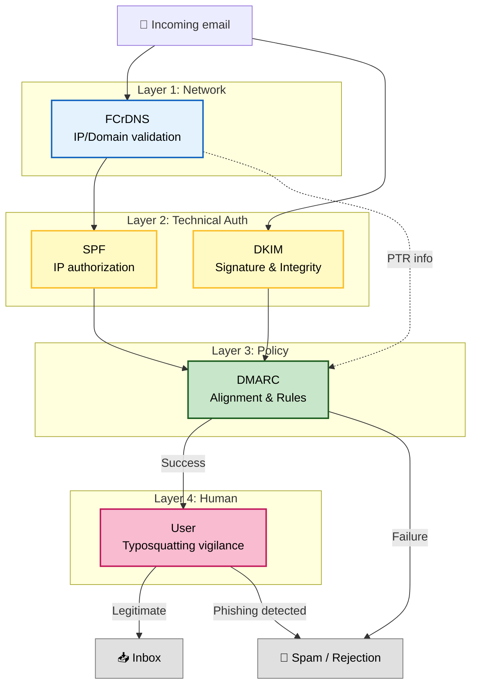



## Summary and conclusion

| Mechanism | Date / RFC | Metaphor | Role | Key limits |
| --- | --- | --- | --- | --- |
| FCrDNS | ~1990s | The technical inspection of the truck that carries the envelopes. | Validates that the **infrastructure owner** (the one who controls the IP / L3) and the **identity owner** (the one who controls the Domain / L7) agree.    Verifies that the sender's `PTR` is not generic. | Does not prove that the source IP is legitimate to send an email on behalf of the sending domain, nor that the message has not been forged. |
| SPF | 2006 ([RFC 4408](https://www.rfc-editor.org/rfc/rfc4408))    2014 ([RFC 7208](https://www.rfc-editor.org/rfc/rfc7208)) | Validates that the truck is authorized to carry the sender's mail. | Authorizes a list of IPs to send email on behalf of the domain indicated in the `Return-Path`. | Vulnerable to redirection. No alignment with the visible field (`From`). |
| DKIM | 2007 ([RFC 4871](https://www.rfc-editor.org/rfc/rfc4871))    2011 ([RFC 6376](https://www.rfc-editor.org/rfc/rfc6376)) | Digital wax seal    Police evidence seal | Guarantees the integrity and authenticity of the message by adding a cryptographic signature to it. (`d=` in the DKIM header). | No mandatory alignment with `From`.    Does not guarantee confidentiality (the email remains readable). |
| DMARC | 2015 ([RFC 7489](https://www.rfc-editor.org/rfc/rfc7489)) | The Butler (head of the protocol).    Verifies that the letter's header is aligned either with the address on the back of the envelope (SPF) or with the digital wax seal (DKIM signature) | Verifies the alignment of the domain verified by SPF or DKIM with the visible domain (`From`).    Defines the policy for handling failures (`none`, `quarantine`, `reject`).    Enables reporting (RUA/RUF) | Works only if SPF/DKIM are implemented and the policy is active. |

Securing email is not the business of a single protocol, but rests on a defense-in-depth strategy. Combining the FCrDNS, SPF, DKIM and DMARC protocols makes it possible to create a robust chain of trust, making technical identity spoofing almost impossible, provided the chain is not broken.

To guarantee this security, two conditions are imperative:
1.  **A strict configuration on the sender side**: Domain administrators must aim for excellence:
- SPF locked down with `-all` (Hard Fail).
- DMARC set to the `p=reject` policy (simply rejecting failures).
2.  **Rigorous validation on the receiver side**: Receiving servers must perform the cryptographic and DNS checks in real time. This is today the standard among the industry giants (Gmail, Microsoft, Yahoo, Proton, etc.).

While these protocols close the door to technical spoofing (sending an email as president@whitehouse.gov), they cannot prevent social engineering. Once the technical barrier is raised, the user's vigilance remains the last line of defense against attacks that bypass the protocols:
- **Typosquatting (Homoglyphs)**: The attacker buys a legitimate-looking domain that visually resembles the target (e.g. bance-postale.fr instead of banque-postale.fr). DMARC will validate this email because it legitimately comes from the attacker's domain.
- **Display Name Spoofing**: The attacker uses a generic address (e.g. jean.pirate@gmail.com) but changes the display name so that it appears as "Technical Support" or "Your CEO".

In summary, while DMARC guarantees that the sender really is who they technically claim to be, it does not guarantee that their intentions are benign. Educating users to systematically verify the domain in the From field remains essential and complementary to the technical measures.

The following diagram summarizes the email security stack:

Finally, if FCrDNS, SPF, DKIM and DMARC are the "anti-spoofing defenses", the standard aliases are the "eyes and ears" of that defense (to receive FBL complaints and error reports).

## A few useful URLs
- https://postmaster.google.com : The legacy version of Google's website that provides feedback on the emails coming from your domain and bound for gmail.com
- https://postmaster.google.com/v2/ : The new version of Google's website that provides feedback on the emails coming from your domain and bound for gmail.com
- https://www.mail-tester.com
- https://dmarc.postmarkapp.com
- https://easydmarc.com/tools/spf-lookup : Checks the SPF syntax, counts the number of DNS lookups, and details the SPF recursively.
- https://easydmarc.com/tools/dmarc-lookup : Checks the DMARC syntax and provides information about the DMARC of the checked domain.
