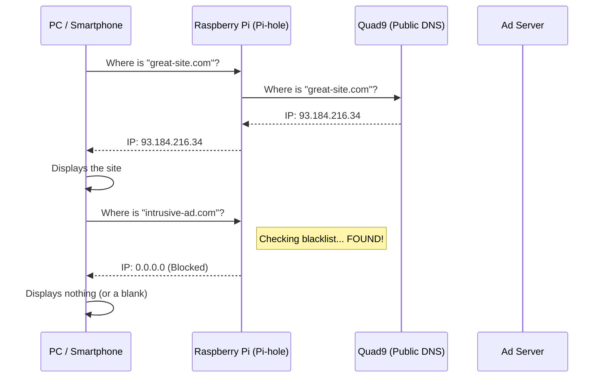



The Raspberry Pi 1, though old, is far from obsolete. It has exactly the amount of power needed for a critical task on your home network: acting as a **DNS sinkhole**.

In this article, we'll see how to turn this little computer into a shield that protects all your devices (PCs, smartphones, tablets, smart TVs) against intrusive advertising, trackers and malicious sites, all without slowing down your browsing.

We'll specifically cover the case of an installation behind a **Freebox Révolution**, with clients running **GNU/Linux (Fedora/Debian)**.

## Why install Pi-hole?

When you browse the Internet, your computer has to translate domain names (like `google.com`) into IP addresses (like `142.250.x.x`). That's the job of the DNS server.

By default, you use the one provided by your ISP (Free). Pi-hole slots in between your devices and the Internet.

1.  Your computer asks: "Where is `doubleclick.net` (an ad network)?"
2.  Pi-hole checks its blacklist.
3.  If the site is blocked, Pi-hole answers "Nowhere" (0.0.0.0). The ad doesn't load.
4.  If the site is legitimate, Pi-hole forwards the request to a trusted DNS server (we'll use Quad9).

Here is how it works schematically:


## Prerequisites

* A **Raspberry Pi 1** (Model B in my case).
* **Raspberry Pi OS Lite** (formerly Raspbian) already installed and configured (SSH enabled, static IP or static DHCP lease).
* An Ethernet connection (preferable to Wi-Fi for a DNS server).

## Step 1: Preserving the SD card with Log2Ram

This is the most important step for the longevity of a Raspberry Pi 1. SD cards hate repeated writes. And a DNS server writes logs continuously.

We'll use [Log2Ram](https://github.com/azlux/log2ram/), a tool that creates a virtual disk in RAM to store the logs (`/var/log`). They are only written to the SD card once a day or at shutdown.

This lets us enable Pi-hole's *Query Logging* (to see the statistics) without killing the SD card. Without Log2Ram, a standard SD card may last between 6 months and 2 years depending on its quality.

Connect to your Pi over SSH and start the installation:

```bash
echo "deb [signed-by=/usr/share/keyrings/azlux-archive-keyring.gpg] http://packages.azlux.fr/debian/ $(bash -c '. /etc/os-release; echo ${VERSION_CODENAME}') main" | sudo tee /etc/apt/sources.list.d/azlux.list
sudo wget -O /usr/share/keyrings/azlux-archive-keyring.gpg  https://azlux.fr/repo.gpg
sudo apt update
sudo apt install log2ram
```

**Important:** Reboot the Pi immediately after the installation.

```bash
sudo reboot
```

### Tuning for the RPi 1 (512 MB RAM)

By default, the allocated size may be too generous or unsuitable (128MiB). For an RPi 1, 64 MB is plenty for the logs.

Edit the configuration file:

```bash
sudo vi /etc/log2ram.conf
```

Change the following variables:

```bash
SIZE=64M
LOG_DISK_SIZE=128M
```

Reboot again to apply the changes. You can check with the `df -h /var/log` command that the mount is indeed of type `log2ram` and is 64M.

## Step 2: Installing Pi-hole

Once the SD card is protected, installing Pi-hole is a breeze. Run the official command:

```bash
curl -sSL https://install.pi-hole.net | bash
```

The installer will walk you through several blue screens.

### Choosing the upstream DNS: Quad9

When asked to choose an "Upstream DNS Provider", I strongly recommend selecting **Quad9 (filtered, DNSSEC)**.

Why Quad9?
1.  **Security:** It blocks known malicious domains.
2.  **Privacy vs. performance (ECS):** I deliberately picked the option without EDNS Client Subnet (ECS). This technology sends part of your IP address to the servers to better geolocate you, which can improve loading speed via CDNs (YouTube, Netflix, etc.). However, if you live near a major city or a major Internet hub, the performance gain is negligible compared to the loss of privacy. So I favor the option without ECS. If you're in a rural area or notice slowdowns, you can choose the "Quad9 (filtered, ECS, DNSSEC)" option to optimize throughput.
3.  **Neutrality:** It's a non-profit foundation based in Switzerland (for the privacy side of things).

Once the installation is complete, make sure to note the password for the web interface (or change it with `pihole -a -p`).

## Step 3: Configuring the Freebox Révolution

In this scenario, we let the Freebox handle DHCP (assigning IP addresses), but we ask it to hand out the Pi-hole's address as the DNS server.

Go to the management interface at `mafreebox.freebox.fr`. There are two places to change.

### 1. IPv4 DNS (DHCP)

Go to **Paramètres de la Freebox > Réseau Local > DHCP** (the Freebox interface is French-only: "Freebox Settings > Local Network > DHCP").
In the "Serveurs DNS" (DNS Servers) section, enter the local IP address of your Raspberry Pi (e.g. `192.168.1.253`) as DNS 1.

### 2. IPv6 DNS

This is often the forgotten step that makes the ads come back! Modern operating systems prioritize IPv6. If you don't configure this, your devices will bypass Pi-hole via the Freebox's IPv6.

Get the **Global** IPv6 address of your Raspberry Pi that is **not** temporary, using the `ip -6 addr` command.

Go to **Paramètres de la Freebox > Configuration IPv6 > DNS IPv6** ("Freebox Settings > IPv6 Configuration > IPv6 DNS").
* Check "Forcer l'utilisation de serveurs DNS IPv6 personnalisés" (Force the use of custom IPv6 DNS servers).
* Paste the Pi-hole's IPv6 into the Preferred DNS field.

I didn't need to reboot the Freebox to force the network leases to update on all your devices.

## Step 4: Validating on the clients (Linux)

How can you be sure that your Fedora or Debian PC is really using Pi-hole? Don't rely solely on `ifconfig`, which doesn't show the DNS servers.

### The NetworkManager method

This is the most reliable command. Open a terminal and type:

```bash
nmcli dev show | grep DNS
```

You should get a result similar to this:

```text
IP4.DNS[1]:                             192.168.1.253
IP6.DNS[1]:                             2001:db8:: (the Pi's IP)
```

If you see the Freebox's IP (`.254`) or an IPv6 starting with `fd0f...` (the Freebox's local address), then the configuration hasn't been picked up yet (disconnect/reconnect the network).

### The Systemd-resolved method

On recent distributions such as Fedora:

```bash
resolvectl status
```

Find your network interface and check the "Current DNS Server" line. It should point to your Pi.

### The final test

To check that blocking works, try resolving a known ad domain with `dig`:

```bash
dig mobile.pipe.aria.microsoft.com
```

If the answer (ANSWER SECTION) is `0.0.0.0`, congratulations: your Pi-hole is doing its cleanup job!

### Verify that the upstream DNS is indeed Quad9

In a browser, type `https://on.quad9.net`. You should get a result indicating that you are indeed using Quad9 as your DNS server.

### Firefox DNS cache

`about:networking#dns`

## Conclusion

Your Raspberry Pi 1 now has a crucial purpose. It protects your privacy, slightly speeds up your browsing (by not loading heavy ad scripts) and gives you a nice statistics interface, all without prematurely wearing out its SD card thanks to Log2Ram.
