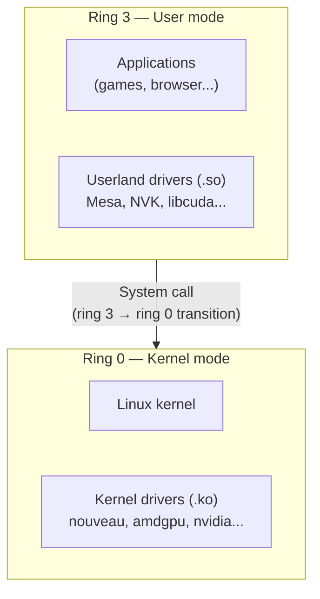
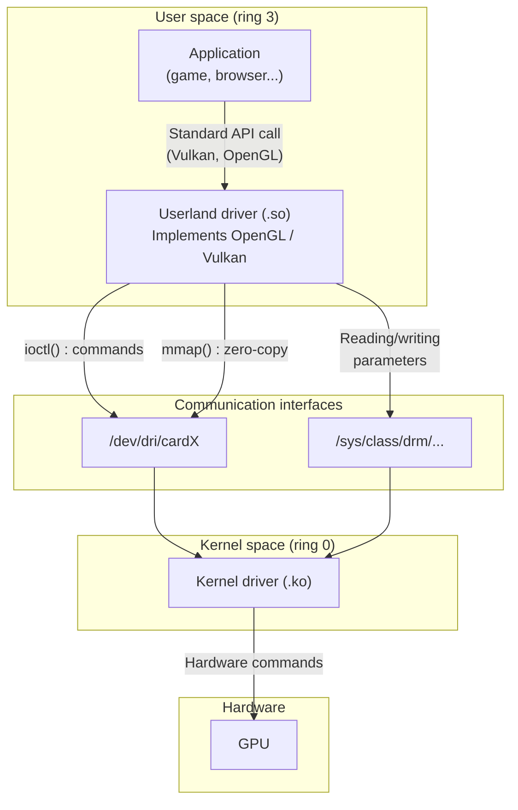



Under Linux, a driver is not necessarily a monolithic block living inside the kernel. It is often **split in two**: one part in the kernel, one part in user space. This article explains that split and the mechanisms that let the two parts communicate.

## The processor's privilege levels: ring 0 and ring 3

Before we talk about drivers, we need to understand how the processor (CPU) **protects the system** from applications.

x86/x86-64 processors (Intel, AMD) implement a mechanism of **privilege levels** called *rings*. There are 4 of them (ring 0 to ring 3), but Linux uses only two:

- **Ring 0** (kernel mode): the most privileged level. Code running in ring 0 has **total** access to the hardware and to all of memory. This is where the Linux kernel and its modules (including kernel drivers) run.
- **Ring 3** (user mode): the least privileged level. Code running in ring 3 **cannot access the hardware directly**, nor the memory of other processes. This is where all applications run: browser, games, web server, and also userland drivers.



This separation is a **hardware protection** enforced by the processor: if a ring 3 application tries to access the hardware directly, the CPU raises an exception and the kernel kills the process. For an application to interact with the hardware, it must **ask the kernel** through a **system call** (*syscall*). Each system call triggers a ring 3 → ring 0 transition (costly in terms of performance); the kernel carries out the requested operation, and then the processor returns to ring 3.

## Kernel driver vs userland driver

### The kernel driver

The **kernel driver** is a module (a `.ko` file) loaded into the Linux kernel. It runs in **ring 0** and has direct access to the hardware: device registers, interrupts, DMA, and so on.

Examples of graphics kernel drivers:
- `nouveau` (NVIDIA, open-source)
- `amdgpu` (AMD)
- `i915` (Intel)
- `nvidia` (NVIDIA, proprietary)

### The userland driver

The **userland driver** is most often a shared library (a `.so` file) that runs in **ring 3** (user space, the same privilege level as your applications). The library is **loaded directly into the process of each application** that uses the device — it is neither a daemon nor a background service.

Concretely, when a game makes a Vulkan call, the Vulkan loader loads the userland driver's `.so` into the game's memory space. The driver's code then runs inside the game's own process.

> **Note**: this shared-library architecture is the norm for GPU and high-performance network drivers, where every microsecond counts. Other domains sometimes use different architectures: FUSE (filesystems in user space) or certain complex USB drivers may run as separate processes (daemons).

A userland driver is defined by two characteristics:
1. It **implements a standard API** (OpenGL, Vulkan, CUDA, SANE, CUPS...) for a specific piece of hardware.
2. It **communicates with the kernel driver** to access the hardware.

This split is not specific to graphics. We find it again for printers (CUPS), scanners (SANE), high-performance networking (DPDK), USB devices (libusb), and so on.

### Why this split?

Putting all the logic in the kernel would be problematic:
- A kernel bug can **crash the whole system** (kernel panic). A userland bug only crashes the application concerned.
- The kernel is a constrained environment: no standard libraries, no easy memory allocation, difficult debugging.
- Complex logic (shader compilation, 3D scene management) is easier to develop and debug in user space.

The kernel driver therefore limits itself to the bare essentials: managing access to the hardware and arbitrating between processes. All the intelligence is pushed out into the userland driver.

## The communication mechanisms

The userland driver runs in ring 3, the kernel driver in ring 0. To communicate, that boundary must be crossed. Linux offers several mechanisms for this.

Communication is **bidirectional**. The following sections first cover the userland → kernel direction (the most frequent), then the reverse path (kernel → userland).

### /dev: the entry point

The kernel exposes each device as a **file** in `/dev/`. This is the fundamental Unix principle: *everything is a file*.

```
/dev/dri/cardX      → graphics card (DRM interface, X = number assigned at boot)
/dev/dri/renderD128 → graphics card (rendering only)
/dev/sda            → hard disk
/dev/ttyUSB0        → USB serial port
/dev/video0         → webcam
```

The userland driver always begins by opening a `/dev` file with `open()`. This call returns a **file descriptor**, which serves as the communication channel to the kernel driver. From there, several operations are possible on that descriptor.

Like any Linux file, `/dev` files have **permissions**. This is what prevents a standard user from writing to `/dev/sda` (your hard disk) while still letting them use `/dev/dri/renderD128` (the GPU). These files are created dynamically by **udev**, Linux's device manager, when the hardware is detected. It is udev that assigns the initial permissions and owning groups (`video`, `render`). Then **logind** (the systemd session manager) adds ACLs (*Access Control Lists*) to automatically grant access to the graphics devices to the user of the active session.

### ioctl: structured commands

**`ioctl()`** (*input/output control*) is a system call that lets you send **arbitrary commands** to the kernel driver through a `/dev` file descriptor.

```c
int fd = open("/dev/dri/cardX", O_RDWR);  // X = card number
ioctl(fd, DRM_IOCTL_MODE_GETRESOURCES, &resources);
```

Each `ioctl()` call triggers a **transition from ring 3 to ring 0** (a *context switch*): the processor switches to kernel mode, executes the kernel driver's code, then returns to user mode with the result. This context switch has a non-negligible **performance cost** (*overhead*), which makes `ioctl()` unsuitable for very high-frequency exchanges (thousands of times per second).

It is the mechanism most used by graphics drivers for configuration and control operations. The command protocol that a kernel driver exposes through `ioctl()` is called the **uAPI** (*User-space API*). Two different kernel drivers (e.g. `nouveau` and `nvidia`) have different, incompatible uAPIs.

An important point: a golden rule of Linux kernel development (enforced by Linus Torvalds) is that **the uAPI must never break**. Once an interface is published in `/dev` or `/sys`, the kernel commits to supporting it indefinitely so as not to break existing userland programs. This is why the creation of a new uAPI (such as `VM_BIND` for NVK in the `nouveau` driver) is a significant event: once introduced, it will have to be maintained for life.

### mmap: direct memory access

**`mmap()`** (*memory map*) is a system call that lets you **map a device's memory** directly into the userland process's address space.

```c
void *buf = mmap(NULL, size, PROT_READ | PROT_WRITE,
                 MAP_SHARED, fd, offset);
// Direct write into GPU memory, without a system call
buf[0] = command_data;
```

The `mmap()` call itself is a kernel transition (ring 3 → ring 0). But once the mapping is established, **each read/write happens directly in memory, without going back through the kernel** (*zero-copy*). No context switch, no overhead. This is what makes `mmap` essential for graphics performance: GPU *command buffers* are mapped into the process's space and rendering commands are written into them at full speed, where `ioctl()` would be a bottleneck.

### read()/write(): classic reading/writing

The classic `read()` and `write()` operations also work on `/dev` files. Each call is a kernel transition.

This is used for simple exchanges (reading data from a serial port, writing to a character device), but rarely for graphics drivers where the required throughput is too high.

### sysfs: the dashboard

**sysfs** is a virtual filesystem mounted at `/sys/`. Unlike `/dev`, which exposes **one file per device**, sysfs exposes **one file per parameter**.

Each file contains a single text value, readable or modifiable:

```
/sys/class/drm/cardX/device/vendor       → "0x10de"  (PCI vendor ID in hexadecimal: NVIDIA)
/sys/class/drm/cardX/device/power_state   → "D0"      (power state)
/sys/class/backlight/*/brightness          → "75"      (screen brightness)
/sys/class/net/eth0/mtu                    → "1500"    (max size of network packets)
```

If `/dev` is a **phone line** to the driver (you can say anything, in any format), `/sys` is a **dashboard** with buttons and gauges: each file controls or displays one single thing.

In practice for a GPU: 3D rendering commands go through `/dev/dri/cardX` (high throughput, complex binary data), but reading the GPU temperature is done through sysfs (a simple text value). The `X` number is assigned by the kernel at boot and may vary from one machine to another.

### poll()/select(): the reverse path (kernel → userland)

All the previous mechanisms (`ioctl`, `mmap`, `read`/`write`, `sysfs`) describe how the userland process **talks to the kernel**. But the reverse path is just as important: when the GPU has finished an operation (a render, a computation), the kernel driver must **notify the userland process**.

Here is the complete mechanism, for example for a 3D render:

1. The userland driver submits rendering commands to the GPU (via `ioctl()` and `mmap()`)
2. The userland driver calls `poll()` on the `/dev/dri/cardX` descriptor → **the process goes to sleep**
3. The GPU works (3D rendering, computation...) while the process consumes **no CPU**
4. The GPU finishes and raises a **hardware interrupt**
5. The CPU interrupts what it is doing and executes the kernel driver's code (the interrupt *handler*, in ring 0)
6. The kernel driver marks the file descriptor as "ready"
7. The kernel **wakes up** the sleeping process
8. `poll()` returns, and the userland driver knows the render is finished

The crucial point: despite its name, **`poll()` does not do *polling*** (looping to check repeatedly). It is even the opposite: the process really sleeps, and it is the GPU's hardware interrupt that triggers the wake-up chain. The name comes from the English sense of *"to consult"*, not *"to poll in a loop"*.

The difference with true polling (busy-waiting):

```c
// Busy-waiting = bad, wastes CPU
while (!gpu_finished()) {
    // loops while consuming 100% of the CPU
}

// poll() = good, the process sleeps
poll(fds, 1, timeout);
// Zero CPU consumed during the wait
// The kernel wakes the process when the GPU has finished
```

There are three variants of this mechanism under Linux:
- **`select()`**: the historical API, limited to ~1024 file descriptors
- **`poll()`**: the more modern version, without that limit
- **`epoll()`**: the Linux-specific high-performance variant, for watching thousands of descriptors simultaneously

## Overview

Here is how all these mechanisms fit together for a graphics driver:



| Mechanism | Goes through | Kernel transition | Typical use |
|---|---|---|---|
| `ioctl()` | `/dev` | On every call | Structured commands (configuration, render submission) |
| `mmap()` | `/dev` | Only once (at mapping time) | High-performance memory access, zero-copy (command buffers, VRAM) |
| `read()`/`write()` | `/dev` | On every call | Simple data exchanges |
| read/write | `/sys` | On every call | Monitoring and configuration (temperature, frequencies) |
