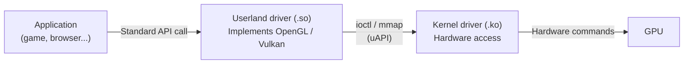
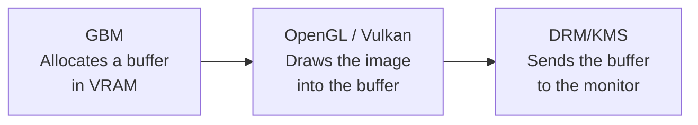
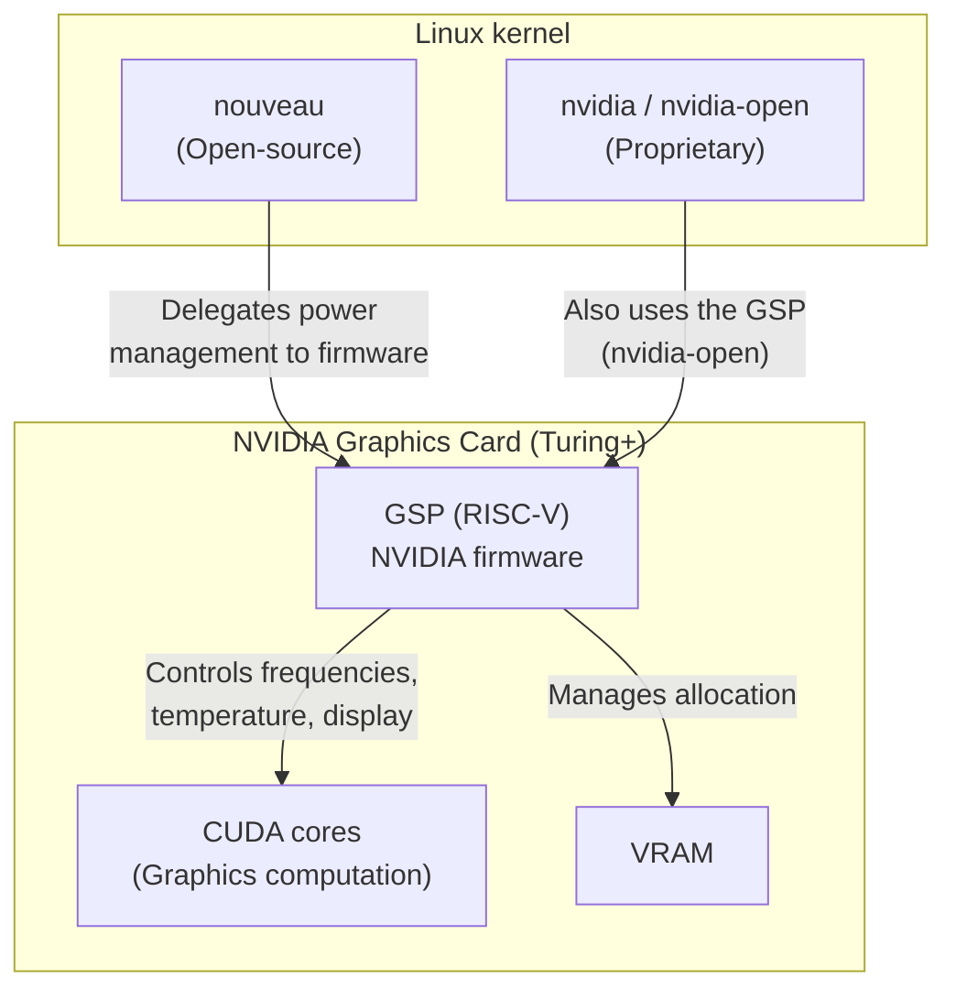
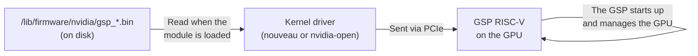
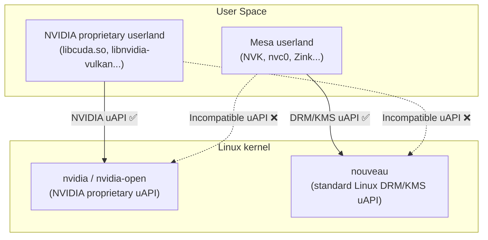



If you use an NVIDIA graphics card under Linux, you have probably already run into a fundamental question: **which driver should I install?** The answer is not trivial, because two complete ecosystems coexist, each with its strengths and its limits.

This article takes stock of the current situation. But before diving into the comparison, we need to understand the fundamental building blocks of display under Linux.

## The fundamentals: how an image reaches your screen

### Kernel driver vs userland driver

Under Linux, a graphics driver is not a monolithic block. It is **split in two**:

- The **kernel driver** (a `.ko` module) runs in the Linux kernel. It handles low-level access to the hardware: video memory allocation, interrupt handling, communication with the graphics chip.
- The **userland driver** (a `.so` library) runs in **user space**, loaded directly into the process of each application that uses the GPU. It is not a daemon or a separate service: when a game calls Vulkan, the userland driver's code runs inside the game's process.

The userland driver's role is twofold:
1. It **implements a standard graphics API** (OpenGL, Vulkan, CUDA...) for a specific piece of hardware.
2. It **communicates with the kernel driver** (through system calls such as `ioctl()`, `mmap()`, `read()`/`write()` on a `/dev/...` file, or `sysfs`) to send commands to the GPU.



This kernel/userland split is the key to understanding this whole article: the two NVIDIA "teams" each provide **their own pair** of drivers (kernel + userland), and these pairs are not interchangeable.

> For more on the communication mechanisms between kernel and userland (`ioctl`, `mmap`, `/dev`, `sysfs`), see the dedicated article: [How drivers communicate under Linux]().

### DRM/KMS: the kernel's display subsystem

**DRM/KMS** (*Direct Rendering Manager / Kernel Mode Setting*) is a subsystem built into the **Linux kernel**. It is the absolute foundation of all graphics display under Linux.

- **DRM** (*Direct Rendering Manager*): handles communication with the graphics card. It ensures that several programs can use the GPU at the same time without stepping on each other's toes.
- **KMS** (*Kernel Mode Setting*): a key feature inside DRM. Its role is purely tied to the final display: it sets the resolution, the color depth, the refresh rate, and it takes a final image in memory and sends it physically to the monitor (via HDMI/DisplayPort).

In short: DRM/KMS manages the hardware and knows how to light up the pixels of your screen.

All the open-source graphics drivers built into the Linux kernel (Intel `i915`, AMD `amdgpu`, Nouveau) are DRM/KMS drivers: they integrate into this standard subsystem.

**The proprietary NVIDIA driver (`nvidia`) is the exception.** For a long time it bypassed DRM/KMS in favor of its own proprietary in-kernel stack. Today, although its internal logic remains proprietary and non-standard, NVIDIA provides a translator module (`nvidia-drm`) that acts as a bridge to Linux's KMS subsystem. It is this indispensable bridge (often enabled via the kernel parameter `nvidia-drm.modeset=1`) that finally makes it possible to use Wayland. The `nvidia-open` driver, even though its source code is open, reproduces this same architecture. The old Legacy drivers, however, do not have this modern bridge — hence the impossibility of using Wayland.

### GBM: the graphics memory allocator

**GBM** (*Generic Buffer Manager*) is a library that lives in **user space** (provided by the Mesa project). Its role is precise: to **allocate memory buffers** in the graphics card's video memory, in coordination with DRM.

Before you can display anything, you need a "blank canvas" in VRAM. GBM is the standard tool for telling the card: *"Reserve me a 1920x1080 pixel space in such-and-such format, I'm going to draw something in it"*.

### How these components work together

Here is the flow of each image displayed under Wayland:



### X11 vs Wayland: why GBM only matters for Wayland

Under **X11**, the **Xorg server** handles buffer allocation itself. Each vendor provides a **DDX** module (*Device Dependent X*) — a loadable component (`.so`) specific to its hardware — that integrates directly into Xorg. For example, NVIDIA provides `nvidia_drv.so`, Intel has `intel_drv.so`, AMD has `amdgpu_drv.so`. It is this DDX module that controls the entire allocation chain. GBM does not come into play.

Under **Wayland**, there is no more Xorg server, so no more DDX. It is the **compositor** (Mutter for GNOME, KWin for KDE, wlroots...) that directly handles the display, and it needs a standard API to allocate buffers with any GPU. That API is GBM. Every Wayland compositor speaks GBM.

### uAPI: the language between kernel and user space

For the user-space driver (which handles your applications) to be able to give orders to the kernel driver (which handles the card), the two must speak exactly the **same language**. Under Linux, this communication protocol is called the **uAPI** (*User-space Application Programming Interface*).

This concept will become important when we compare the two NVIDIA graphics stacks: they each use a different, incompatible uAPI.

## The GSP: the centerpiece of recent cards

### What is the GSP?

The **GSP** (*GPU System Processor*) is a **RISC-V microprocessor embedded directly in the NVIDIA graphics chip**, present starting from the **Turing** architecture (GTX 16xx / RTX 20xx series, released in 2018). It is a processor in its own right, independent of the graphics cores (the *CUDA cores*), running its own **firmware**.

The GSP takes over low-level GPU management tasks that were previously handled by the driver on the CPU side:

- **Power and frequency management** (*power management*, *re-clocking*): it is the GSP that decides to raise or lower the GPU's frequencies depending on the load. This is critical for performance.
- **Thermal management**: monitoring temperature sensors and adjusting the fans.
- **Initialization and configuration of the display** (*display engine*).
- **Video memory management** (VRAM).

### Why does the GSP change everything for Linux?

Historically, the open-source **Nouveau** driver had to do a colossal amount of reverse engineering to manage the power and frequencies of NVIDIA cards. On modern cards, **without being able to do re-clocking, the GPU stayed stuck at its lowest frequencies**, making Nouveau unusable for gaming or computation.

The GSP changes the game: since it is the **embedded firmware** that handles power (and no longer the driver), Nouveau can simply **delegate these tasks to the GSP**. NVIDIA distributes this firmware, and the Linux kernel loads it automatically at boot.

The result: on Turing and newer cards, Nouveau can finally make use of the GPU's real frequencies, which makes the open-source **Mesa/NVK** stack viable for 3D gaming.



### How is the GSP firmware loaded?

The GSP firmware is **not permanently flashed** onto the graphics card (unlike a BIOS). The GSP has no persistent flash memory for its firmware. It works like the majority of firmwares under Linux (WiFi, Bluetooth...):

1. The firmware is stored on disk as a binary file (*blob*) in the `linux-firmware` package, typically in `/lib/firmware/nvidia/`.
2. At each boot, when the kernel loads the driver module (`nouveau` or `nvidia-open`), the module sends the firmware to the GSP over the PCIe bus.
3. The GSP then starts up and takes control of power management, frequencies, and display.

If the machine is turned off, the firmware disappears from the GSP's memory. It will be reloaded at the next boot.



## The two graphics stacks: overview

Now that the concepts are laid out, let's see how they fit together. Under Linux, two "teams" develop drivers for NVIDIA cards. The behavior varies drastically depending on the **age of the card**. Here is the complete comparison across 4 configurations:

| Configuration | Kernel (Kernel Driver) | Userland (User Space & .so) | Supported Cards | Possible Applications |
|---|---|---|---|---|
| **Team A (Recent Cards)** | `nvidia` (closed) or `nvidia-open` (open, via GSP chip)<br/>*Proprietary stack interfacing with DRM/KMS (via the `nvidia-drm` bridge)* | NVIDIA closed driver:<br/>**Vulkan**: `libnvidia-vulkan-producer.so`<br/>**OpenGL**: `libGLX_nvidia.so` / `libnvidia-glcore.so`<br/>**CUDA**: `libcuda.so` / `libcudnn.so` | Turing and above<br/>(GTX 16xx, RTX 20, 30, 40, 50+ series)<br/>*Modern drivers (e.g. 555+)* | **X11**: Excellent.<br/>**Wayland**: Very good (native GBM support).<br/>**CUDA/AI**: Excellent and indispensable.<br/>**3D gaming**: Excellent. |
| **Team A (Older Cards)** | `nvidia` (closed, "Legacy" drivers)<br/>*Older proprietary stack (limited or no DRM/KMS integration)* | NVIDIA closed driver<br/>(Same .so, but older versions) | Kepler, Maxwell, Pascal<br/>(GTX 600, 700, 900, 1000 series)<br/>*Legacy drivers (e.g. 470.xx)* | **X11**: Good (historically stable).<br/>**Wayland**: Unusable (no GBM support).<br/>**CUDA/AI**: Limited to old software.<br/>**3D gaming**: Good (decent performance under X11). |
| **Team B (Recent Cards)** | `nouveau` (open, uses the GSP firmware provided by NVIDIA to manage power)<br/>*Standard DRM/KMS* | Mesa project (open):<br/>**Vulkan**: NVK<br/>**OpenGL**: `nvc0` / Zink<br/>**Compute**: Rusticl (OpenCL) | Turing and above<br/>(GTX 16xx, RTX 20, 30, 40, 50+ series) | **X11**: Good.<br/>**Wayland**: Excellent (native integration).<br/>**CUDA/AI**: Not possible.<br/>**3D gaming**: Very good (thanks to GSP re-clocking). |
| **Team B (Older Cards)** | `nouveau` (open, but without GSP: frequencies stuck at minimum)<br/>*Standard DRM/KMS* | Mesa project (open):<br/>**OpenGL**: `nvc0`<br/>**Vulkan**: Nonexistent or unusable support. | Kepler, Maxwell, Pascal<br/>(GTX 600, 700, 900, 1000 series) | **X11 / Wayland**: Very good for office work/video.<br/>**CUDA/AI**: Not possible.<br/>**3D gaming**: Poor (card capped in frequency). |

You can now reread this table with a clear understanding of each term: why the GSP determines performance, why GBM determines Wayland support, and why older cards are doubly penalized (no GSP + no GBM on the proprietary side).

## Why don't the proprietary Legacy drivers support Wayland?

As we saw above, under Wayland the compositor needs GBM to allocate graphics buffers. And the Linux community has adopted GBM as a universal standard. The open-source drivers from Intel, AMD, and Nouveau implemented it right away.

NVIDIA refused for years and pushed its own proprietary API, **EGLStreams**. Only GNOME/Mutter had implemented EGLStreams support as a compromise, but it was buggy and limited. KDE and the wlroots-based compositors never did.

Under pressure, NVIDIA finally gave in and added GBM support starting from the **495+** drivers (late 2021), then matured it gradually with the 510, 535, and especially **555+** series where the Wayland experience became smooth.

The **Legacy** drivers (the 470.xx branch, for Kepler/Maxwell/Pascal cards) were **frozen before GBM was added**. They only receive security fixes now, never new features. No GBM = no functional Wayland, and that will never change.

For owners of these older cards, the options under Wayland are therefore limited to the `nouveau` driver (Team B), which supports GBM natively but suffers from the absence of a GSP (capped performance).

## Can the two stacks be mixed?

Looking at this table, a legitimate question arises: can you take NVIDIA's **open kernel** (`nvidia-open`) and combine it with Mesa's **open-source userland** (NVK)? The best of both worlds, in short.

The answer is **no, it's impossible**. This is where the notion of uAPI comes into play.

The two stacks use completely different uAPIs:

- **`nvidia-open`**: although open-source, this kernel driver reproduces exactly the same uAPI as the old closed `nvidia` driver. It was designed so that NVIDIA's proprietary userland would work without modification. NVK cannot talk to it.
- **NVK**: built on the Linux community's standards (the DRM/KMS subsystem), it communicates exclusively with the `nouveau` kernel driver. NVK in fact required the creation of a new API in `nouveau` (called `VM_BIND`, introduced in Linux kernel 6.6).



### So what is `nvidia-open` good for in the free-software ecosystem?

If the stacks can't be mixed, why was the release of `nvidia-open` such good news for Nouveau and NVK?

Because the **source code** of `nvidia-open` shows how to communicate with the GSP chip. The `nouveau` developers were able to read that code, understand it, and integrate GSP support into their own driver. Today, `nouveau` is able to load the same GSP firmware as `nvidia-open`, which unlocked re-clocking on recent cards.

The big beneficiary therefore remains **Team B** (`nouveau` + NVK): it cannot use the `nvidia-open` code directly, but it was able to draw inspiration from it to finally exploit the real performance of modern cards.

## Which driver should you choose?

The choice depends on your card and your primary use case:

### Recent card (Turing+ / GTX 16xx / RTX 20+)

- **You do AI, CUDA, or GPU computation** → NVIDIA proprietary driver, no hesitation. There is no viable alternative for CUDA.
- **You play 3D games** → The proprietary driver remains the most performant. However, the Mesa/NVK stack is progressing rapidly and is becoming an increasingly credible option.
- **You want a native, friction-free Wayland experience** → Nouveau + Mesa offer perfect GBM integration. The proprietary driver has caught up (555+), but the open-source approach remains more naturally integrated into the ecosystem.

### Older card (Kepler, Maxwell, Pascal / GTX 600–1000)

- **Proprietary Legacy driver** → Works well under X11, but Wayland support is absent (no GBM).
- **Nouveau** → Good for office work and video under Wayland, but 3D games will be unusable (no GSP = no re-clocking, frequencies stuck at minimum).

### What future for older cards?

The situation for pre-Turing cards (Kepler, Maxwell, Pascal) is deteriorating on all fronts:

- **X11 is at end of life.** GNOME and KDE are in the process of dropping X11 support in favor of Wayland exclusively. Yet the only performant driver for these cards (the proprietary Legacy one) works only under X11 (no GBM). When distributions stop shipping X11, this driver will become unusable.
- **The Nouveau driver works under Wayland**, because it is a standard DRM/KMS driver that supports GBM natively. Office work, video, and web browsing remain perfectly usable — the GPU's minimum frequency is enough for desktop compositing.
- **3D gaming is definitively dead**: without a GSP, Nouveau cannot unlock the GPU's frequencies, and the proprietary Legacy driver will never receive Wayland. And don't count on a future unlock: on these older architectures, re-clocking requires directly manipulating the GPU's hardware registers (clock domains, voltage regulators...). NVIDIA has **never documented these registers** and most likely never will. The Nouveau developers achieved partial support through reverse engineering on Kepler, but it remains incomplete and unstable. On Maxwell and Pascal, it is even more limited. NVIDIA's open-source strategy is forward-looking (GSP + `nvidia-open`), not aimed at these legacy architectures.
- **CUDA/AI is also finished**: recent versions of PyTorch, TensorFlow, and the like no longer support these older architectures.

In short: these cards remain viable as **office/desktop cards under Wayland** (via Nouveau), but for gaming or GPU computation under Linux, they are at end of life.

## How to check your current configuration?

After all this theory, here is how to concretely identify which graphics stack is running on your machine.

### Which kernel driver is loaded?

```bash
lspci -k | grep -A 3 -i nvidia
```

In the output, look for the `Kernel driver in use:` line:
- `nvidia` → NVIDIA proprietary driver (Team A)
- `nouveau` → open-source driver (Team B)

### Which Vulkan driver is used?

```bash
vulkaninfo --summary 2>/dev/null | grep -E "driverName|deviceName"
```

- `nvidia` → NVIDIA proprietary userland
- `NVK` → Mesa open-source userland

### Is the GSP firmware active?

```bash
dmesg | grep -i gsp
```

If you see messages containing `GSP firmware` or `gsp-rm`, the GSP firmware is loaded. The absence of messages indicates that your card has no GSP (pre-Turing) or that the firmware was not found in `/lib/firmware/nvidia/`.

### Which display server is active?

```bash
echo $XDG_SESSION_TYPE
```

- `wayland` → You are using Wayland
- `x11` → You are using X11
