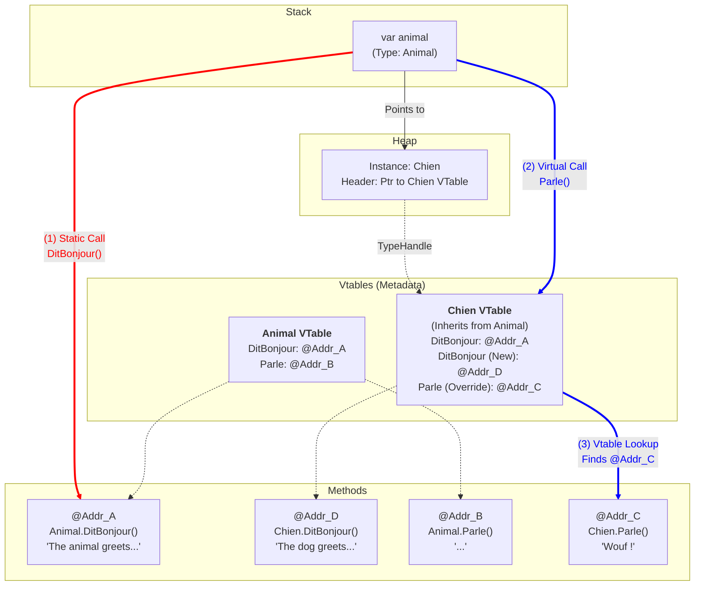



## A Deep Dive into C# Polymorphism

In C#, polymorphism is often summed up as "the right code is executed for the right object". But for a seasoned developer, it is crucial to understand the internal mechanics: how does the CLR (Common Language Runtime) decide which method to call?

This article breaks down the difference between a static call and a dynamic call via **Vtables**.

### 1. The setup: The code

Let's take a base class `Animal` and two implementations: `Chien` (Dog) and `Chat` (Cat).
We have two types of methods:
1.  `DitBonjour()`: A classic (non-virtual) method that we will hide with `new` in the children.
2.  `Parle()`: A polymorphic method (`virtual` / `override`).

```csharp
using System;
using System.Collections.Generic;

public class Animal
{
    // Méthode NON VIRTUELLE : L'adresse est résolue à la compilation
    public void DitBonjour() 
    {
        Console.WriteLine("L'animal vous salue (Méthode de base).");
    }

    // Méthode VIRTUELLE : L'adresse est résolue à l'exécution (vtable)
    public virtual void Parle()
    {
        Console.WriteLine("...");
    }
}

public class Chien : Animal
{
    // Masquage (shadowing) : Cette méthode existe, mais n'écrase pas celle du parent
    public new void DitBonjour()
    {
        Console.WriteLine("Le chien vous salue.");
    }

    public override void Parle()
    {
        Console.WriteLine("Wouf !");
    }
}

public class Chat : Animal
{
    // Masquage (shadowing)
    public new void DitBonjour()
    {
        Console.WriteLine("Le chat vous salue.");
    }

    public override void Parle()
    {
        Console.WriteLine("Miaou !");
    }
}

class Program
{
    static void Main()
    {
        // On stocke des enfants dans un tableau de parents
        // Le type déclaré du tableau est Animal[]
        Animal[] mesAnimaux = [ new Chien(), new Chat() ];

        // Les objets de mesAnimaux sont de type Animal (Chien ou Chat)
        foreach (Animal animal in mesAnimaux)
        {
            Console.WriteLine($"--- Instance réelle : {animal.GetType().Name} ---");
            
            // Cas 1 : Liaison Statique (Appel Non-Virtuel)
            // Le compilateur regarde le type de la variable 'animal'
            animal.DitBonjour(); 

            // Cas 2 : Liaison Dynamique (Appel Virtuel)
            // Le runtime regarde le type de l'objet en mémoire
            animal.Parle(); 
            
            Console.WriteLine();
        }
    }
}
```

### 2. Case 1: Non-Virtual Call (`DitBonjour`)

When the compiler encounters the line `animal.DitBonjour()`, it analyzes the type of the **variable** `animal`.

* The variable is of type `Animal`.
* The `DitBonjour` method is **not** virtual.
* **The compiler's conclusion:** "I know exactly which method to call. It's `Animal.DitBonjour`. No matter what is actually in memory, the version of the code to execute is the one from the `Animal` class."

It doesn't matter that the `Chat` and `Chien` classes define a new version of the `DitBonjour` method (with `new`); it is indeed the base class `Animal`'s one that is called, because the destination address is set in stone at compile time.

#### Step-by-step execution (Static Binding)
1.  **Compilation:** The C# compiler generates an IL instruction that explicitly designates the `Animal.DitBonjour` method. When the JIT translates it into machine code, this instruction is turned into a direct jump to the memory address of the code, without going through any table.
2.  **Execution:** The processor jumps directly to that address.
3.  **Result:** Even if the object is a `Chien`, it is the `Animal`'s method that runs. The `Chien.DitBonjour` method is completely ignored.

### 3. Case 2: Virtual Call (`Parle`) and the Vtable

When the compiler encounters `animal.Parle()`, it detects the `virtual` keyword. It then understands that it cannot freeze the method's address at compile time, because the variable `animal` could point to any derived instance (a Chat, a Chien, and so on) at execution time.

Instead of writing a direct jump to a fixed code address (as for `DitBonjour`), the compiler sets up a **dynamic resolution** mechanism. It asks the runtime to go and find the right method based on the actual object in memory. This is where the **Vtable** comes into play.

#### Memory layout of a .NET object
Every object on the Heap has a hidden header containing a **TypeHandle**. This pointer leads to the **MethodTable** (the class's identity card). This table contains the **Vtable** (Virtual Method Table): an array of pointers to the methods.


#### Step-by-step execution (Dynamic Binding)

Let's take the first loop iteration, where the object is a **Chien**.

1.  **Dereferencing:** The runtime follows the `animal` reference to find the object on the Heap.
2.  **Inspection (TypeHandle):** It reads the object's header and understands: "This is an instance of `Chien`". It goes and consults `Chien`'s MethodTable.
3.  **Lookup in the Vtable:**
    * The `Parle` method occupies a fixed index (say slot #4) in the `Animal` hierarchy.
    * The runtime looks at slot #4 of `Chien`'s table.
    * Since `Chien` performed an `override`, the address stored in that slot is that of `Chien.Parle` (and not `Animal.Parle`).
4.  **Jump (Indirection):** The runtime retrieves that address (for example `0x3000`) and executes the code.

## How it works (diagram)

The diagram below illustrates the fundamental difference. Notice how `Chien.DitBonjour` (Address D) does exist, but is bypassed by the red arrow.



**Diagram legend**
* **Red Arrow (Static Binding):** The path is direct. The compiler saw the variable of type `Animal` and wired the call straight to the `Animal.DitBonjour` code (@Addr_A). It completely ignores the fact that the object is a Chien and that the `Chien.DitBonjour` method (@Addr_D) exists.
* **Blue Arrow (Dynamic Binding):** The path goes through the Vtable. We start from the object -> we go and look at its Vtable (that of the `Chien` class) -> we retrieve the specific address in the `Parle` slot -> we execute the `Chien.Parle` code (@Addr_C).

## Summary
* **Non-virtual (`new` keyword):** The method is determined by the **type of the variable**. It is fast, rigid, and it can lead to calling the parent's method even if the child has a "new" one.
* **Virtual (`override` keyword):** The method is determined by the **type of the object in memory** through an indirection (Vtable). It is flexible and guarantees polymorphic behavior.
