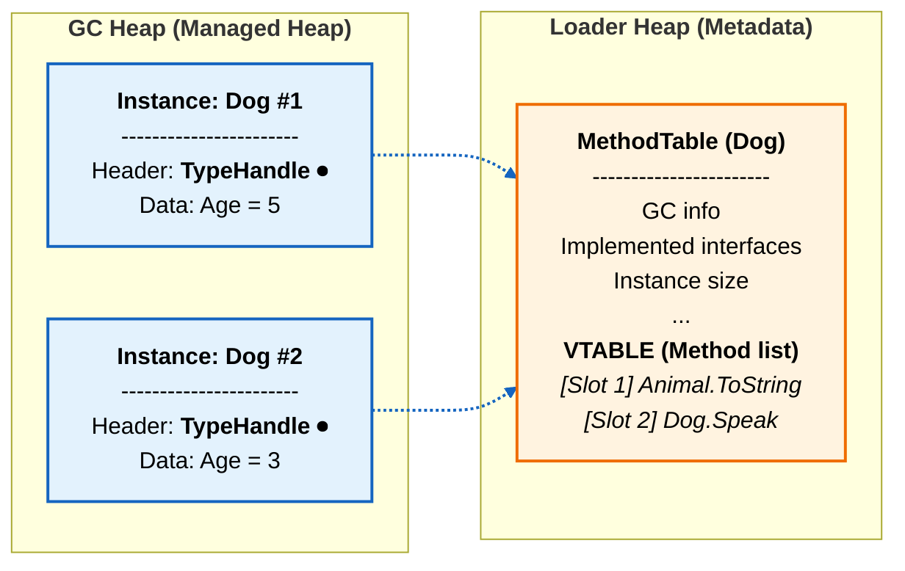
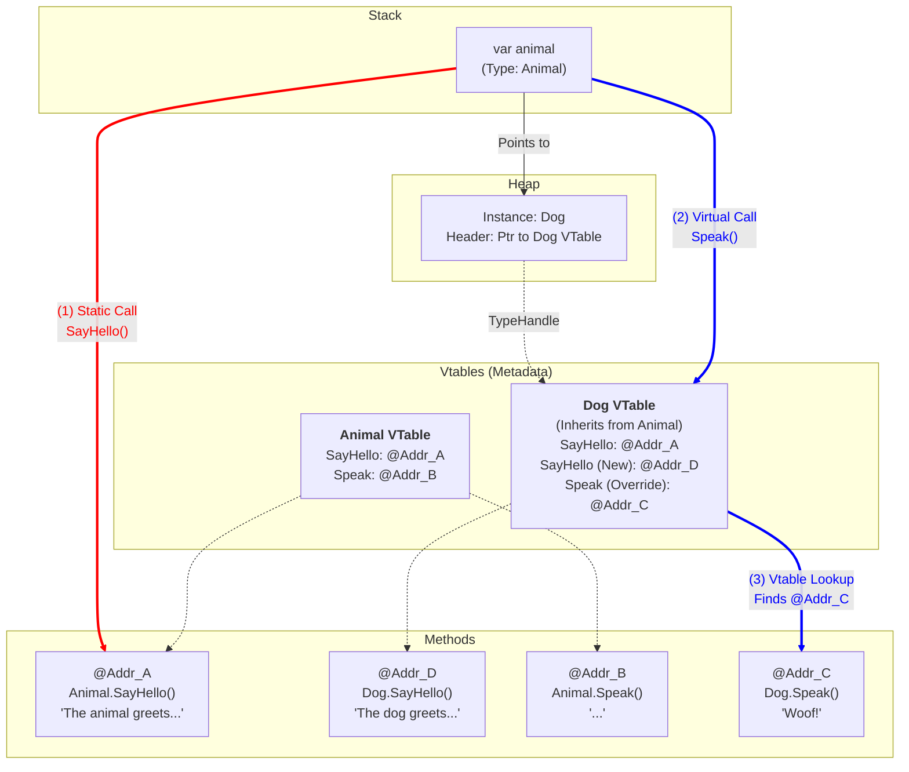



## A Deep Dive into C# Polymorphism

In C#, polymorphism is often summed up as "the right code is executed for the right object". But for a seasoned developer, it is crucial to understand the internal mechanics: how does the CLR (Common Language Runtime) decide which method to call?

This article breaks down the difference between a static call and a dynamic call via **Vtables**.

### 1. The setup: The code

Let's take a base class `Animal` and two implementations: `Dog` and `Cat`.
We have two types of methods:
1.  `SayHello()`: A classic (non-virtual) method that we will hide with `new` in the children.
2.  `Speak()`: A polymorphic method (`virtual` / `override`).

```csharp
using System;
using System.Collections.Generic;

public class Animal
{
    // NON-VIRTUAL method: the address is resolved at compile time
    public void SayHello() 
    {
        Console.WriteLine("The animal greets you (base method).");
    }

    // VIRTUAL method: the address is resolved at runtime (vtable)
    public virtual void Speak()
    {
        Console.WriteLine("...");
    }
}

public class Dog : Animal
{
    // Shadowing: this method exists but does not override the parent's
    public new void SayHello()
    {
        Console.WriteLine("The dog greets you.");
    }

    public override void Speak()
    {
        Console.WriteLine("Woof!");
    }
}

public class Cat : Animal
{
    // Shadowing
    public new void SayHello()
    {
        Console.WriteLine("The cat greets you.");
    }

    public override void Speak()
    {
        Console.WriteLine("Meow!");
    }
}

class Program
{
    static void Main()
    {
        // We store children in an array of parents
        // The declared type of the array is Animal[]
        Animal[] myAnimals = [ new Dog(), new Cat() ];

        // The objects in myAnimals are of type Animal (Dog or Cat)
        foreach (Animal animal in myAnimals)
        {
            Console.WriteLine($"--- Actual instance: {animal.GetType().Name} ---");
            
            // Case 1: Static Binding (Non-Virtual Call)
            // The compiler looks at the type of the variable 'animal'
            animal.SayHello(); 

            // Case 2: Dynamic Binding (Virtual Call)
            // The runtime looks at the type of the object in memory
            animal.Speak(); 
            
            Console.WriteLine();
        }
    }
}
```

### 2. Case 1: Non-Virtual Call (`SayHello`)

When the compiler encounters the line `animal.SayHello()`, it analyzes the type of the **variable** `animal`.

* The variable is of type `Animal`.
* The `SayHello` method is **not** virtual.
* **The compiler's conclusion:** "I know exactly which method to call. It's `Animal.SayHello`. No matter what is actually in memory, the version of the code to execute is the one from the `Animal` class."

It doesn't matter that the `Cat` and `Dog` classes define a new version of the `SayHello` method (with `new`); it is indeed the base class `Animal`'s one that is called, because the destination address is set in stone at compile time.

#### Step-by-step execution (Static Binding)
1.  **Compilation:** The C# compiler generates an IL instruction that explicitly designates the `Animal.SayHello` method. When the JIT translates it into machine code, this instruction is turned into a direct jump to the memory address of the code, without going through any table.
2.  **Execution:** The processor jumps directly to that address.
3.  **Result:** Even if the object is a `Dog`, it is the `Animal`'s method that runs. The `Dog.SayHello` method is completely ignored.

### 3. Case 2: Virtual Call (`Speak`) and the Vtable

When the compiler encounters `animal.Speak()`, it detects the `virtual` keyword. It then understands that it cannot freeze the method's address at compile time, because the variable `animal` could point to any derived instance (a Cat, a Dog, and so on) at execution time.

Instead of writing a direct jump to a fixed code address (as for `SayHello`), the compiler sets up a **dynamic resolution** mechanism. It asks the runtime to go and find the right method based on the actual object in memory. This is where the **Vtable** comes into play.

#### Memory layout of a .NET object
Every object on the Heap has a hidden header containing a **TypeHandle**. This pointer leads to the **MethodTable** (the class's identity card). This table contains the **Vtable** (Virtual Method Table): an array of pointers to the methods.



#### Step-by-step execution (Dynamic Binding)

Let's take the first loop iteration, where the object is a **Dog**.

1.  **Dereferencing:** The runtime follows the `animal` reference to find the object on the Heap.
2.  **Inspection (TypeHandle):** It reads the object's header and understands: "This is an instance of `Dog`". It goes and consults `Dog`'s MethodTable.
3.  **Lookup in the Vtable:**
    * The `Speak` method occupies a fixed index (say slot #4) in the `Animal` hierarchy.
    * The runtime looks at slot #4 of `Dog`'s table.
    * Since `Dog` performed an `override`, the address stored in that slot is that of `Dog.Speak` (and not `Animal.Speak`).
4.  **Jump (Indirection):** The runtime retrieves that address (for example `0x3000`) and executes the code.

## How it works (diagram)

The diagram below illustrates the fundamental difference. Notice how `Dog.SayHello` (Address D) does exist, but is bypassed by the red arrow.



**Diagram legend**
* **Red Arrow (Static Binding):** The path is direct. The compiler saw the variable of type `Animal` and wired the call straight to the `Animal.SayHello` code (@Addr_A). It completely ignores the fact that the object is a Dog and that the `Dog.SayHello` method (@Addr_D) exists.
* **Blue Arrow (Dynamic Binding):** The path goes through the Vtable. We start from the object -> we go and look at its Vtable (that of the `Dog` class) -> we retrieve the specific address in the `Speak` slot -> we execute the `Dog.Speak` code (@Addr_C).

## Summary
* **Non-virtual (`new` keyword):** The method is determined by the **type of the variable**. It is fast, rigid, and it can lead to calling the parent's method even if the child has a "new" one.
* **Virtual (`override` keyword):** The method is determined by the **type of the object in memory** through an indirection (Vtable). It is flexible and guarantees polymorphic behavior.
