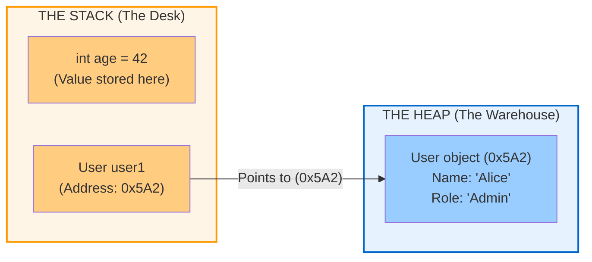
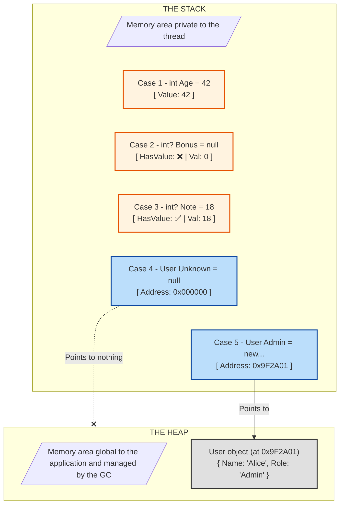



If you learned development with modern languages like C#, Java, Python or JavaScript, memory management is probably a black box for you. You create a variable, and "magically", it exists.

Yet sooner or later, you will run into concepts like `StackOverflowException`, memory leaks, or the subtle difference between a **copy by value** and a **copy by reference**. Worse still, handling `null` values can become a nightmare if you don't visualize what happens "under the hood".

Today, we're going to demystify two fundamental memory areas: **the Stack** and **the Heap**.

## The Analogy: The Desk and the Warehouse

To understand this without writing assembly, let's picture your program as a very busy office worker.



### The Stack: Your Work Surface
Imagine a pile of folders on the corner of your desk.
* This is your immediate workspace.
* It is **very fast** to access (it's right at hand).
* It is **organized**: you handle the folder on top, and when you're done, you remove it (LIFO: *Last In, First Out*).
* Space is **limited**: if you pile up too many folders, the stack collapses (this is the famous *Stack Overflow*).

### The Heap: The Giant Warehouse
Now imagine a huge warehouse located across the street.
* It's a gigantic and messy storage space.
* It is **slower**: to retrieve something, you have to go and fetch it.
* To find an object, you need its address (an aisle and shelf number). On your desk (the Stack), you only keep that small note with the address written on it.


## 1. The Stack: Speed and Order

The Stack is used for the execution of the current thread. Every time your code calls a method, a new block (a *stack frame*) is pushed onto it.

This is where **value types** live. In C#, these are `int`, `double`, `bool`, `char`, and `struct`.

**Characteristics:**
* **Automatic cleanup:** As soon as the method finishes (when you leave the closing brace `}`), the data is popped off and disappears instantly.
* **Fixed size:** An `int` variable always takes up 32 bits.

> **The catch:** If you pass a variable from the Stack to another method, a **full copy** of the value is made. Modifying the copy does not modify the original.

## 2. The Heap: Flexibility and Disorder

The Heap is used to store data whose lifetime does not depend directly on the current method, or that is too large.

This is where **reference types** live. In C#, these are `class`, `string`, `object`, and arrays.

When you do:
```csharp
var monUtilisateur = new User("Alice");
```

Two things happen:
1.  The `User` object (with all its data) is created in the **Warehouse (Heap)**.
2.  On your **Desk (Stack)**, a small variable `monUtilisateur` is created. It does not contain the object, but **the address** (the pointer) to the object in the warehouse.

**Characteristics:**
* **Complex cleanup:** When you no longer need the object, it stays in the warehouse. It is the job of the **Garbage Collector** to come by regularly and throw out whatever is no longer referenced.
* **Indirect access:** To read a piece of data, the CPU must read the address on the Stack, then go and fetch the data in the Heap.

## Why is this vital for `Nullable`?

This is where the distinction becomes crucial for understanding modern code, particularly in C#.

### Case 1: Value Types (Stack)
An `int` (on the stack) is a raw value. It necessarily exists (there are electrons in memory). It cannot be "nothing".
* `int a = null;` // Historically impossible.

To have a "null" integer, you have to wrap it in a special container (`Nullable<int>` or `int?`). It's like putting an empty box on your desk with a label saying "There is nothing inside".

### Case 2: Reference Types (Heap)
A `string` or a `class` is manipulated through an address on the Stack.
* This address can point to a real object in the Heap `0x123456`.
* Or it can be empty: `null` (or `0x000000`).

That is why objects can be `null` by default: the variable on the stack exists, but it points to nothing.

### The modern confusion (C# 8+)
With "Nullable Reference Types" enabled in recent C#, you write `string?`.
Watch out for the nuance:
* **`int?`**: Changes the structure in memory (adds a boolean to say "I have a value or not").
* **`string?`**: Changes **nothing** in memory (it is still a pointer). It is purely an instruction for the compiler so that it slaps your wrist if you forget to check whether it's null before using it.

## In summary



| Characteristic | The Stack | The Heap |
| :--- | :--- | :--- |
| **Analogy** | Pile of folders on the desk | Storage warehouse |
| **Contents** | Value types (`int`, `bool`, `struct`) + pointers | Reference types (`class`, `string`, arrays) |
| **Management** | Automatic (end of method) | Garbage Collector |
| **Speed** | Very fast | Slower (allocation + access) |
| **Typical problem** | Stack Overflow (too many recursive calls) | Out of Memory / Fragmentation |

Understanding this separation will help you better visualize why modifying an object inside a function modifies the original object (because you copy the address, not the object), whereas modifying an integer only changes the local copy.

---

## Ready to test what you've learned?

Have you remembered everything? Do the pitfalls of `null` and references hold no more secrets for you?

👉 [Take the quiz: test your knowledge of the Stack and the Heap]()
