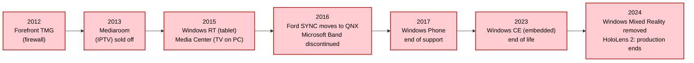



Let's start with the segments where Windows eventually vanished. They cover two distinct realities. In some cases, Windows held a **real position** before being supplanted: the smartphone (Windows Mobile peaked at ~42% of the US smartphone market in 2007), the enterprise firewall, automotive infotainment. In others, it is a **failed foray** — Microsoft tried to enter without ever taking root: the tablet, the smartwatch, the virtual-reality headset, network storage. In both cases the dates are precise, because a software retirement can be dated — to an end of sales, to an end of support.

The timeline below gathers these successive withdrawals over a dozen years.

## Smartphones

Here, two eras must be distinguished. Before the iPhone, Microsoft was a serious smartphone player with **Windows Mobile** (heir to Pocket PC, built on Windows CE), which powered HTC and Dell devices aimed at business (push email, Exchange integration). Windows Mobile peaked in **2007**, reaching roughly **42% of the US smartphone market**; it was then among the sector's leading systems, behind the global leader Symbian (the OS of Nokia phones). Scale must be kept in mind, though: the smartphone was still a niche — the vast majority of the **1.15 billion phones sold in 2007** were ordinary feature phones — and across the whole phone market, Windows remained marginal.

The arrival of the **iPhone (2007)** and then **Android (2008)**, designed for mainstream touch, swept Windows Mobile away within a few years. Microsoft attempted a relaunch with **Windows Phone 7** (2010): a break in the interface (the new "Metro" visual language) and in the app ecosystem — incompatible with Windows Mobile software — even though, technically, the kernel was still that of **Windows CE**. Only with **Windows Phone 8** (2012) did Microsoft adopt the **Windows NT** kernel, shared with the PC. But the relaunch never took off: the peak was just **3.6%** of worldwide smartphone sales in **Q3 2013** (IDC), when Android already exceeded 80%. Then the collapse: **0.3% at the end of 2016**, and abandonment in **2017**.

Today the market is a duopoly: according to StatCounter, in June 2026, **Android captures 69% of mobile systems worldwide, iOS about 31%**. Notably, both systems belong to the **Unix family**: Android is built on a **Linux kernel**, and iOS on **Darwin**, whose XNU kernel weds a Mach microkernel to a BSD layer — a heritage more tangled than it looks, which [I detail in the article on permissive licences](../../logiciel-libre/02-licences-permissives-freebsd/#apple-the-technological-frankenstein). Windows has vanished from the phone, entirely replaced by OSes built on Unix foundations.

**Sources:**
- [StatCounter — worldwide mobile OS market share](https://gs.statcounter.com/os-market-share/mobile/worldwide)
- [Windows Mobile — market-share peak in 2007, ~42% in the US (Wikipedia)](https://en.wikipedia.org/wiki/Windows_Mobile)
- [TechCrunch (Gartner data) — 1.15 billion phones sold in 2007](https://techcrunch.com/2008/02/27/over-a-billion-mobile-phones-sold-in-2007/)
- [TheNextWeb (IDC data) — smartphone OS shares in Q3 2013: Android 81%, Windows Phone 3.6%](https://thenextweb.com/news/idc-android-hit-81-0-smartphone-share-q3-2013-ios-fell-12-9-windows-phone-took-3-6-blackberry-1-7)
- [Windows Phone 8 — switch from the Windows CE kernel (WP7) to the Windows NT kernel (Wikipedia)](https://en.wikipedia.org/wiki/Windows_Phone_8)

## Tablets

The same trajectory, shorter. In October 2012, Microsoft launched **Windows RT**, a variant of Windows 8 for ARM processors, with the first Surface tablet. Failure came quickly: incompatibility with regular Windows software, confusion for buyers. The Surface 2, one of the last Windows RT devices, was **discontinued in January 2015**, with no upgrade path to Windows 10. Support ended for good in January 2023.

The tablet market is now split between **iPadOS** and **Android**; Apple alone accounts for nearly 42% of worldwide shipments in the last quarter of 2025 according to IDC. Windows lingers at the margins on "2-in-1" hybrids, which are closer to a laptop than to a tablet.

**Sources:**
- [Windows RT — timeline and discontinuation (Wikipedia)](https://en.wikipedia.org/wiki/Windows_RT)
- [Surface 2, the last Windows RT device (Wikipedia)](https://en.wikipedia.org/wiki/Surface_2)
- [IDC — worldwide tablet shipments, Q4 2025](https://www.idc.com/resource-center/blog/global-tablet-shipments-rise-1-9-in-4q25-as-seasonal-demand-offsets-cooling-replacement-cycle/)

## Smartwatches

Microsoft launched the **Microsoft Band**, a fitness band, in 2014, then the Band 2 in 2015. Sales ceased as early as **October 2016**, and the team was disbanded. The final blow came on **31 May 2019**: Microsoft shut down the Band's online services, pulled the apps, and deleted the data, with a refund programme for the last active users. The segment is now held by watchOS (Apple, in the lead) and Google's Wear OS, the latter built on Linux.

**Sources:**
- [Microsoft Band — history and discontinuation (Wikipedia)](https://en.wikipedia.org/wiki/Microsoft_Band)
- [Microsoft — end of the Microsoft Health Dashboard services, 31 May 2019](https://support.microsoft.com/en-us/topic/end-of-support-for-the-microsoft-health-dashboard-applications-and-services-faq-ae78b810-5acb-6f00-bf5f-e0935aca84af)

## Virtual- and augmented-reality headsets

In 2017, Microsoft pushed **Windows Mixed Reality**, a VR platform built into Windows, with headsets made by Acer, Asus, Dell, HP, Lenovo, and Samsung. The platform was **deprecated in December 2023**, then simply **removed from Windows 11 in the 24H2 update**, in late 2024: the headsets concerned then stopped working.

Microsoft also had its own headset, but for **augmented reality**: the **HoloLens** (first edition in 2016, HoloLens 2 in 2019), running a variant of Windows, aimed at business and the US military (the IVAS programme). Same outcome: **HoloLens 2 production stops in October 2024**, with no successor; support will end in 2027; and in **February 2025, Microsoft hands the IVAS military contract to Anduril**. Microsoft is thus leaving XR on both fronts, consumer VR as well as professional AR.

The market is largely dominated by Meta (Quest headsets, roughly 75 to 80% of shipments, running an Android derivative), ahead of Apple (Vision Pro, on visionOS) — in both cases, no Windows.

**Sources:**
- [Windows Mixed Reality — deprecation and removal (Wikipedia)](https://en.wikipedia.org/wiki/Windows_Mixed_Reality)
- [Road to VR — Windows 11 24H2 drops WMR support](https://www.roadtovr.com/windows-11-drops-wmr-support-24h2/)
- [Microsoft HoloLens — dates and platform (Wikipedia)](https://en.wikipedia.org/wiki/Microsoft_HoloLens)
- [TechCrunch — HoloLens 2 production ends, with no successor (1 October 2024)](https://techcrunch.com/2024/10/01/microsoft-hololens-2-discontinued-with-no-successor-in-site/)
- [Axios — the IVAS military programme handed to Anduril (February 2025)](https://www.axios.com/2025/02/11/anduril-microsoft-ivas-army-deal)
- [Counterpoint Research — global VR headset market, H1 2025](https://counterpointresearch.com/en/insights/global-vr-headset-market-in-h1-2025)

## Televisions and TV boxes

Microsoft had an IP television platform for operators — first named **Microsoft TV IPTV Edition**, then rebranded **Mediaroom** in 2007 — which powered DSL television offerings in the mid-2000s. In France, **Club Internet** thus launched, in 2006, its DSL television on this Microsoft platform, on the **set-top box** side (and not the internet-modem side). Microsoft **sold Mediaroom to Ericsson in 2013** (deal closed in September 2013) and exited the sector. On the consumer side, **Windows Media Center** — the PC television and recording software — was not carried over into Windows 10 (announced in 2015) and disappeared.

Today's connected TVs and boxes all run Linux-derived systems: **Tizen** (Samsung), **webOS** (LG), **Android TV / Google TV**, **Roku OS** (Roku, a US TV-streaming player), **Fire TV** (Amazon). The leader varies by region — Roku in the United States, Android TV / Google TV across much of the rest of the world — but in every case, Windows has no presence in this segment.

**Sources:**
- [Ariase — Club Internet's DSL television on Microsoft TV (2006)](https://www.ariase.com/box/actualite/article-735-details-television-clubinternet)
- [Ericsson — closing of the Microsoft Mediaroom acquisition, September 2013](https://news.cision.com/ericsson/r/ericsson-closes-acquisition-of-microsoft-mediaroom,c2245704)
- [Windows Media Center — end with Windows 10 (Wikipedia)](https://en.wikipedia.org/wiki/Windows_Media_Center)
- [AppleWorld.Today — smart-TV OS shares in the United States (Parks Associates data, 2026)](https://appleworld.today/2026/04/roku-os-28-and-samsungs-tizen-os-23-account-for-the-largest-share-of-tv-operating-system-usage-in-the-us/)

## Network firewalls

Microsoft offered an enterprise firewall and proxy, first under the name **ISA Server**, then **Forefront Threat Management Gateway (TMG)**. In **September 2012**, Microsoft announced the end of development; the product was no longer sold from December 2012, and extended support ended in April 2020. No in-house on-premises successor was offered.

The market shifted to appliances built on **FreeBSD** (the popular pfSense and OPNsense) and to proprietary systems (Fortinet's FortiOS, Palo Alto Networks' PAN-OS). It is a clear-cut case: Windows was present, and no longer is.

**Sources:**
- [Microsoft Forefront Threat Management Gateway — product discontinuation (Wikipedia)](https://en.wikipedia.org/wiki/Microsoft_Forefront_Threat_Management_Gateway)
- [Microsoft Lifecycle — end of support for Forefront TMG](https://learn.microsoft.com/en-us/lifecycle/products/microsoft-forefront-threat-management-gateway-web-protection-services)

## NAS (network storage)

Microsoft targeted home storage with **Windows Home Server** (2007), whose last incarnation, Windows Home Server 2011, saw its support end in **January 2013**. The flagship consumer product on this system, the HP MediaSmart Server, had already been discontinued in late 2010.

The consumer and professional NAS market now belongs entirely to Linux and BSD: **Synology DSM** and **QNAP QTS** are built on Linux; **TrueNAS**, long on FreeBSD, moved to Linux in 2022. Windows has left network storage.

**Sources:**
- [Windows Home Server — end of support (Wikipedia)](https://en.wikipedia.org/wiki/Windows_Home_Server)
- [HP MediaSmart Server — discontinuation (Wikipedia)](https://en.wikipedia.org/wiki/HP_MediaSmart_Server)
- [iXsystems — first release of TrueNAS on Linux (2022)](https://www.truenas.com/blog/first-release-of-truenas-on-linux/)

## Automotive

The car offers a concrete example of Windows being dropped in favour of a named competitor. The **Ford SYNC** infotainment systems, in their first and second generations, were built on **Windows Embedded Automotive** (Microsoft Auto). In December 2014, Ford announced **SYNC 3**, rolled out on 2016 models: it dropped Windows in favour of **QNX**, a proprietary real-time system from BlackBerry. The following generations stayed on QNX.

More broadly, the automotive operating-system market is today dominated by **QNX** — strong on its certification for safety-critical functions (braking, steering), with around 38% of the market in 2025 according to the firm Mordor Intelligence — and by **Android Automotive** in infotainment. Neither is Windows; and QNX is not Linux, but a proprietary system of the Unix family.

Microsoft, moreover, never published a single end-of-life date for its automotive platform (Windows Embedded Automotive): it faded out gradually over the 2010s. It should not be confused with the general-purpose embedded base **Windows CE / Windows Embedded Compact**, whose last version reached its **end of life in October 2023** — a milestone that concerns embedded systems broadly (industrial terminals, kiosks…), and not the car in particular.

**Sources:**
- [The Register — Ford drops Windows for QNX (SYNC 3), December 2014](https://www.theregister.com/2014/12/12/ford_dumps_windows_for_qnx_in_new_incar_entertainment_unit/)
- [Windows Embedded Automotive — product timeline (Wikipedia)](https://en.wikipedia.org/wiki/Windows_Embedded_Automotive)
- [The Register — Windows CE reaches end of life (30 October 2023)](https://www.theregister.com/2023/10/30/windows_ce_reaches_eol/)
- [Mordor Intelligence — automotive operating-systems market (QNX share ~38%, to be treated as an analyst-firm estimate)](https://www.mordorintelligence.com/industry-reports/automotive-operating-systems-market)
