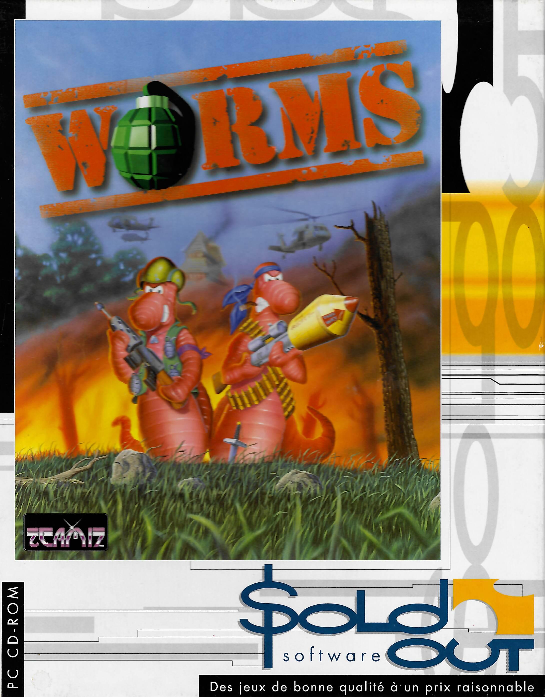

## Installation de Worms (PC DOS) sur Recalbox avec pistes CD Audio

Ce guide explique comment extraire et installer la version CD-ROM originale de **Worms** vendu par **Sold out** sur Recalbox, en préservant les pistes audio (musique d'ambiance) qui sont souvent perdues lors d'une copie standard.



### 1. Prérequis (Sous Fedora Linux 43)

Il est nécessaire d'installer les outils en ligne de commande pour manipuler les CD mixtes (Données + Audio).

```bash
sudo dnf install cdrdao gcdmaster
```

### 2. Extraction du CD (Image binaire)

Le CD de Worms est un disque "mixte" : la piste 1 contient les données du jeu, et les pistes suivantes contiennent la musique. Pour que la musique soit lue correctement sous Linux/Recalbox, il faut inverser l'ordre des bits (Byte Swap).

Insérez le CD (ne pas monter le disque) et lancez cette commande pour créer une image brute :

```bash
cdrdao read-cd --read-raw --datafile Worms.bin --device /dev/sr0 --driver generic-mmc-raw:0x20000 Worms.toc
```

**Explication des options :**
* `--read-raw` : Copie le disque bit par bit (utile pour les protections).
* `generic-mmc-raw:0x20000` : L'option cruciale. Le suffixe `:0x20000` force l'inversion des bits audio (Byte Swap). Cela corrige le problème de lecture "Little Endian" vs "Big Endian" qui transformerait sinon la musique en bruit blanc (grésillements).

### 3. Conversion du fichier de structure (.cue)

Recalbox utilise le format `.cue`. Il faut convertir le fichier `.toc` généré par cdrdao.

```bash
toc2cue Worms.toc Worms.cue
```

#### Vérification du fichier .cue
Ouvrez le fichier `Worms.cue` avec un éditeur de texte. Vérifiez la première ligne :
* Elle doit contenir un **chemin relatif** : `FILE "Worms.bin" BINARY`
* Si elle contient un chemin absolu (ex: `/home/user/...`), supprimez le chemin pour ne garder que le nom du fichier.

### 4. Installation sur la Recalbox

1. Connectez-vous à votre Recalbox via le réseau.
2. Allez dans le dossier `share/roms/dos/`.
3. Créez un répertoire nommé **`Worms.pc`**.
4. Copiez-y les fichiers `Worms.bin` et `Worms.cue`.

### 5. Configuration et Lancement

Créez un fichier `dosbox.bat` à l'intérieur du dossier `Worms.pc`.

#### Phase A : Première installation (Setup)
Au premier lancement, il faut installer le jeu sur le disque dur virtuel pour configurer le son.
Utilisez ce contenu temporaire pour `dosbox.bat` :

```bat
@echo off
keyb fr
imgmount D "Worms.cue" -t iso
D:
SETUP.EXE
```
*Lancez le jeu, faites l'installation (Sound Blaster 16), puis quittez.*

#### Phase B : Script de jeu définitif
Une fois installé, modifiez le fichier `dosbox.bat` avec le script final :

```bat
@echo off
keyb fr
imgmount D "Worms.cue" -t iso
C:
cd WORMS
WORMS.EXE
```

### Astuces

* **Manette souris - Pas encore testé** : Sur Recalbox (DosBox Pure), vous pouvez activer la souris virtuelle en appuyant sur **L3** (clic stick gauche) ou via le menu de configuration (L3+R3 > Controller Mapping).
* **Sauvegardes** : Le dossier `WORMS` créé lors de l'installation contient vos équipes et progressions. Il est stocké directement dans votre dossier `Worms.pc`.
