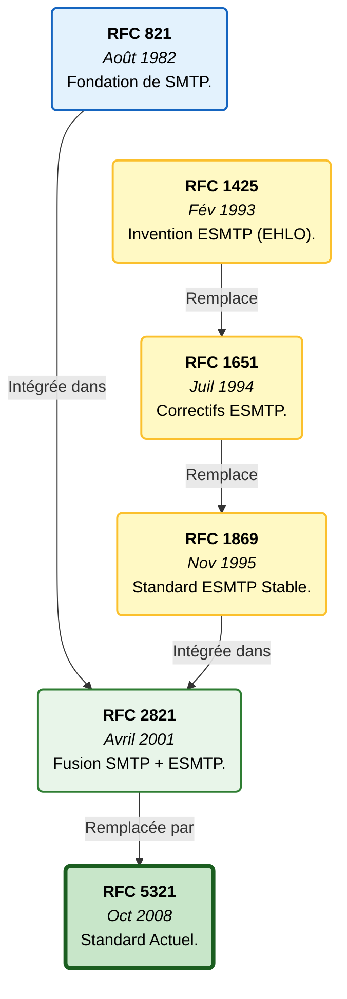
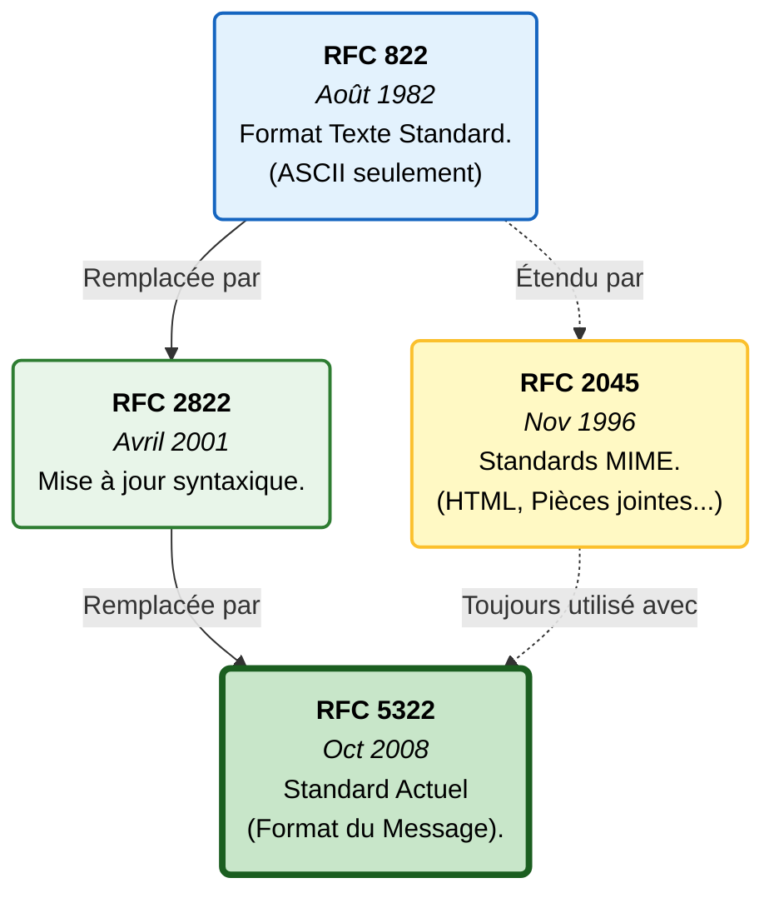
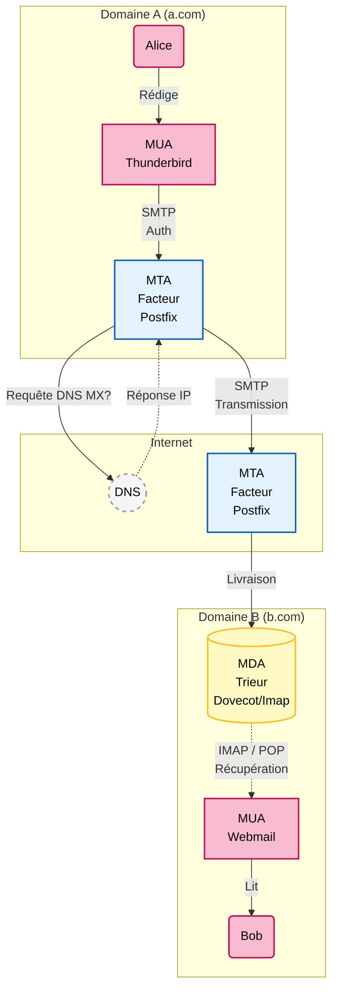

# Introduction

## Objectif et audience

Il y a trois types d'utilisateurs du système d'e-mail :
- Les utilisateurs des boîtes e-mail
- Les administrateurs des domaines
	- Les mainteneurs de l'infrastructure e-mail

Cette série d'articles s'adresse aux administrateurs de domaines qui ont besoin de configurer des boîtes e-mail de façon à empêcher l'usurpation d'identité.

## Prérequis

Pour tirer pleinement profit de cet article et sécuriser votre domaine, vous devez :
1.  **Accès et Environnement**
- Avoir un accès administrateur à la zone DNS de votre domaine (chez votre registrar ou hébergeur).
- Disposer d'un terminal (Linux/macOS) pour effectuer des requêtes DNS.
2.  **Connaissances Techniques**
- Compréhension du DNS :
    - Savoir modifier une zone DNS.
    - Connaître les types d'enregistrements : A, AAAA, TXT, CNAME, MX et PTR.
    - Comprendre les notions de TTL (Time To Live) et de propagation DNS (délais de mise à jour).
- Réseau (IP) :
    - Différencier IPv4 et IPv6.
    - Comprendre la notation CIDR (ex: 192.51.100.0/24) utilisée fréquemment dans les règles SPF pour autoriser des plages d'adresses entières.
- Avoir une notion basique de la cryptographie asymétrique (clé privée / clé publique), utile pour comprendre le fonctionnement de la signature DKIM.

# Concepts spécifiques au mail

Tout au long de cette série d'articles, on considère un e-mail partant du domaine `a.com` (domaine expéditeur) à destination du domaine `b.com` (domaine de réception). Ex : `alice@a.com` vers `bob@b.com`.  
Dans l'article, on parle d'**ESP**. Un ESP (pour Email Service Provider, ou Fournisseur de Services de Messagerie en français) est une entreprise ou une plateforme qui fournit des services pour aider les particuliers ou, plus couramment, les entreprises à gérer et envoyer des campagnes d'e-mails en masse (e-mail marketing, newsletters, etc.) ou des e-mails transactionnels.  
Un e-mail transactionnel (ou e-mail de service/système) est un message automatisé et non promotionnel qui est envoyé à un utilisateur suite à une action spécifique que cet utilisateur a initiée sur un site web ou dans une application (ex : le mail qu'on reçoit quand on clique sur "mot de passe oublié").

## Le protocole d'envoi de mails : SMTP

Le SMTP (Simple Mail Transfer Protocol) est le protocole standard utilisé pour envoyer et transférer le courrier électronique sur internet. Ce protocole sert uniquement à expédier ("push") le message de votre ordinateur vers le serveur, puis de serveur en serveur. Il ne sert pas à récupérer vos e-mails pour les lire. Pour cela, on utilise d'autres protocoles (comme IMAP ou POP) qui agissent comme la clé pour ouvrir votre boîte aux lettres et lire le courrier arrivé.

Historiquement défini par la [RFC 821 (1982)](https://www.rfc-editor.org/rfc/rfc821) puis mis à jour par la [RFC 5321 (2008)](https://www.rfc-editor.org/rfc/rfc5321), le protocole SMTP a été conçu à une époque où Internet était un réseau de confiance. La sécurité n'était pas la priorité.  
Le diagramme suivant montre les différentes RFC qui ont façonné le protocole SMTP :

## Structure d'un e-mail

Un e-mail est une chaîne de caractères formatée selon des standards spécifiques (principalement la [RFC 5322 (2008)](https://www.rfc-editor.org/rfc/rfc5322)), contenant un en-tête et un corps de message.  
L'en-tête contient notamment le `Return-Path` (l'adresse pour les notifications d'erreurs/rebonds non visible pour l'utilisateur) et le `From` (l'adresse affichée à l'utilisateur), mais aussi d'autres champs cruciaux comme le `To` (destinataire affiché) et le `Subject` (objet du message affiché à l'utilisateur), ainsi que des champs techniques invisibles comme le `Message-ID` et des champs d'authentification comme `DKIM-Signature` que nous verrons plus tard. Le `Message-ID` est l'identifiant mondialement unique d'un e-mail et indépendant du serveur qui l'héberge.

Le diagramme suivant montre les différentes RFC qui ont façonné la structure d'un e-mail :

Un e-mail peut se décomposer en trois composants techniques :

### L'Enveloppe (The Envelope) - Protocole SMTP

C'est la partie utilisée par les serveurs pour le transport de l'e-mail. Elle n'est généralement pas visible par l'utilisateur final. Elle est définie par les commandes du protocole SMTP (`MAIL FROM:` et `RCPT TO:`). Elle contient :
- L'adresse de l'expéditeur de l'enveloppe (`MAIL FROM`) : C'est cette adresse qui est utilisée pour le `Return-Path` dans l'en-tête (une fois l'e-mail reçu). Elle est essentielle pour les mécanismes SPF et la gestion des rebonds.
- L'adresse du destinataire de l'enveloppe (`RCPT TO`) : L'adresse réelle où l'e-mail doit être livré.

### L'En-tête (The Header) - [RFC 5322](https://www.rfc-editor.org/rfc/rfc5322)

C'est un ensemble de champs structurés au début du message.  
Il contient notamment les champs :
- `From` (Adresse de l'expéditeur affichée)
- `Return-Path` (qui est rempli avec l'adresse `MAIL FROM` de l'enveloppe)
- `To`, `Cc`, `Bcc`, `Subject`, `Date`.  
    Il contient également les informations de sécurité ajoutées par le serveur de réception pour indiquer le résultat des vérifications SPF, DKIM et DMARC.

### Le Corps du Message (The Body)

C'est le contenu réel de l'e-mail, souvent formaté en texte simple (text/plain) et/ou en HTML (text/html).  
Il est structuré selon le standard **MIME** (Multipurpose Internet Mail Extensions, **[RFC 2045](https://www.rfc-editor.org/rfc/rfc2045)**), permettant d'inclure des pièces jointes et du HTML.

### Le voyage d'un e-mail

Pour comprendre le voyage d'un e-mail, il est utile de connaître les acteurs logiciels impliqués.

1.  MUA (Mail User Agent) - Le Client de Messagerie  
    C'est l'interface utilisée par l'humain pour lire et écrire des e-mails.  
    **Exemples :** Mozilla Thunderbird, Microsoft Outlook, l'application Mail sur iPhone, ou une interface web comme Roundcube ou Gmail (Webmail).  
    **Rôle :** Il formate le message et l'envoie au premier maillon de la chaîne (le MSA/MTA) via SMTP.
2.  MTA (Mail Transfer Agent) - Le Facteur / Le Serveur de Relais  
    C'est le logiciel serveur qui transporte l'e-mail d'une machine à une autre via le protocole SMTP.  
    **Exemples :** Postfix, Sendmail, Microsoft Exchange Server.  
    **Rôle :** Il reçoit le message du MUA, consulte le DNS (MX records) pour savoir où l'envoyer, et le transmet au MTA du destinataire (ou à un relais intermédiaire). C'est le MTA qui effectue souvent les contrôles SPF.
3.  MDA (Mail Delivery Agent) - Le Trieur / Le Livreur Final  
    C'est le logiciel qui reçoit le message final du MTA et le dépose dans la boîte aux lettres de l'utilisateur sur le serveur.  
    **Exemples :** Dovecot, Procmail.  
    **Rôle :** Il stocke le message sur le disque dur pour qu'il puisse être récupéré plus tard par le MUA (via les protocoles IMAP ou POP). C'est souvent à ce stade que les filtres anti-spam (comme SpamAssassin) analysent le contenu final.

**Le voyage typique :**  
MUA (Expéditeur) ➔ MTA (Serveur départ) ➔ Internet ➔ MTA (Serveur arrivée) ➔ MDA (Stockage) ➔ MUA (Destinataire)

# L'analogie postale

Bien que les images aient leurs limites, elles permettent de garder de la hauteur sans se perdre dans les détails techniques. Voici les protocoles de sécurité que nous allons voir et leurs images respectives :
1.  SMTP est le facteur et le camion de livraison : Il prend votre lettre (e-mail) depuis votre boîte aux lettres de départ et la transporte jusqu'au bureau de poste du destinataire.
2.  FCrDNS valide le camion qui transporte l'enveloppe. C'est la vérification que la plaque d'immatriculation (IP) correspond bien à la carte grise du camion (Nom de domaine du serveur). On s'assure que le camion n'est pas volé.
3.  Si le FCrDNS valide le camion, le SPF valide l'enveloppe et l'adresse de l'expéditeur (le `Return-Path`). L'entreprise émettrice du message (le Domaine `a.com`) a publié une liste. Si le camion qui arrive chez `b.com` ne figure pas sur la liste, on refuse l'enveloppe.
4.  DKIM est un genre de sceau de cire numérique de l'enveloppe. Attention cependant, DKIM ne permet pas de garantir que le message n'a pas été lu, juste qu'il n'a pas été modifié. Une autre image est le scellé de preuves de la police car tout le monde peut voir ce qu'il y a dedans, mais personne ne peut le modifier sans laisser de traces. La limite évidente de cette image est que l'on n'envoie pas nos lettres dans des scellés en plastique de la police !
5.  DMARC vérifie la cohérence entre le message et l'enveloppe :
    1.  Il ouvre l'enveloppe.
    2.  Il regarde l'en-tête du papier à lettre (le `From:` que le destinataire va lire).
    3.  Il compare cet en-tête avec les preuves extérieures : soit avec l'adresse au dos de l'enveloppe (`Return-Path` validé par le SPF), soit avec le logo sur le sceau de cire (Signature DKIM).