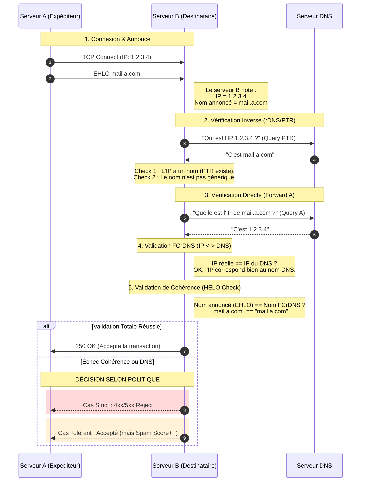

# Principe de fonctionnement

Cette technique est apparue comme une bonne pratique dans les années 90.

**Le principe de sécurité :** La robustesse de cette technique repose sur la nécessité de contrôler à la fois l'infrastructure IP (Côté Hébergeur) et la zone DNS (Côté Domaine). Un usurpateur ne possédant que l'un des deux accès ne pourra pas valider le test.

**Rappels :**

- **Le FQDN** (Fully Qualified Domain Name) est l'adresse complète et absolue d'une machine sur Internet (ex : `mail.a.com`). Le FQDN est configuré dans la zone **DNS** (ex : `a.com`) qui est géré par le **propriétaire du domaine**.
- **Le rDNS** est le processus inverse qui permet de trouver le nom de domaine associé à une adresse IP. L'enregistrement s'appelle un `PTR` (Pointer Record). Il est stocké dans la zone `in-addr.arpa` (IPv4) ou `ip6.arpa` (IPv6). Les zones **rDNS** `in-addr.arpa` pour IPv4 et `ip6.arpa` sont gérées par délégation par les **fournisseurs d'adresse IP** (Hébergeurs, FAI).

## Phase 1 : La connexion et l'annonce

1.  **Connexion** : Le serveur de mail de `a.com` se connecte au serveur de mail de `b.com`.
2.  **Annonce (HELO/EHLO)** : Il se présente : `EHLO pf-1010.whm.fr-par.scw.cloud`
3.  **Récupération IP** : Le serveur de `b.com` accepte la connexion. Il voit physiquement d'où viennent les paquets de données.  
    Il note l'IP appelante : `51.159.128.187`.

## Phase 2 : Requête Inverse (Le "Reverse")

1.  **Recherche `PTR`** : Le serveur `b.com` interroge le DNS (zone `in-addr.arpa` car c'est une IPv4) :  
    "Quel est le nom associé à l'IP `51.159.128.187` ?" (Requête `PTR`)  
    Réponse Inverse : Le DNS répond :  
    "Cette IP appartient au nom de machine `pf-1010.whm.fr-par.scw.cloud`."  
    (Premier bon point : le nom trouvé correspond au nom annoncé dans le EHLO à l'étape 2. Mais ce n'est pas suffisant, le DNS a pu être manipulé).

## Phase 3 : Vérification de non-généricité (Generic PTR Check)

Le serveur de `b.com` vérifie que le nom d'hôte ne ressemble pas à une IP résidentielle dynamique.  
Cette vérification, qui est une règle supplémentaire de qualité, est appelée **Generic PTR Check** et ne fait pas stricto sensu partie de la vérification `FCrDNS`.  
ex : Cas d'un nom d'hôte personnalisé

```bash
$ host 51.159.128.187
*187.128.159.51.in-addr.arpa domain name pointer pf-1010.whm.fr-par.scw.cloud.
```

ex : Cas d'un nom d'hôte générique

```bash
$ host 82.65.37.251
251.37.65.82.in-addr.arpa domain name pointer 82-65-37-251.subs.proxad.net.
```

Les indices suspects (Expressions régulières (Regex)) :
- Présence de l'IP dans le nom.
- Mots-clés résidentiels : `dynamic`, `dsl`, `fiber`, `pool`, `dhcp`, `cable`, `dialup`, etc..
- Manque de domaine personnalisé : Finir par le domaine du FAI (`orange.fr`, `free.fr`) au lieu d'un domaine personnalisé.

## Phase 4 : Requête Directe (Le "Forward")

La méthode **FCrDNS** (Forward-confirmed reverse DNS) ferme la boucle de vérification.

1.  **Requête Directe (Le "Forward") :** Le serveur `b.com` prend le nom trouvé dans le `PTR` et interroge le DNS classique :  
    "Quelle est l'adresse IP officielle de `pf-1010.whm.fr-par.scw.cloud` ?" (Requête `A`)
2.  **Réponse Directe** : Le DNS de Scaleway (`scw.cloud`) répond :  
    "L'IP de cette machine est `51.159.128.187`."
3.  **Comparaison Finale** : Le serveur de `b.com` compare l'IP qu'il a sous les yeux (Phase 1 - étape 3) avec l'IP officielle que le DNS vient de lui donner (Phase 4 - étape 2).  
    `51.159.128.187` (IP réelle) == `51.159.128.187` (IP DNS)  
    Résultat : Cette machine est bien celle qu'elle prétend être. L'infrastructure est cohérente. Si les deux correspondent, cela garantit que l'entrée `PTR` n'est pas falsifiée et que le propriétaire du domaine a explicitement autorisé cette IP à utiliser ce nom.

## Phase 5 : Le contrôle de cohérence "HELO"
En plus de la vérification de l'IP, les serveurs modernes effectuent une vérification sur le nom annoncé par le serveur lors de sa présentation (la commande EHLO mon.serveur.com). Si le FCrDNS valide que l'IP `1.2.3.4` correspond bien au nom `mail.a.com`, mais que le serveur se présente en disant EHLO `je.suis.google.com`, le serveur de réception détectera cette incohérence. Bien que techniquement distinct du FCrDNS, ce test (souvent appelé **HELO check**) complète la validation de l'infrastructure : le serveur doit avoir une IP valide, un nom DNS valide, et s'annoncer avec ce même nom.

## Synthèse



## La protection contre les Spammeurs "Amateurs"

Le principal avantage du **FCrDNS** est qu'il bloque l'envoi de masse depuis des infrastructures non professionnelles (PC infectés qui forment des botnets).  
Historiquement, les spammeurs utilisaient souvent des serveurs mal configurés ou des machines infectées sur des réseaux d'accès grand public (DSL, câble) qui ne disposaient pas de PTR configurés ou qui avaient des PTR génériques. Un PTR valide était la preuve qu'un administrateur responsable contrôlait l'adresse IP.  
Le **FCrDNS** est la première barrière. C'est un test binaire : si le PTR est absent ou générique, la réputation est mauvaise.

# Limite

Le FCrDNS valide le serveur (la machine), mais pas l'identité de l'expéditeur. Il ne garantit pas que le serveur a le droit d'envoyer des mails pour le domaine `a.com`, ni que le message n'a pas été modifié. FCrDNS est uniquement une mesure de **réputation d'infrastructure** afin de lutter contre les botnets.

C'est ce qui a rendu obligatoire l'adoption de protocoles complémentaires :
- Sender Policy Framework (SPF)
- DomainKeys Identified Mail (DKIM)
- Domain-based Message Authentication (DMARC)
