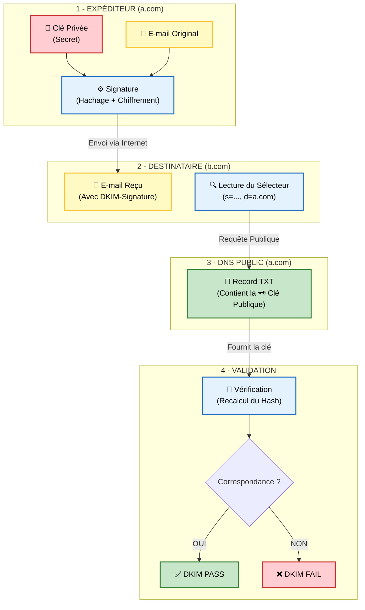

# Principe de fonctionnement : Le scellé de preuves de la police

Standardisé en 2007 ([RFC 4871](https://www.rfc-editor.org/rfc/rfc4871)), mis à jour en 2011 ([RFC 6376](https://www.rfc-editor.org/rfc/rfc6376)).

Si le SPF protège l'enveloppe (le serveur d'envoi), DKIM (DomainKeys Identified Mail) protège le message lui-même. C'est l'équivalent numérique d'un scellé de preuves de la police :

- **Transparence (Pas de confidentialité)** : N'importe qui peut regarder à travers le scellé et voir exactement ce qu'il contient (le texte de l'e-mail).
- **Scellé inviolable (Intégrité)** : Si quelqu'un essaie d'ouvrir le sac pour remplacer l'objet à l'intérieur ou changer un mot sur un document, il doit déchirer le plastique. Le destinataire verra immédiatement que le sac a été forcé (i.e. la signature DKIM échoue).
- **Étiquette officielle (Authentification)** : Le sac porte le logo du commissariat ou de la banque (le domaine émetteur).

DKIM utilise la cryptographie asymétrique (clé privée / clé publique) :

1.  **Signature (Serveur d'envoi)** : Le serveur sortant (ou l'ESP) choisit certains champs de l'en-tête et le corps du message. La liste des champs d'en-tête signés se trouve dans le tag `h=` du champ d'en-tête `DKIM-Signature` de l'e-mail. La norme recommande de signer au minimum les champs d'en-tête: `h=From:To:Subject:Date:Message-ID`. Le corps du message est d'abord haché et celui-ci est mis dans le tag `bh=` : on dit que le champ d'en-tête `DKIM-Signature` est préparé à la signature. Enfin les champs d'en-tête renseignés dans le tag `h=` ainsi que le champ d'en-tête `DKIM-Signature` sont signés avec une clé privée puis mis dans le tag `b=`.
2.  **Vérification (Serveur de réception)** : Le serveur destinataire lit l'en-tête DKIM. Il y trouve le "sélecteur" (selector) et le domaine signataire (`d=a.com`). Il va alors interroger le DNS de ce domaine pour récupérer la clé publique.
3.  **Validation** : Avec la clé publique, il déchiffre la signature et recalcule le hash du message reçu. Si les deux correspondent, cela prouve deux choses :

- Authenticité : Le propriétaire du domaine détient bien la clé privée.
- Intégrité : Le message n'a pas été modifié d'un seul octet en cours de route.

# Résistance au Forwarding

Contrairement au SPF, DKIM résiste au transfert d'e-mail (forwarding) : En effet, la signature est attachée au corps du message et aux en-têtes, tant que le serveur de transfert ne modifie pas le contenu (ce qu'il ne doit pas faire), la signature reste valide, même si l'adresse IP d'envoi change.

# Limites

### DKIM ne garantie pas l'authenticité de l'émetteur visible dans le champ d'en-tête `From`

Comme pour SPF, un attaquant peut signer un e-mail avec son propre domaine (`attaquant.com`) tout en affichant `banque.com` dans le champ `From`. DKIM dira "Signature Valide pour `attaquant.com`", mais l'utilisateur verra "Banque" dans son client e-mail. Encore une fois, il y a encore un manque d'alignement qui sera pallié par DMARC.

### L'attaque par Replay et l'atténuation
Une limite de DKIM est l'attaque par rejeu (Replay Attack). Un pirate peut intercepter un e-mail légitime (signé DKIM) envoyé par votre PDG, et le renvoyer tel quel à des millions de personnes. Comme le message n'est pas modifié, la signature DKIM reste valide mathématiquement. Bien que DMARC aide, la vraie parade se situe dans la configuration avancée de DKIM :
- L'expiration (`x=`) : Il est possible d'ajouter un tag `x= dans la signature pour dire "Cette signature n'est valable que 24h".
	- Le timestamp (`t=`) : Indique l'heure de signature. Les serveurs modernes peuvent refuser des signatures trop anciennes.