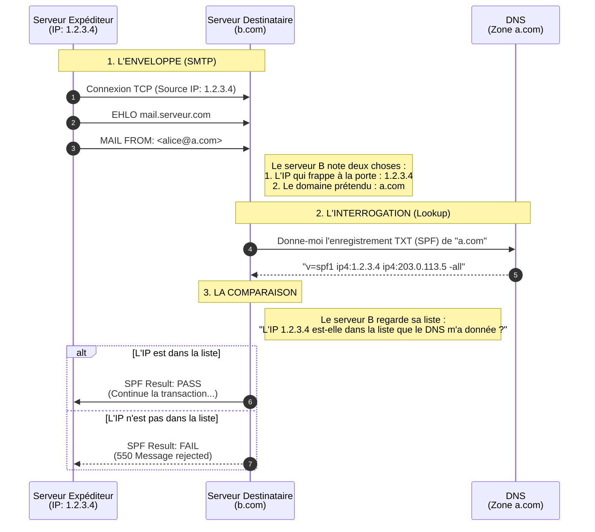

# Principe de fonctionnement

Standardisé en 2006 ([RFC 4408](https://www.rfc-editor.org/rfc/rfc4408)), mis à jour en 2014 ([RFC 7208](https://www.rfc-editor.org/rfc/rfc7208)).

Le SPF agit comme un annuaire de confiance. Le propriétaire du domaine `a.com` publie dans son DNS (enregistrement `TXT`) la liste des IPs autorisées à envoyer des e-mails en son nom.  
Lorsqu'un e-mail arrive, le serveur de réception vérifie l'IP d'envoi par rapport à cette liste. Attention : Le SPF vérifie le domaine indiqué dans le `Return-Path` (l'enveloppe), et non le `From` (l'en-tête visible).

# Limites : La délégation, Forwarding et intégrité du message

Le SPF présente deux faiblesses majeures :
1.  **Délégation sophistiquée des ESP et problème d'alignement** : Si `a.com` utilise un ESP comme Mailjet, l'e-mail aura un `Return-Path` chez `mailjet.com` (pour gérer les rebonds) et un `From` chez `a.com`. Le SPF validera l'IP de Mailjet pour le domaine `mailjet.com`. Le SPF passe, mais il ne valide pas que l'expéditeur visible (`a.com`) est légitime, ce qui laisse parfois place à une falsification visuelle pour l'utilisateur. Nous verrons plus tard que DMARC vient pallier ce problème.
2.  **Le Forwarding** : Si un e-mail est transféré automatiquement d'une boîte A vers une boîte B, l'IP d'envoi change (c'est celle du serveur de transfert), mais le `Return-Path` reste souvent celui de l'expéditeur original. L'IP du serveur de transfert n'étant pas dans la liste SPF de l'expéditeur, le SPF échoue.
3.  **L'intégrité de message** : Si SPF permet de vérifier qu'un mail a été légitimement émis par `a.com`, il ne permet pas de valider que le message n'a pas été modifié lors de son transfert. Il faudra s'appuyer sur DKIM pour confirmer que le message n'a pas été altéré comme nous le verrons plus tard.
4. **La contrainte technique : La limite des 10 requêtes DNS :** Pour éviter que la vérification SPF ne serve de vecteur d'attaque par déni de service (DoS) sur les infrastructures DNS, l'évaluation d'un enregistrement SPF ne doit pas générer plus de 10 requêtes DNS supplémentaires. 

## Délégation sophistiquée des ESP et problème d'alignement

Le problème se pose lorsque le propriétaire d'un domaine (`a.com`) délègue l'envoi de ses e-mails à un Fournisseur de Services de Messagerie (ESP) comme Mailjet.

### Le Mécanisme Classique du SPF

Le SPF fonctionne en vérifiant si l'adresse IP d'envoi est autorisée par le domaine du `Return-Path` (le domaine de l'enveloppe) :
- Expéditeur : `alice@a.com`
- Adresse IP : L'IP appartient à Mailjet.
- `Return-Path` : Dans une configuration standard, l'ESP utilise son propre domaine pour gérer les rebonds (ex : `bounce-id@mailjet.com`).

Le serveur récepteur (`b.com`) effectue la vérification SPF :
- Il regarde le `Return-Path` : `mailjet.com`.
- Il consulte le record SPF de `mailjet.com`.
- Il constate que l'IP est bien dans la liste des IPs autorisées par `mailjet.com`.
- Résultat SPF : `PASS`.

### L'Échec de l'Authentification de l'Utilisateur Final

Le problème est que le SPF a validé la légitimité de Mailjet, mais n'a rien prouvé concernant la légitimité de l'expéditeur : `a.com` :
- Le serveur récepteur sait que Mailjet a envoyé l'e-mail.
- Le serveur récepteur ne vérifie pas que l'utilisateur qui a configuré le `From` en `alice@a.com` est effectivement légitime pour émettre un e-mail de `a.com`.

### Le Contournement du Problème

C'est là que le SPF seul montre ses limites en matière d'anti-usurpation (anti-spoofing) :  
Une personne mal intentionnée (un spammeur) pourrait :
- Utiliser l'infrastructure de Mailjet avec son propre compte ou un compte piraté.
- Régler le champ From à `president@whitehouse.gov`.
- Le `Return-Path` restera `bounce-id@bnc3.mailjet.com`.
- Vérification SPF : L'e-mail passe, car l'IP est autorisée par le domaine `mailjet.com`.
- Conclusion : Le SPF seul permet de valider le chemin d'envoi (l'ESP), mais ne garantit pas que le domaine visible (`From`) a été utilisé légitimement, car il y a un désalignement entre le domaine du `From` (`whitehouse.gov`) et le domaine vérifié par SPF (`mailjet.com`).  
    Le SPF est donc aveugle à cette délégation sophistiquée : il voit juste que le `Return-Path` est bien géré.  
    C'est précisément pour remédier à ce manque d'alignement du domaine visible (`From`) que le protocole **DMARC** a été créé. DMARC exige que le domaine du `Return-Path` (vérifié par SPF) soit aligné avec le domaine du `From` (ou que le domaine de la signature DKIM soit aligné avec le domaine du `From` comme nous le verrons plus tard).

## Le SPF ne résiste pas au forward d'e-mail

Le transfert (forward) d'e-mail est le talon d'Achille du SPF.  
Imaginons qu'Alice (`a.com`) envoie un e-mail à Bob (`b.com`).  
Bob a configuré une redirection automatique de sa boîte pro vers sa boîte perso (`c.com`).  
Le serveur de Bob reçoit l'e-mail (SPF valide : l'IP d'Alice est OK).  
Le serveur de Bob transfère l'e-mail vers `c.com`.  
Le problème : Du point de vue du serveur `c.com`, l'e-mail provient de l'adresse IP du serveur de Bob (`b.com`), mais l'adresse d'expéditeur (`Return-Path`) indique toujours `a.com`.  
Le serveur `c.com` va vérifier le SPF : "Est-ce que l'IP de Bob (`b.com`) est autorisée à envoyer des e-mails pour le domaine `a.com` ?" La réponse est NON. Le SPF échoue. C'est pourquoi le SPF seul ne permet pas, dans le cas du forward d'e-mail, de garantir la légitimité de l'e-mail d'Alice `a.com` aux yeux du serveur d'e-mail de `c.com`.  
Dans ce cas, il faudra utiliser un autre protocole DKIM pour valider l'authenticité de l'e-mail.

## La contrainte technique : La limite des 10 requêtes DNS

Pour éviter que la vérification SPF ne serve de vecteur d'attaque par déni de service (DoS) sur les infrastructures DNS, la [RFC 7208 impose une limite stricte : l'évaluation d'un enregistrement SPF ne doit pas générer plus de 10 requêtes DNS supplémentaires.](https://datatracker.ietf.org/doc/html/rfc7208#section-4.6.4) 

Chaque mécanisme qui demande au serveur de réception d'interroger le DNS compte pour 1 : cela concerne les `include`, `a`, `mx`, `ptr` et `exists`. Attention, cela est récursif : si vous faites un `include:spf.protection.outlook.com` et que Microsoft fait lui-même un `include` dans son record, cela compte pour 2 requêtes. En revanche, les mécanismes `ip4` et `ip6` sont "gratuits" car ils ne nécessitent pas d'interrogation DNS.

**Le danger :** Si vous cumulez trop de prestataires (ex: Google + Salesforce + Mailjet + Zendesk), vous dépasserez cette limite. Le résultat sera un `PermError immédiat, provoquant le rejet de vos e-mails ou leur classement en spam, même si l'IP expéditrice était techniquement autorisée.
