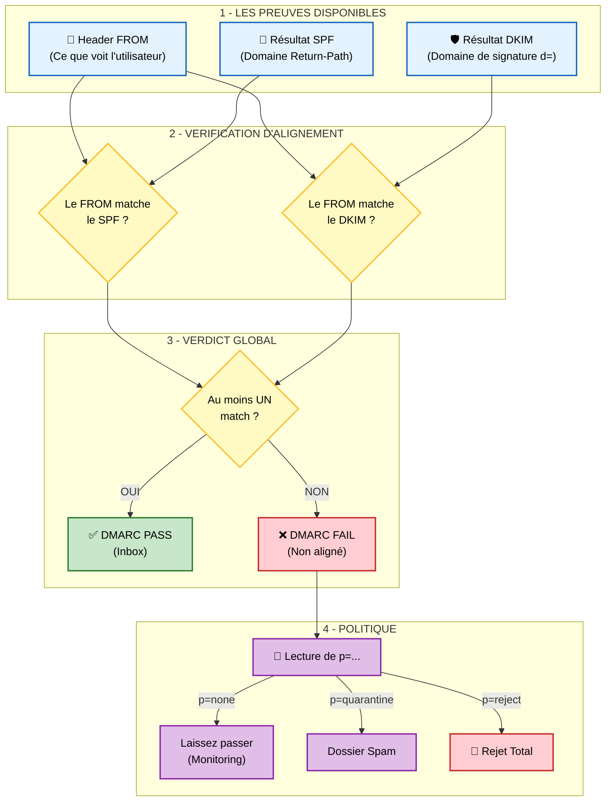

## Le Chef d'Orchestre

Publié en 2015 ([RFC 7489](https://www.rfc-editor.org/rfc/rfc7489)).

Jusqu'ici, nous avons vu que :
- SPF valide l'IP mais vérifie le `Return-Path`, pas le `From`.
- DKIM valide le contenu et vérifie le domaine de la signature (`d=`). Il ne vérifie pas le `From`.

**DMARC (Domain-based Message Authentication, Reporting, and Conformance)** ne propose pas une nouvelle méthode d'authentification technique, mais une couche de politique qui s'appuie sur SPF et DKIM pour résoudre le problème de **l'alignement**.

DMARC utilise les résultats de SPF et DKIM et ajoute une règle simple : **Pour que l'e-mail soit valide, le domaine visible par l'utilisateur (le `From`) doit être "aligné" (identique) avec au moins l'un des deux protocoles authentifiés (soit le domaine du SPF, soit le domaine du DKIM)**.

## Les 3 piliers de DMARC

1. **L'Alignement (Identifier Alignment) :** DMARC vérifie si le domaine du `From` correspond soit au domaine validé par SPF (celui du `Return-Path`), soit au domaine de la signature DKIM (le tag `d=` du champ d'en-tête `DKIM-Signature`). On appelle "alignement" cette correspondance. C'est ce qui empêche un spammeur d'utiliser par exemple l'infrastructure de Mailjet (SPF valide pour Mailjet) pour envoyer un e-mail avec `From: president@whitehouse.gov`. DMARC échoue car `whitehouse.gov` n'est pas aligné avec `mailjet.com`. C'est ce mécanisme qui empêche enfin le spoofing d'adresse visible.
2. **La Politique (Policy) :** DMARC permet au propriétaire du domaine de dire au récepteur quoi faire si la validation échoue. C'est défini par la balise `p=` dans le DNS :
- `p=none` : **Observation uniquement**. "Dis-moi juste qui échoue, mais laisse passer l'e-mail." (Idéal pour commencer et auditer).
- `p=quarantine` : **Mise en doute**. "Mets les e-mails qui échouent dans le dossier Spam du destinataire."
- `p=reject` : **Protection maximale**. "Rejette purement et simplement les e-mails qui échouent. Ils n'arriveront jamais."
3. **Le Reporting (RUA/RUF) :** C'est la boucle de rétroaction. Les serveurs de réception (Gmail, Yahoo, etc.) envoient des rapports XML quotidiens à l'adresse définie dans le record DMARC. Cela permet à l'administrateur de savoir exactement qui envoie des e-mails en son nom (légitimement ou non) et de corriger sa configuration avant de passer en mode `reject`.

## Pour aller plus loin

### Note sur le transfert et les Mailing Lists (SRS & ARC)

Vous avez peut-être constaté que certains transferts d'e-mails fonctionnent malgré les limitations de SPF. C'est grâce à deux mécanismes gérés par les serveurs intermédiaires (sur lesquels vous n'avez pas la main) :
1. **SRS (Sender Rewriting Scheme) :** Le serveur de relais réécrit l'enveloppe (Return-Path) pour que le SPF passe avec sa propre IP. Cela corrige le SPF mais casse l'alignement DMARC.
2. **ARC (Authenticated Received Chain) :** Le serveur de relais signe l'état de l'authentification (SPF/DKIM) avant de modifier le message. Cela permet au destinataire final (comme Gmail) de valider l'e-mail via une chaîne de confiance, même si SPF et DKIM échouent techniquement à l'arrivée.
