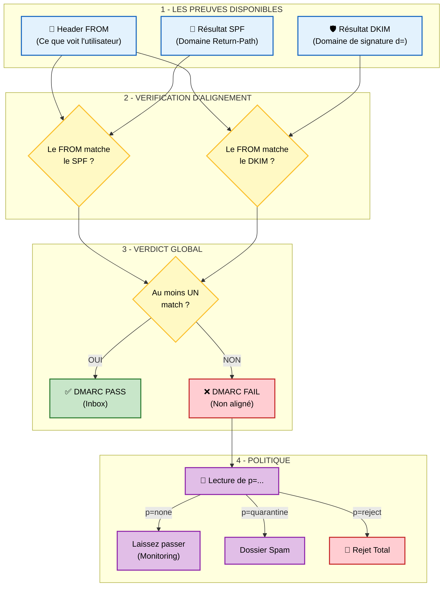



## Le Chef d'Orchestre

Publié en 2015 ([RFC 7489](https://www.rfc-editor.org/rfc/rfc7489)).

Jusqu'ici, nous avons vu que :
- SPF valide l'IP mais vérifie le `Return-Path`, pas le `From`.
- DKIM valide le contenu et vérifie le domaine de la signature (`d=`). Il ne vérifie pas le `From`.

**DMARC (Domain-based Message Authentication, Reporting, and Conformance)** ne propose pas une nouvelle méthode d'authentification technique, mais une couche de politique qui s'appuie sur SPF et DKIM pour résoudre le problème de **l'alignement**.

DMARC utilise les résultats de SPF et DKIM et ajoute une règle simple : **Pour que l'e-mail soit valide, le domaine visible par l'utilisateur (le `From`) doit être "aligné" (identique) avec au moins l'un des deux protocoles authentifiés (soit le domaine du SPF, soit le domaine du DKIM)**.

## Les 3 piliers de DMARC

1. **L'Alignement (Identifier Alignment) :** DMARC vérifie si le domaine du `From` correspond soit au domaine validé par SPF (celui du `Return-Path`), soit au domaine de la signature DKIM (le tag `d=` du champ d'en-tête `DKIM-Signature`). On appelle "alignement" cette correspondance. C'est ce qui empêche un spammeur d'utiliser par exemple l'infrastructure de Mailjet (SPF valide pour Mailjet) pour envoyer un e-mail avec `From: president@whitehouse.gov`. DMARC échoue car `whitehouse.gov` n'est pas aligné avec `mailjet.com`. C'est ce mécanisme qui empêche enfin le spoofing d'adresse visible.
2. **La Politique (Policy) :** DMARC permet au propriétaire du domaine de dire au récepteur quoi faire si la validation échoue. C'est défini par la balise `p=` dans le DNS :
- `p=none` : **Observation uniquement**. "Dis-moi juste qui échoue, mais laisse passer l'e-mail." (Idéal pour commencer et auditer).
- `p=quarantine` : **Mise en doute**. "Mets les e-mails qui échouent dans le dossier Spam du destinataire."
- `p=reject` : **Protection maximale**. "Rejette purement et simplement les e-mails qui échouent. Ils n'arriveront jamais."
3. **Le Reporting (RUA/RUF) :** C'est la boucle de rétroaction. Les serveurs de réception (Gmail, Yahoo, etc.) envoient des rapports XML quotidiens à l'adresse définie dans le record DMARC. Cela permet à l'administrateur de savoir exactement qui envoie des e-mails en son nom (légitimement ou non) et de corriger sa configuration avant de passer en mode `reject`.

```mermaid
graph TD
  %% --- Styles ---
  classDef input fill:#e3f2fd,stroke:#1565c0,stroke-width:2px,color:#000
  classDef check fill:#fff9c4,stroke:#fbc02d,stroke-width:2px,color:#000
  classDef pass fill:#c8e6c9,stroke:#2e7d32,stroke-width:2px,color:#000
  classDef fail fill:#ffcdd2,stroke:#c62828,stroke-width:2px,color:#000
  classDef policy fill:#e1bee7,stroke:#8e24aa,stroke-width:2px,color:#000
  %% --- ETAPE 1 : LES PREUVES ---
  subgraph INPUTS ["1 - LES PREUVES DISPONIBLES"]
      HeaderFrom["👤 Header FROM<br/>(Ce que voit l'utilisateur)"]:::input
      
      SPF_Res["🚚 Résultat SPF<br/>(Domaine Return-Path)"]:::input
      DKIM_Res["🛡️ Résultat DKIM<br/>(Domaine de signature d=)"]:::input
  end
  %% --- ETAPE 2 : LE TEST D'ALIGNEMENT ---
  subgraph ALIGNMENT ["2 - VERIFICATION D'ALIGNEMENT"]
      %% Liens invisibles pour forcer la structure
      HeaderFrom --> CompareSPF
      HeaderFrom --> CompareDKIM
      
      CompareSPF{"Le FROM matche<br/>le SPF ?"}:::check
      CompareDKIM{"Le FROM matche<br/>le DKIM ?"}:::check
      
      SPF_Res --> CompareSPF
      DKIM_Res --> CompareDKIM
  end
  %% --- ETAPE 3 : LE VERDICT DMARC ---
  subgraph VERDICT ["3 - VERDICT GLOBAL"]
      FinalDecision{"Au moins UN<br/>match ?"}:::check
      
      CompareSPF --> FinalDecision
      CompareDKIM --> FinalDecision
      
      FinalDecision -- OUI --> DMARC_OK["✅ DMARC PASS<br/>(Inbox)"]:::pass
      FinalDecision -- NON --> DMARC_FAIL["❌ DMARC FAIL<br/>(Non aligné)"]:::fail
  end
  %% --- ETAPE 4 : APPLICATION POLITIQUE ---
  subgraph ENFORCEMENT ["4 - POLITIQUE"]
      PolicyCheck["👮 Lecture de p=..."]:::policy
      
      DMARC_FAIL --> PolicyCheck
      
      PolicyCheck -- "p=none" --> ActNone["Laissez passer<br/>(Monitoring)"]:::policy
      PolicyCheck -- "p=quarantine" --> ActSpam["Dossier Spam"]:::policy
      PolicyCheck -- "p=reject" --> ActReject["🚫 Rejet Total"]:::fail
  end
```

## Pour aller plus loin

### Les deux modes d'alignement : `relaxed` et `strict`

L'alignement décrit plus haut peut être plus ou moins tolérant. DMARC définit deux modes, configurables indépendamment pour SPF et pour DKIM via les balises `aspf` et `adkim` de l'enregistrement DMARC :

- **`relaxed` (mode par défaut, valeur `r`)** : l'alignement est validé dès lors que les deux domaines partagent le même **domaine organisationnel** (le domaine « racine » enregistrable, par exemple `a.com` pour `bnc3.a.com` comme pour `mail.a.com`). Un sous-domaine suffit donc à s'aligner avec son domaine racine.
- **`strict` (valeur `s`)** : l'alignement exige une correspondance **exacte** des domaines. `bnc3.a.com` n'est alors *pas* considéré comme aligné avec `a.com`.

En l'absence des balises `aspf=`/`adkim=`, c'est le mode `relaxed` qui s'applique. C'est le comportement le plus courant, et c'est lui qui rend possible la technique du return-path personnalisé décrite ci-dessous.

### Aligner SPF : le return-path personnalisé (custom Return-Path)

Rappelons que SPF s'évalue sur le domaine de l'enveloppe (le `Return-Path`), et non sur le `From`. Pour DMARC, il ne suffit donc pas que SPF soit `PASS` : encore faut-il que le domaine ainsi validé soit **aligné** avec le `From`.

Or, par défaut, un ESP gère les rebonds sous son propre domaine. Prenons Mailjet :

- Le `Return-Path` par défaut est du type `…@bnc3.mailjet.com`.
- SPF y est `PASS` (l'IP est bien autorisée par `mailjet.com`), mais le domaine organisationnel validé est `mailjet.com`, alors que le `From` est `…@a.com`.
- **L'alignement SPF échoue** : `mailjet.com` ≠ `a.com`.

La parade consiste à configurer un **return-path personnalisé** : on publie un sous-domaine de son propre domaine (par exemple `bnc3.a.com`) en `CNAME` vers l'infrastructure de rebond de l'ESP (`bnc3.mailjet.com`). L'enveloppe porte alors `…@bnc3.a.com`, dont le domaine organisationnel est `a.com` : **l'alignement SPF passe** (en mode `relaxed`).

| | Return-path par défaut | Return-path personnalisé |
| --- | --- | --- |
| Domaine de l'enveloppe | `bnc3.mailjet.com` | `bnc3.a.com` (`CNAME` → `bnc3.mailjet.com`) |
| Résultat SPF (RFC 7208) | `PASS` | `PASS` |
| Domaine organisationnel validé | `mailjet.com` | `a.com` |
| Alignement SPF (`relaxed`) avec `From: …@a.com` | ❌ échoue | ✅ passe |

À noter : ce return-path personnalisé n'est pas strictement indispensable pour que DMARC passe. Les ESP délèguent aussi la signature DKIM sous votre domaine (via des `CNAME` de sélecteur), ce qui procure un **alignement DKIM**. Comme DMARC se satisfait de l'alignement d'*un seul* des deux protocoles, un DKIM aligné suffit. Le return-path personnalisé apporte donc surtout de la **robustesse** (DMARC repose alors sur deux canaux alignés au lieu d'un seul), et certains l'apprécient aussi pour faire figurer leur propre domaine dans le `Return-Path`.

### Où publier (ou non) le SPF d'un prestataire

Tout ce qui précède se résume à une règle simple, qui déroute souvent :

- Si les rebonds (bounces) d'un envoi sont gérés sous **votre** domaine — un sous-domaine réellement présent dans votre zone DNS, avec son propre enregistrement `TXT` (c'est le cas d'Amazon SES en « custom MAIL FROM domain ») — alors c'est **là**, sur ce sous-domaine, que vous devez publier l'`include` SPF du prestataire.
- Si les rebonds sont gérés sous le **domaine du prestataire** — son propre domaine, ou un sous-domaine chez vous en simple `CNAME` vers son infrastructure (le cas de Mailjet avec `bnc3.a.com` → `bnc3.mailjet.com`) — alors le SPF réellement consulté est celui du prestataire. Publier son `include` sur l'apex de votre domaine (`a.com`) **ne sert à rien pour l'authentification** : cet enregistrement n'est jamais interrogé pour ces envois.

Ce dernier point est contre-intuitif : l'interface de certains ESP (Mailjet, par exemple) réclame malgré tout cet `include` sur votre domaine racine et affiche une alerte en son absence, alors qu'il est **purement cosmétique**. Le support de Mailjet nous l'a confirmé explicitement (échange du vendredi 10 juillet 2026) : cet `include` sert uniquement à afficher une coche verte dans l'interface, et son absence n'affecte pas la délivrabilité dès lors que le return-path est correctement configuré. Il n'a donc aucun effet sur la délivrabilité, mais il consomme l'une de vos [10 requêtes DNS autorisées par SPF](04-spf-sender-policy-framework.md). À conserver si vous êtes loin de cette limite (pour éviter qu'un administrateur ne s'alarme d'une fausse alerte), à retirer si vous manquez de place.

### Note sur le transfert et les Mailing Lists (SRS & ARC)

Vous avez peut-être constaté que certains transferts d'e-mails fonctionnent malgré les limitations de SPF. C'est grâce à deux mécanismes gérés par les serveurs intermédiaires (sur lesquels vous n'avez pas la main) :
1. **SRS (Sender Rewriting Scheme) :** Le serveur de relais réécrit l'enveloppe (Return-Path) pour que le SPF passe avec sa propre IP. Cela corrige le SPF mais casse l'alignement DMARC.
2. **ARC (Authenticated Received Chain) :** Le serveur de relais signe l'état de l'authentification (SPF/DKIM) avant de modifier le message. Cela permet au destinataire final (comme Gmail) de valider l'e-mail via une chaîne de confiance, même si SPF et DKIM échouent techniquement à l'arrivée.

## Quelques URL utiles
- https://easydmarc.com/tools/dmarc-lookup : Vérifie la syntaxe du DMARC et donne des informations relatives au DMARC du domaine vérifié.
