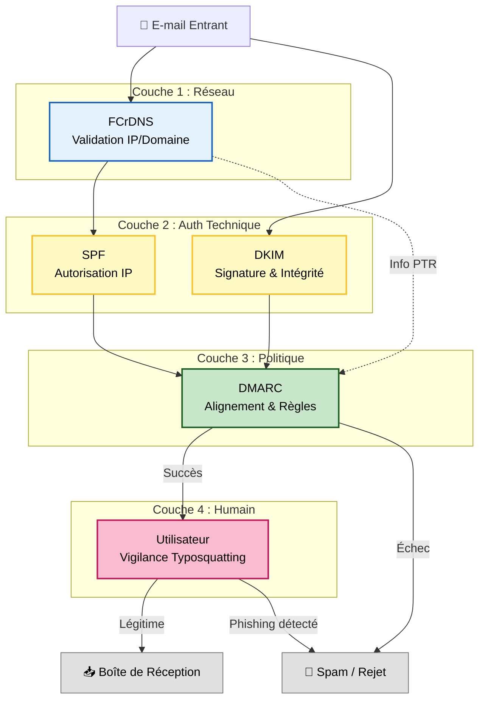

# Synthèse et conclusion

| Mécanisme | Date / RFC | Image | Rôle | Limites Clés |
| --- | --- | --- | --- | --- |
| FCrDNS | ~1990s | Le contrôle technique du camion qui transporte les enveloppes. | Valide que le **propriétaire de l'infrastructure** (celui qui contrôle l'IP / L3) et le **propriétaire de l'identité** (celui qui contrôle le Domaine / L7) sont d'accord.    Vérifie que le `PTR` de l'émetteur ne soit pas générique. | Ne prouve pas que l'IP source est légitime pour envoyer un e-mail au nom du domaine expéditeur ni que le message n'a pas été falsifié. |
| SPF | 2006 ([RFC 4408](https://www.rfc-editor.org/rfc/rfc4408))    2014 ([RFC 7208](https://www.rfc-editor.org/rfc/rfc7208)) | Valide que le camion est autorisé à transporter le courrier de l'émetteur. | Autorise une liste d'IPs à envoyer des e-mails au nom du domaine indiqué dans le `Return-Path`. | Vulnérable aux redirections. Pas d'alignement avec le champ visible (`From`). |
| DKIM | 2007 ([RFC 4871](https://www.rfc-editor.org/rfc/rfc4871))    2011 ([RFC 6376](https://www.rfc-editor.org/rfc/rfc6376)) | Sceau de cire numérique    Scellé de preuves de la police | Garantit l'intégrité et l'authenticité du message par l'ajout d'une signature cryptographique au message. (`d=` dans l'en-tête DKIM). | Pas d'alignement obligatoire avec `From`.    Ne garantit pas la confidentialité (l'e-mail reste lisible). |
| DMARC | 2015 ([RFC 7489](https://www.rfc-editor.org/rfc/rfc7489)) | Le Majordome (Chef du protocole).    Vérifie que l'en-tête de la lettre est aligné soit avec l'adresse au dos de l'enveloppe (SPF) soit avec le sceau de cire numérique (Signature DKIM) | Vérifie l'alignement du domaine vérifié par SPF ou DKIM avec le domaine visible (`From`).    Définit la politique de gestion des échecs (`none`, `quarantine`, `reject`).    Permet le reporting (RUA/RUF) | Fonctionne uniquement si SPF/DKIM sont implémentés et que la politique est active. |

La sécurisation des e-mails n'est pas l'affaire d'un seul protocole, mais repose sur une stratégie de défense en profondeur. La combinaison des protocoles FCrDNS, SPF, DKIM et DMARC permet de créer une chaîne de confiance robuste, rendant l'usurpation d'identité technique (spoofing) quasi impossible, à condition que la chaîne ne soit pas brisée.

Pour garantir cette sécurité, deux conditions sont impératives :
1.  **Une configuration stricte côté émetteur** : Les administrateurs de domaines doivent viser l'excellence :
- SPF verrouillé avec `-all` (Hard Fail).
- DMARC en politique `p=reject` (Rejet pur et simple des échecs).
2.  **Une validation rigoureuse côté récepteur** : Les serveurs de réception doivent effectuer les contrôles cryptographiques et DNS en temps réel. C'est aujourd'hui le standard chez les géants du secteur (Gmail, Microsoft, Yahoo, Proton, etc.).

Si ces protocoles ferment la porte à l'usurpation technique (envoyer un e-mail en tant que president@whitehouse.gov), ils ne peuvent pas empêcher l'ingénierie sociale. Une fois la barrière technique levée, la vigilance de l'utilisateur reste le dernier rempart contre les attaques qui contournent les protocoles :
- **Le Typosquatting (Homoglyphes)** : L'attaquant achète un domaine légitime qui ressemble visuellement à la cible (ex : bance-postale.fr au lieu de banque-postale.fr). DMARC validera cet e-mail car il provient légitimement du domaine de l'attaquant.
- **Le Display Name Spoofing** : L'attaquant utilise une adresse générique (ex : jean.pirate@gmail.com) mais modifie le nom d'affichage pour qu'il apparaisse comme "Support Technique" ou "Votre PDG".

En résumé, si DMARC garantit que l'expéditeur est bien celui qu'il prétend être techniquement, il ne garantit pas que ses intentions sont bienveillantes. L'éducation des utilisateurs à la vérification systématique du domaine dans le champ From demeure indispensable et complémentaire des mesures techniques.

Le diagramme suivant synthétise la pile de sécurité d'e-mail :

Enfin si FCrDNS, SPF, DKIM et DMARC sont les "défenses anti usurpation". Les alias standards sont les "yeux et les oreilles" de cette défense (pour recevoir les plaintes FBL et les rapports d'erreurs).

Quelques URL utiles :
- https://postmaster.google.com
- https://www.mail-tester.com
- https://dmarc.postmarkapp.com
