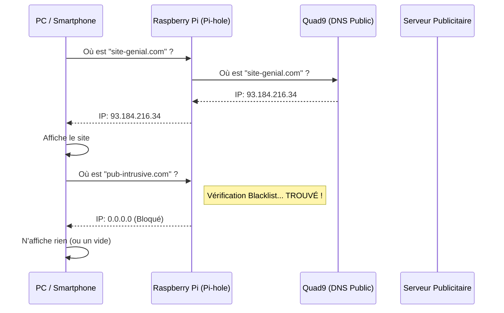

Le Raspberry Pi 1, bien qu'ancien, est loin d'être obsolète. Il possède exactement la puissance nécessaire pour une tâche critique de votre réseau domestique : agir comme un **sinkhole DNS**.

Dans cet article, nous allons voir comment transformer ce petit ordinateur en un bouclier qui protège tous vos appareils (PC, smartphones, tablettes, TV connectées) contre la publicité intrusive, les traceurs et les sites malveillants, le tout sans ralentir votre navigation.

Nous aborderons spécifiquement le cas d'une installation derrière une **Freebox Révolution**, avec des clients sous **GNU/Linux (Fedora/Debian)**.

## Pourquoi installer Pi-hole ?

Lorsque vous naviguez sur Internet, votre ordinateur doit traduire les noms de domaine (comme `google.com`) en adresses IP (comme `142.250.x.x`). C'est le rôle du serveur DNS.

Par défaut, vous utilisez celui de votre fournisseur d'accès (Free). Pi-hole vient s'intercaler entre vos appareils et Internet.

1.  Votre ordinateur demande : "Où est `doubleclick.net` (une régie pub) ?"
2.  Pi-hole consulte sa liste noire.
3.  Si le site est bloqué, Pi-hole répond "Nulle part" (0.0.0.0). La pub ne se charge pas.
4.  Si le site est légitime, Pi-hole transmet la demande à un serveur DNS de confiance (nous utiliserons Quad9).

Voici comment cela fonctionne schématiquement :


## Prérequis

* Un **Raspberry Pi 1** (Modèle B dans mon cas).
* **Raspberry Pi OS Lite** (anciennement Raspbian) déjà installé et configuré (SSH activé, IP fixe ou bail DHCP statique).
* Une connexion Ethernet (préférable au Wi-Fi pour un serveur DNS).

## Étape 1 : Préserver la carte SD avec Log2Ram

C'est l'étape la plus importante pour la longévité d'un Raspberry Pi 1. Les cartes SD détestent les écritures répétées. Or, un serveur DNS écrit des journaux (logs) en permanence.

Nous allons utiliser **Log2Ram**, un outil qui crée un disque virtuel en mémoire vive (RAM) pour y stocker les logs (`/var/log`). Ils ne sont écrits sur la carte SD qu'une fois par jour ou à l'extinction.

Cela nous permet d'activer le *Query Logging* de Pi-hole (pour voir les statistiques) sans tuer la carte SD. Sans Log2Ram, une carte SD standard peut tenir entre 6 mois et 2 ans selon sa qualité.

Connectez-vous à votre Pi en SSH et lancez l'installation :

```bash
echo "deb [signed-by=/usr/share/keyrings/azlux-archive-keyring.gpg] http://packages.azlux.fr/debian/ $(bash -c '. /etc/os-release; echo ${VERSION_CODENAME}') main" | sudo tee /etc/apt/sources.list.d/azlux.list
sudo wget -O /usr/share/keyrings/azlux-archive-keyring.gpg  https://azlux.fr/repo.gpg
sudo apt update
sudo apt install log2ram
```

**Important :** Redémarrez le Pi immédiatement après l'installation.

```bash
sudo reboot
```

### Optimisation pour le RPi 1 (512 Mo RAM)

Par défaut, la taille allouée peut être trop généreuse ou inadaptée (128MiB). Pour un RPi 1, 64 Mo suffisent largement pour les logs.

Éditez le fichier de configuration :

```bash
sudo vi /etc/log2ram.conf
```

Modifiez les variables suivantes :

```bash
SIZE=64M
LOG_DISK_SIZE=128M
```

Redémarrez à nouveau pour appliquer les changements. Vous pouvez vérifier avec la commande `df -h /var/log` que le montage est bien de type `log2ram` et fait 64M.

## Étape 2 : Installation de Pi-hole

Une fois la carte SD protégée, l'installation de Pi-hole est un jeu d'enfant. Lancez la commande officielle :

```bash
curl -sSL https://install.pi-hole.net | bash
```

L'installateur va vous guider à travers plusieurs écrans bleus.

### Le choix du DNS Upstream : Quad9

Lorsqu'on vous demandera de choisir un "Upstream DNS Provider", je vous conseille vivement de sélectionner **Quad9 (filtered, DNSSEC)**.

Pourquoi Quad9 ?
1.  **Sécurité :** Il bloque les domaines malveillants connus.
2.  **Confidentialité vs Performance (ECS) :** J'ai volontairement sélectionné l'option sans EDNS Client Subnet (ECS). Cette technologie permet d'envoyer une partie de votre adresse IP aux serveurs pour mieux vous géolocaliser, ce qui peut améliorer la vitesse de chargement via les CDN (Youtube, Netflix, etc.). Cependant, si vous habitez près d'une grande ville ou d'un nœud Internet majeur, le gain de performance est négligeable par rapport à la perte de confidentialité. Je privilégie donc l'option sans ECS. Si vous êtes en zone rurale ou constatez des lenteurs, vous pourrez choisir l'option "Quad9 (filtered, ECS, DNSSEC)" pour optimiser les débits.
3.  **Neutralité :** C'est une fondation à but non lucratif basée en Suisse (pour la partie vie privée).

Une fois l'installation terminée, notez bien le mot de passe de l'interface web (ou changez-le avec `pihole -a -p`).

## Étape 3 : Configuration de la Freebox Révolution

Dans ce scénario, nous laissons la Freebox gérer le DHCP (l'attribution des IP), mais nous lui demandons de distribuer l'adresse du Pi-hole comme serveur DNS.

Rendez-vous sur l'interface de gestion `mafreebox.freebox.fr`. Il y a deux endroits à modifier.

### 1. Le DNS IPv4 (DHCP)

Allez dans **Paramètres de la Freebox > Réseau Local > DHCP**.
Dans la section "Serveurs DNS", indiquez l'adresse IP locale de votre Raspberry Pi (ex: `192.168.1.253`) en tant que DNS 1.

### 2. Le DNS IPv6

C'est souvent l'étape oubliée qui fait que les pubs reviennent ! Les OS modernes priorisent l'IPv6. Si vous ne configurez pas ça, vos appareils contourneront le Pi-hole via l'IPv6 de la Freebox.

Récupérez l'adresse IPv6 **Globale** de votre Raspberry Pi qui n'est **pas** temporaire via la commande `ip -6 addr`.

Allez dans **Paramètres de la Freebox > Configuration IPv6 > DNS IPv6**.
* Cochez "Forcer l'utilisation de serveurs DNS IPv6 personnalisés".
* Collez l'IPv6 du Pi-hole dans le champ DNS Préférentiel.

Je n'ai pas eu besoin de redémarrer la Freebox pour forcer la mise à jour des baux réseau sur tous vos appareils.

## Étape 4 : Validation sur les clients (Linux)

Comment être sûr que votre PC sous Fedora ou Debian utilise bien le Pi-hole ? Ne vous fiez pas uniquement à `ifconfig`, qui ne montre pas les DNS.

### La méthode via NetworkManager

C'est la commande la plus fiable. Ouvrez un terminal et tapez :

```bash
nmcli dev show | grep DNS
```

Vous devriez obtenir un résultat similaire à celui-ci :

```text
IP4.DNS[1]:                             192.168.1.253
IP6.DNS[1]:                             2001:db8:: (L'IP du Pi)
```

Si vous voyez l'IP de la Freebox (`.254`) ou une IPv6 commençant par `fd0f...` (l'adresse locale de la Freebox), c'est que la configuration n'est pas encore prise en compte (déconnectez/reconnectez le réseau).

### La méthode via Systemd-resolved

Sur les distributions récentes comme Fedora :

```bash
resolvectl status
```

Cherchez votre interface réseau et vérifiez la ligne "Current DNS Server". Elle doit pointer vers votre Pi.

### Le test final

Pour vérifier que le blocage fonctionne, essayez de résoudre un domaine publicitaire connu avec `dig` :

```bash
dig mobile.pipe.aria.microsoft.com
```

Si la réponse (ANSWER SECTION) est `0.0.0.0`, félicitations : votre Pi-hole fait son travail de nettoyage !

## Conclusion

Votre Raspberry Pi 1 a désormais une utilité cruciale. Il protège votre vie privée, accélère légèrement votre navigation (en ne chargeant pas les lourds scripts publicitaires) et vous offre une belle interface de statistiques, le tout sans user prématurément sa carte SD grâce à Log2Ram.