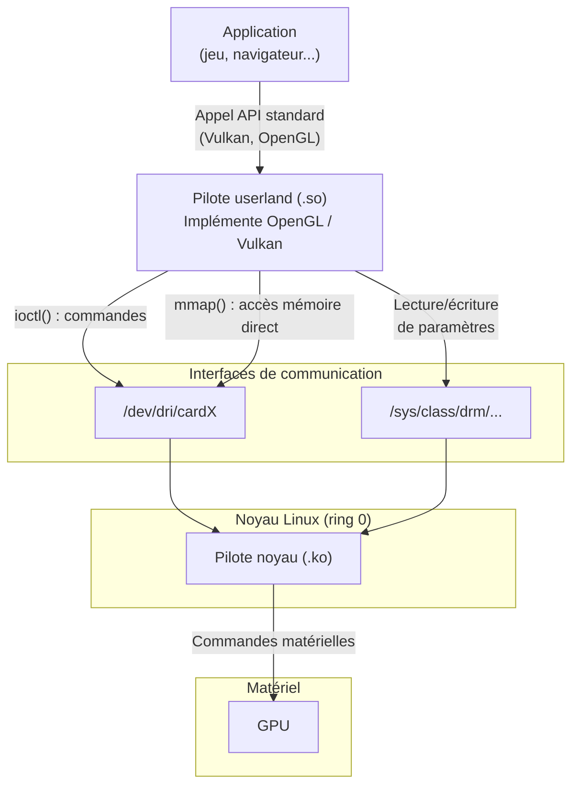



Sous Linux, un pilote n'est pas forcément un bloc monolithique qui vit dans le noyau. Il est souvent **coupé en deux** : une partie dans le noyau, une partie en espace utilisateur. Cet article explique ce découpage et les mécanismes qui permettent aux deux parties de communiquer.

## Pilote noyau vs pilote userland

### Le pilote noyau

Le **pilote noyau** est un module (un fichier `.ko`) chargé dans le noyau Linux. Il s'exécute en **ring 0** (le niveau de privilège le plus élevé du processeur) et a un accès direct au matériel : registres du périphérique, interruptions, DMA, etc.

Exemples de pilotes noyau graphiques :
- `nouveau` (NVIDIA, open-source)
- `amdgpu` (AMD)
- `i915` (Intel)
- `nvidia` (NVIDIA, propriétaire)

### Le pilote userland

Le **pilote userland** est une bibliothèque partagée (un fichier `.so`) qui s'exécute en **ring 3** (espace utilisateur, le même niveau de privilège que vos applications). Ce n'est ni un daemon, ni un service en arrière-plan : la bibliothèque est **chargée directement dans le processus de chaque application** qui utilise le périphérique.

Concrètement, quand un jeu fait un appel Vulkan, le loader Vulkan charge le `.so` du pilote userland dans l'espace mémoire du jeu. Le code du pilote s'exécute alors dans le processus du jeu lui-même.

Un pilote userland se définit par deux caractéristiques :
1. Il **implémente une API standard** (OpenGL, Vulkan, CUDA, SANE, CUPS...) pour un matériel spécifique.
2. Il **communique avec le pilote noyau** pour accéder au matériel.

Ce découpage n'est pas propre au graphisme. On le retrouve pour les imprimantes (CUPS), les scanners (SANE), le réseau haute performance (DPDK), les périphériques USB (libusb), etc.

### Pourquoi ce découpage ?

Mettre toute la logique dans le noyau serait problématique :
- Un bug noyau peut faire **planter tout le système** (kernel panic). Un bug userland ne plante que l'application concernée.
- Le noyau est un environnement contraint : pas de bibliothèques standard, pas d'allocation mémoire facile, débogage difficile.
- La logique complexe (compilation de shaders, gestion de scènes 3D) est plus facile à développer et déboguer en espace utilisateur.

Le pilote noyau se limite donc au strict nécessaire : gérer l'accès au matériel et arbitrer entre les processus. Toute l'intelligence est repoussée dans le pilote userland.

## Les mécanismes de communication

Le pilote userland s'exécute en ring 3, le pilote noyau en ring 0. Pour communiquer, il faut franchir cette frontière. Linux offre plusieurs mécanismes pour cela.

### /dev : le point d'entrée

Le noyau expose chaque périphérique sous forme de **fichier** dans `/dev/`. C'est le principe fondamental d'Unix : *tout est un fichier*.

```
/dev/dri/cardX      → carte graphique (interface DRM, X = numéro attribué au boot)
/dev/dri/renderD128 → carte graphique (rendu uniquement)
/dev/sda            → disque dur
/dev/ttyUSB0        → port série USB
/dev/video0         → webcam
```

Le pilote userland commence toujours par ouvrir un fichier `/dev` avec `open()`. Cet appel retourne un **descripteur de fichier** (*file descriptor*), qui sert de canal de communication vers le pilote noyau. Ensuite, plusieurs opérations sont possibles sur ce descripteur.

### ioctl : les commandes structurées

**`ioctl()`** (*input/output control*) est un appel système qui permet d'envoyer des **commandes arbitraires** au pilote noyau via un descripteur de fichier `/dev`.

```c
int fd = open("/dev/dri/cardX", O_RDWR);  // X = numéro de la carte
ioctl(fd, DRM_IOCTL_MODE_GETRESOURCES, &resources);
```

Chaque appel `ioctl()` provoque une **transition de ring 3 vers ring 0** : le processeur bascule en mode noyau, exécute le code du pilote noyau, puis revient en mode utilisateur avec le résultat.

C'est le mécanisme le plus utilisé par les pilotes graphiques. Le protocole de commandes qu'un pilote noyau expose via `ioctl()` s'appelle l'**uAPI** (*User-space API*). Deux pilotes noyau différents (ex: `nouveau` et `nvidia`) ont des uAPI différentes et incompatibles.

### mmap : l'accès mémoire direct

**`mmap()`** (*memory map*) est un appel système qui permet de **mapper la mémoire d'un périphérique** directement dans l'espace d'adressage du processus userland.

```c
void *buf = mmap(NULL, size, PROT_READ | PROT_WRITE,
                 MAP_SHARED, fd, offset);
// Écriture directe dans la mémoire du GPU, sans appel système
buf[0] = command_data;
```

L'appel `mmap()` lui-même est une transition noyau (ring 3 → ring 0). Mais une fois le mapping établi, **chaque lecture/écriture se fait directement en mémoire, sans repasser par le noyau**. C'est ce qui rend `mmap` essentiel pour les performances graphiques : on mappe des *command buffers* GPU dans l'espace du processus et on y écrit des commandes de rendu à pleine vitesse.

### read()/write() : la lecture/écriture classique

Les opérations `read()` et `write()` classiques fonctionnent aussi sur les fichiers `/dev`. Chaque appel est une transition noyau.

C'est utilisé pour des échanges simples (lire des données d'un port série, écrire sur un périphérique caractère), mais rarement pour les pilotes graphiques où le débit requis est trop élevé.

### sysfs : le tableau de bord

**sysfs** est un système de fichiers virtuel monté sur `/sys/`. Contrairement à `/dev` qui expose **un fichier par périphérique**, sysfs expose **un fichier par paramètre**.

Chaque fichier contient une seule valeur texte, lisible ou modifiable :

```
/sys/class/drm/cardX/device/vendor       → "0x10de"  (fabricant : NVIDIA)
/sys/class/drm/cardX/device/power_state   → "D0"      (état d'alimentation)
/sys/class/backlight/*/brightness          → "75"      (luminosité de l'écran)
/sys/class/net/eth0/mtu                    → "1500"    (taille max des paquets réseau)
```

Si `/dev` est un **téléphone** vers le pilote (on peut dire n'importe quoi, dans n'importe quel format), `/sys` est un **tableau de bord** avec des boutons et des jauges : chaque fichier contrôle ou affiche une seule chose.

En pratique pour un GPU : les commandes de rendu 3D passent par `/dev/dri/cardX` (débit élevé, données binaires complexes), mais lire la température du GPU se fait via sysfs (une simple valeur texte). Le numéro `X` est attribué par le noyau au démarrage et peut varier d'une machine à l'autre.

## Vue d'ensemble

Voici comment tous ces mécanismes s'articulent pour un pilote graphique :



| Mécanisme | Passe par | Transition noyau | Usage typique |
|---|---|---|---|
| `ioctl()` | `/dev` | À chaque appel | Commandes structurées (configuration, soumission de rendu) |
| `mmap()` | `/dev` | Une seule fois (au mapping) | Accès mémoire haute performance (command buffers, VRAM) |
| `read()`/`write()` | `/dev` | À chaque appel | Échanges simples de données |
| lecture/écriture | `/sys` | À chaque appel | Monitoring et configuration (température, fréquences) |