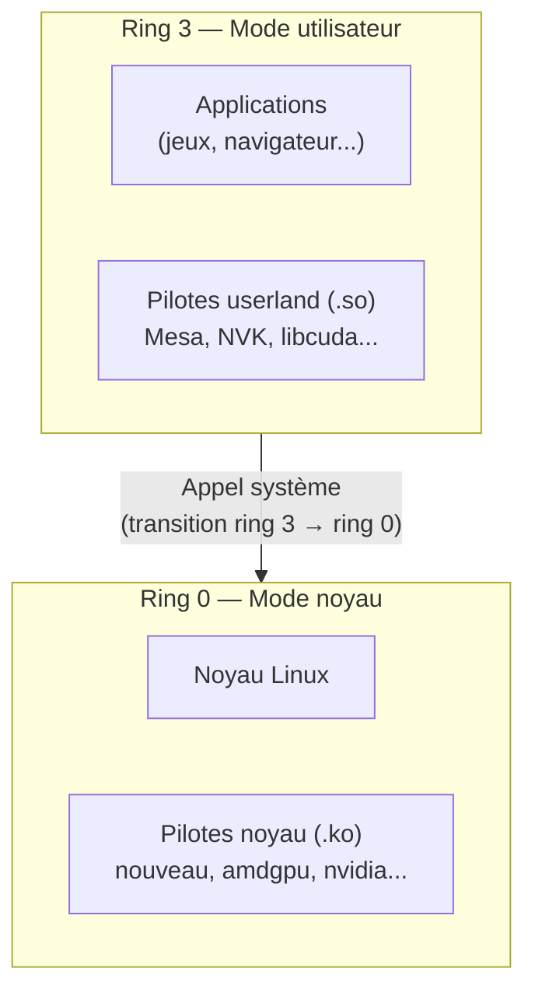
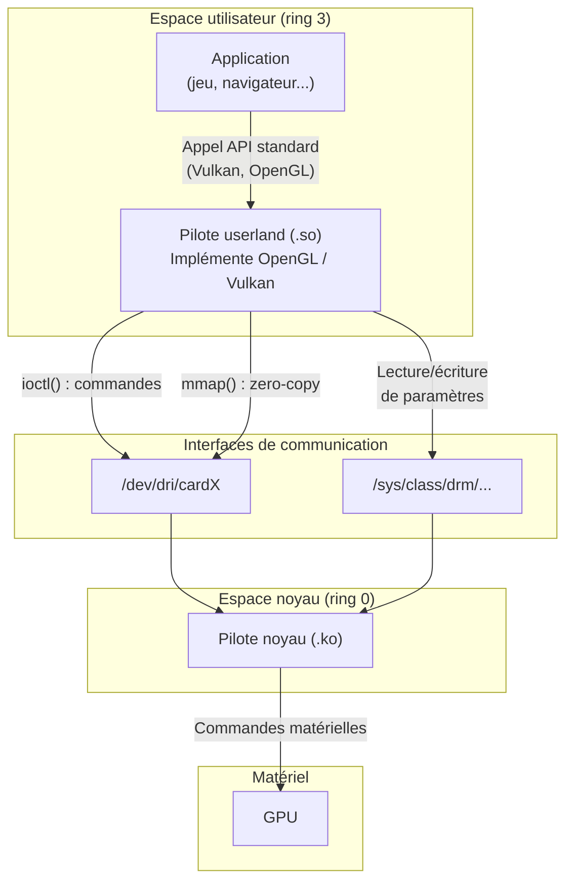



Sous Linux, un pilote n'est pas forcément un bloc monolithique qui vit dans le noyau. Il est souvent **coupé en deux** : une partie dans le noyau, une partie en espace utilisateur. Cet article explique ce découpage et les mécanismes qui permettent aux deux parties de communiquer.

## Les niveaux de privilège du processeur : ring 0 et ring 3

Avant de parler de pilotes, il faut comprendre comment le processeur (CPU) **protège le système** des applications.

Les processeurs x86/x86-64 (Intel, AMD) implémentent un mécanisme de **niveaux de privilège** appelés *rings* (anneaux). Il en existe 4 (ring 0 à ring 3), mais Linux n'en utilise que deux :

- **Ring 0** (mode noyau) : le niveau le plus privilégié. Le code qui s'exécute en ring 0 a un accès **total** au matériel et à toute la mémoire. C'est ici que tourne le noyau Linux et ses modules (dont les pilotes noyau).
- **Ring 3** (mode utilisateur) : le niveau le moins privilégié. Le code qui s'exécute en ring 3 **ne peut pas accéder directement au matériel** ni à la mémoire d'autres processus. C'est ici que tournent toutes les applications : navigateur, jeux, serveur web, et aussi les pilotes userland.



Cette séparation est une **protection matérielle** imposée par le processeur : si une application en ring 3 tente d'accéder directement au matériel, le CPU déclenche une exception et le noyau tue le processus. Pour qu'une application puisse interagir avec le matériel, elle doit **demander au noyau** via un **appel système** (*syscall*). Chaque appel système provoque une transition ring 3 → ring 0 (coûteuse en performance), le noyau exécute l'opération demandée, puis le processeur revient en ring 3.

## Pilote noyau vs pilote userland

### Le pilote noyau

Le **pilote noyau** est un module (un fichier `.ko`) chargé dans le noyau Linux. Il s'exécute en **ring 0** et a un accès direct au matériel : registres du périphérique, interruptions, DMA, etc.

Exemples de pilotes noyau graphiques :
- `nouveau` (NVIDIA, open-source)
- `amdgpu` (AMD)
- `i915` (Intel)
- `nvidia` (NVIDIA, propriétaire)

### Le pilote userland

Le **pilote userland** est le plus souvent une bibliothèque partagée (un fichier `.so`) qui s'exécute en **ring 3** (espace utilisateur, le même niveau de privilège que vos applications). La bibliothèque est **chargée directement dans le processus de chaque application** qui utilise le périphérique — ce n'est ni un daemon, ni un service en arrière-plan.

Concrètement, quand un jeu fait un appel Vulkan, le loader Vulkan charge le `.so` du pilote userland dans l'espace mémoire du jeu. Le code du pilote s'exécute alors dans le processus du jeu lui-même.

> **Note** : cette architecture en bibliothèque partagée est la norme pour les pilotes GPU et réseau haute performance, où chaque microseconde compte. D'autres domaines utilisent parfois des architectures différentes : FUSE (systèmes de fichiers en espace utilisateur) ou certains pilotes USB complexes peuvent fonctionner comme des processus séparés (daemons).

Un pilote userland se définit par deux caractéristiques :
1. Il **implémente une API standard** (OpenGL, Vulkan, CUDA, SANE, CUPS...) pour un matériel spécifique.
2. Il **communique avec le pilote noyau** pour accéder au matériel.

Ce découpage n'est pas propre au graphisme. On le retrouve pour les imprimantes (CUPS), les scanners (SANE), le réseau haute performance (DPDK), les périphériques USB (libusb), etc.

### Pourquoi ce découpage ?

Mettre toute la logique dans le noyau serait problématique :
- Un bug noyau peut faire **planter tout le système** (kernel panic). Un bug userland ne plante que l'application concernée.
- Le noyau est un environnement contraint : pas de bibliothèques standard, pas d'allocation mémoire facile, débogage difficile.
- La logique complexe (compilation de shaders, gestion de scènes 3D) est plus facile à développer et déboguer en espace utilisateur.

Le pilote noyau se limite donc au strict nécessaire : gérer l'accès au matériel et arbitrer entre les processus. Toute l'intelligence est repoussée dans le pilote userland.

## Les mécanismes de communication

Le pilote userland s'exécute en ring 3, le pilote noyau en ring 0. Pour communiquer, il faut franchir cette frontière. Linux offre plusieurs mécanismes pour cela.

La communication est **bidirectionnelle**. Les sections qui suivent couvrent d'abord le sens userland → noyau (le plus fréquent), puis le chemin inverse (noyau → userland).

### /dev : le point d'entrée

Le noyau expose chaque périphérique sous forme de **fichier** dans `/dev/`. C'est le principe fondamental d'Unix : *tout est un fichier*.

```
/dev/dri/cardX      → carte graphique (interface DRM, X = numéro attribué au boot)
/dev/dri/renderD128 → carte graphique (rendu uniquement)
/dev/sda            → disque dur
/dev/ttyUSB0        → port série USB
/dev/video0         → webcam
```

Le pilote userland commence toujours par ouvrir un fichier `/dev` avec `open()`. Cet appel retourne un **descripteur de fichier** (*file descriptor*), qui sert de canal de communication vers le pilote noyau. Ensuite, plusieurs opérations sont possibles sur ce descripteur.

Comme tout fichier Linux, les fichiers `/dev` ont des **permissions**. C'est ce qui empêche un utilisateur standard d'écrire sur `/dev/sda` (votre disque dur) tout en lui permettant d'utiliser `/dev/dri/renderD128` (le GPU). Ces fichiers sont créés dynamiquement par **udev**, le gestionnaire de périphériques de Linux, au moment où le matériel est détecté. C'est udev qui assigne les permissions initiales et les groupes propriétaires (`video`, `render`). Ensuite, **logind** (le gestionnaire de session systemd) ajoute des ACL (*Access Control Lists*) pour accorder automatiquement l'accès aux périphériques graphiques à l'utilisateur de la session active.

### ioctl : les commandes structurées

**`ioctl()`** (*input/output control*) est un appel système qui permet d'envoyer des **commandes arbitraires** au pilote noyau via un descripteur de fichier `/dev`.

```c
int fd = open("/dev/dri/cardX", O_RDWR);  // X = numéro de la carte
ioctl(fd, DRM_IOCTL_MODE_GETRESOURCES, &resources);
```

Chaque appel `ioctl()` provoque une **transition de ring 3 vers ring 0** (un *context switch*) : le processeur bascule en mode noyau, exécute le code du pilote noyau, puis revient en mode utilisateur avec le résultat. Ce changement de contexte a un **coût en performance** (*overhead*) non négligeable, ce qui rend `ioctl()` inadapté aux échanges à très haute fréquence (des milliers de fois par seconde).

C'est le mécanisme le plus utilisé par les pilotes graphiques pour les opérations de configuration et de contrôle. Le protocole de commandes qu'un pilote noyau expose via `ioctl()` s'appelle l'**uAPI** (*User-space API*). Deux pilotes noyau différents (ex: `nouveau` et `nvidia`) ont des uAPI différentes et incompatibles.

Un point important : une règle d'or du développement du noyau Linux (imposée par Linus Torvalds) est que **l'uAPI ne doit jamais casser**. Une fois qu'une interface est publiée dans `/dev` ou `/sys`, le noyau s'engage à la supporter indéfiniment pour ne pas casser les programmes userland existants. C'est pour cette raison que la création d'une nouvelle uAPI (comme `VM_BIND` pour NVK dans le pilote `nouveau`) est un événement significatif : une fois introduite, elle devra être maintenue à vie.

### mmap : l'accès mémoire direct

**`mmap()`** (*memory map*) est un appel système qui permet de **mapper la mémoire d'un périphérique** directement dans l'espace d'adressage du processus userland.

```c
void *buf = mmap(NULL, size, PROT_READ | PROT_WRITE,
                 MAP_SHARED, fd, offset);
// Écriture directe dans la mémoire du GPU, sans appel système
buf[0] = command_data;
```

L'appel `mmap()` lui-même est une transition noyau (ring 3 → ring 0). Mais une fois le mapping établi, **chaque lecture/écriture se fait directement en mémoire, sans repasser par le noyau** (*zero-copy*). Aucun changement de contexte, aucun overhead. C'est ce qui rend `mmap` essentiel pour les performances graphiques : on mappe des *command buffers* GPU dans l'espace du processus et on y écrit des commandes de rendu à pleine vitesse, là où `ioctl()` serait un goulot d'étranglement.

### read()/write() : la lecture/écriture classique

Les opérations `read()` et `write()` classiques fonctionnent aussi sur les fichiers `/dev`. Chaque appel est une transition noyau.

C'est utilisé pour des échanges simples (lire des données d'un port série, écrire sur un périphérique caractère), mais rarement pour les pilotes graphiques où le débit requis est trop élevé.

### sysfs : le tableau de bord

**sysfs** est un système de fichiers virtuel monté sur `/sys/`. Contrairement à `/dev` qui expose **un fichier par périphérique**, sysfs expose **un fichier par paramètre**.

Chaque fichier contient une seule valeur texte, lisible ou modifiable :

```
/sys/class/drm/cardX/device/vendor       → "0x10de"  (ID vendeur PCI en hexadécimal : NVIDIA)
/sys/class/drm/cardX/device/power_state   → "D0"      (état d'alimentation)
/sys/class/backlight/*/brightness          → "75"      (luminosité de l'écran)
/sys/class/net/eth0/mtu                    → "1500"    (taille max des paquets réseau)
```

Si `/dev` est un **téléphone** vers le pilote (on peut dire n'importe quoi, dans n'importe quel format), `/sys` est un **tableau de bord** avec des boutons et des jauges : chaque fichier contrôle ou affiche une seule chose.

En pratique pour un GPU : les commandes de rendu 3D passent par `/dev/dri/cardX` (débit élevé, données binaires complexes), mais lire la température du GPU se fait via sysfs (une simple valeur texte). Le numéro `X` est attribué par le noyau au démarrage et peut varier d'une machine à l'autre.

### poll()/select() : le chemin inverse (noyau → userland)

Tous les mécanismes précédents (`ioctl`, `mmap`, `read`/`write`, `sysfs`) décrivent comment le processus userland **parle au noyau**. Mais le chemin inverse est tout aussi important : quand le GPU a terminé une opération (un rendu, un calcul), le pilote noyau doit **prévenir le processus userland**.

Voici le mécanisme complet, par exemple pour un rendu 3D :

1. Le pilote userland soumet des commandes de rendu au GPU (via `ioctl()` et `mmap()`)
2. Le pilote userland appelle `poll()` sur le descripteur `/dev/dri/cardX` → **le processus s'endort**
3. Le GPU travaille (rendu 3D, calcul...) pendant que le processus ne consomme **aucun CPU**
4. Le GPU termine et déclenche une **interruption matérielle** (*hardware interrupt*)
5. Le CPU interrompt ce qu'il fait et exécute le code du pilote noyau (le *handler* d'interruption, en ring 0)
6. Le pilote noyau marque le descripteur de fichier comme "prêt"
7. Le noyau **réveille** le processus endormi
8. `poll()` retourne, le pilote userland sait que le rendu est terminé

Le point crucial : malgré son nom, **`poll()` ne fait pas de *polling*** (interrogation en boucle). C'est même le contraire : le processus dort vraiment et c'est l'interruption matérielle du GPU qui déclenche la chaîne de réveil. Le nom vient du sens anglais *"consulter"*, pas *"interroger en boucle"*.

La différence avec du vrai polling (attente active) :

```c
// Attente active = mauvais, gaspille du CPU
while (!gpu_finished()) {
    // boucle en consommant 100% du CPU
}

// poll() = bon, le processus dort
poll(fds, 1, timeout);
// Zéro CPU consommé pendant l'attente
// Le noyau réveille le processus quand le GPU a fini
```

Il existe trois variantes de ce mécanisme sous Linux :
- **`select()`** : l'API historique, limitée à ~1024 descripteurs de fichier
- **`poll()`** : la version plus moderne, sans cette limite
- **`epoll()`** : la variante haute performance spécifique à Linux, pour surveiller des milliers de descripteurs simultanément

## Vue d'ensemble

Voici comment tous ces mécanismes s'articulent pour un pilote graphique :



| Mécanisme | Passe par | Transition noyau | Usage typique |
|---|---|---|---|
| `ioctl()` | `/dev` | À chaque appel | Commandes structurées (configuration, soumission de rendu) |
| `mmap()` | `/dev` | Une seule fois (au mapping) | Accès mémoire haute performance, zero-copy (command buffers, VRAM) |
| `read()`/`write()` | `/dev` | À chaque appel | Échanges simples de données |
| lecture/écriture | `/sys` | À chaque appel | Monitoring et configuration (température, fréquences) |