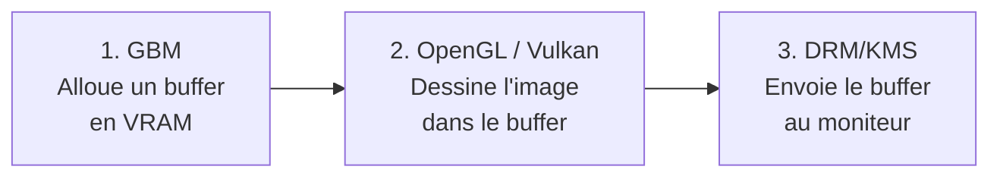
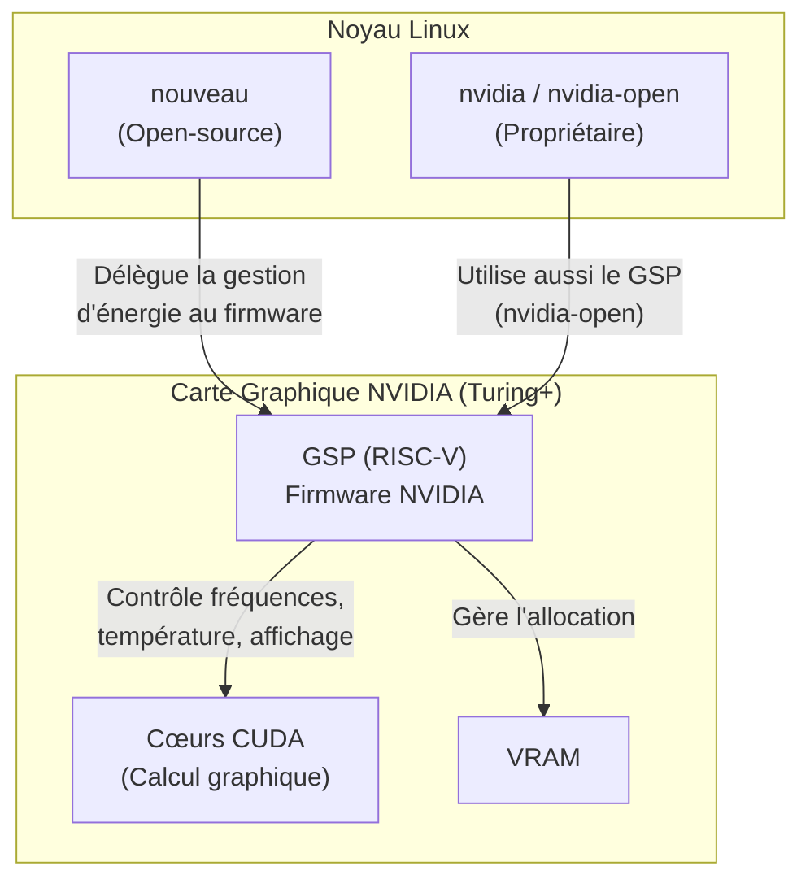
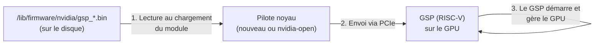
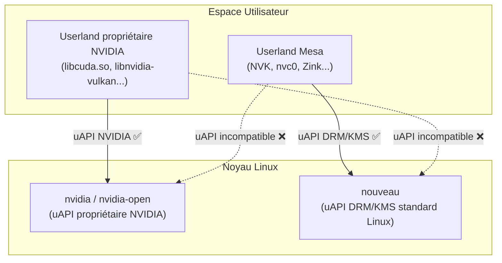



Si vous utilisez une carte graphique NVIDIA sous Linux, vous avez probablement déjà été confronté à une question fondamentale : **quel pilote installer ?** La réponse n'est pas triviale, car deux écosystèmes complets coexistent, chacun avec ses forces et ses limites.

Cet article fait le point sur la situation actuelle. Mais avant de plonger dans le comparatif, il faut comprendre les briques fondamentales de l'affichage sous Linux.

## Les fondamentaux : comment une image arrive sur votre écran

### DRM/KMS : le sous-système d'affichage du noyau

**DRM/KMS** (*Direct Rendering Manager / Kernel Mode Setting*) est un sous-système intégré au **noyau Linux**. C'est la base absolue de tout affichage graphique sous Linux.

- **DRM** (*Direct Rendering Manager*) : gère la communication avec la carte graphique. Il s'assure que plusieurs programmes peuvent utiliser le GPU en même temps sans se marcher sur les pieds.
- **KMS** (*Kernel Mode Setting*) : une fonctionnalité clé à l'intérieur de DRM. Son rôle est purement lié à l'affichage final : il configure la résolution, la profondeur des couleurs, le taux de rafraîchissement, et il prend une image finale en mémoire pour l'envoyer physiquement au moniteur (via HDMI/DisplayPort).

En résumé : DRM/KMS gère le matériel et sait comment allumer les pixels de votre écran.

Tous les pilotes graphiques open-source intégrés au noyau Linux (Intel `i915`, AMD `amdgpu`, Nouveau) sont des pilotes DRM/KMS : ils s'intègrent dans ce sous-système standard.

**Le pilote propriétaire NVIDIA (`nvidia`) fait exception.** Il a longtemps contourné DRM/KMS au profit de sa propre pile propriétaire dans le noyau. Aujourd'hui, bien que sa logique interne reste propriétaire et non standard, NVIDIA fournit un module traducteur (`nvidia-drm`) qui sert de pont vers le sous-système KMS de Linux. C'est ce pont indispensable (souvent activé via le paramètre noyau `nvidia-drm.modeset=1`) qui permet enfin d'utiliser Wayland. Le pilote `nvidia-open`, bien que son code source soit ouvert, reproduit cette même architecture. Les anciens pilotes Legacy, eux, n'ont pas ce pont moderne — d'où l'impossibilité d'utiliser Wayland.

### GBM : l'allocateur de mémoire graphique

**GBM** (*Generic Buffer Manager*) est une bibliothèque qui vit dans l'**espace utilisateur** (fournie par le projet Mesa). Son rôle est précis : **allouer des tampons mémoire** (*buffers*) dans la mémoire vidéo de la carte graphique, en coordination avec DRM.

Avant de pouvoir afficher quoi que ce soit, il faut une "toile vierge" en VRAM. GBM est l'outil standard pour dire à la carte : *"Réserve-moi un espace de 1920x1080 pixels dans tel format, je vais y dessiner quelque chose"*.

### Comment ces composants collaborent

Voici le flux de chaque image affichée sous Wayland :

### X11 vs Wayland : pourquoi GBM ne compte que pour Wayland

Sous **X11**, le **serveur Xorg** gère lui-même l'allocation des buffers. Chaque constructeur fournit un module **DDX** (*Device Dependent X*) — un composant chargeable (`.so`) spécifique à son matériel — qui s'intègre directement dans Xorg. Par exemple, NVIDIA fournit `nvidia_drv.so`, Intel a `intel_drv.so`, AMD a `amdgpu_drv.so`. C'est ce module DDX qui contrôle toute la chaîne d'allocation. GBM n'intervient pas.

Sous **Wayland**, il n'y a plus de serveur Xorg, donc plus de DDX. C'est le **compositeur** (Mutter pour GNOME, KWin pour KDE, wlroots...) qui gère directement l'affichage, et il a besoin d'une API standard pour allouer les buffers avec n'importe quel GPU. Cette API, c'est GBM. Tous les compositeurs Wayland parlent GBM.

### uAPI : la langue entre noyau et espace utilisateur

Pour que le pilote en espace utilisateur (qui gère vos applications) puisse donner des ordres au pilote noyau (qui gère la carte), les deux doivent parler exactement la **même langue**. Sous Linux, ce protocole de communication s'appelle l'**uAPI** (*User-space Application Programming Interface*).

Ce concept deviendra important quand on comparera les deux piles graphiques NVIDIA : elles utilisent chacune une uAPI différente et incompatible.

## Le GSP : la pièce maîtresse des cartes récentes

### Qu'est-ce que le GSP ?

Le **GSP** (*GPU System Processor*) est un **microprocesseur RISC-V embarqué directement dans la puce graphique NVIDIA**, présent à partir de l'architecture **Turing** (séries GTX 16xx / RTX 20xx, sortie en 2018). C'est un processeur à part entière, indépendant des cœurs graphiques (les *CUDA cores*), qui tourne son propre **firmware**.

Le GSP prend en charge des tâches de gestion bas-niveau du GPU qui étaient auparavant gérées par le pilote côté CPU :

- **Gestion de l'énergie et des fréquences** (*power management*, *re-clocking*) : c'est le GSP qui décide de monter ou baisser les fréquences du GPU en fonction de la charge. C'est critique pour les performances.
- **Gestion thermique** : surveillance des capteurs de température et ajustement des ventilateurs.
- **Initialisation et configuration de l'affichage** (*display engine*).
- **Gestion de la mémoire vidéo** (VRAM).

### Pourquoi le GSP change tout pour Linux ?

Historiquement, le pilote open-source **Nouveau** devait effectuer un travail colossal de rétro-ingénierie pour gérer l'énergie et les fréquences des cartes NVIDIA. Sur les cartes modernes, **sans pouvoir faire de re-clocking, le GPU restait bloqué à ses fréquences les plus basses**, rendant Nouveau inutilisable pour le jeu ou le calcul.

Le GSP change la donne : puisque c'est le **firmware embarqué** qui gère l'énergie (et non plus le pilote), Nouveau peut simplement **déléguer ces tâches au GSP**. NVIDIA distribue ce firmware, et le noyau Linux le charge automatiquement au démarrage.

Résultat : sur les cartes Turing et plus récentes, Nouveau peut enfin exploiter les vraies fréquences du GPU, ce qui rend la pile open-source **Mesa/NVK** viable pour le jeu 3D.

### Comment le firmware GSP est-il chargé ?

Le firmware GSP **n'est pas flashé de manière permanente** sur la carte graphique (contrairement à un BIOS). Le GSP n'a pas de mémoire flash persistante pour son firmware. Il fonctionne comme la majorité des firmwares sous Linux (WiFi, Bluetooth...) :

1. Le firmware est stocké sur le disque sous forme de fichier binaire (*blob*) dans le paquet `linux-firmware`, typiquement dans `/lib/firmware/nvidia/`.
2. À chaque démarrage, lorsque le noyau charge le module du pilote (`nouveau` ou `nvidia-open`), celui-ci envoie le firmware au GSP via le bus PCIe.
3. Le GSP démarre alors et prend le contrôle de la gestion d'énergie, des fréquences et de l'affichage.

Si la machine est éteinte, le firmware disparaît de la mémoire du GSP. Il sera rechargé au prochain boot.

## Les deux piles graphiques : vue d'ensemble

Maintenant que les concepts sont posés, voyons comment ils s'assemblent. Sous Linux, deux « équipes » développent des pilotes pour les cartes NVIDIA. Le comportement varie drastiquement selon l'**âge de la carte**. Voici le comparatif complet en 4 configurations :

| Configuration | Kernel (Pilote Noyau) | Userland (Espace Utilisateur & .so) | Cartes Supportées | Applications Possibles |
|---|---|---|---|---|
| **Équipe A (Cartes Récentes)** | `nvidia` (fermé) ou `nvidia-open` (ouvert, via puce GSP) *Pile propriétaire s'interfaçant avec DRM/KMS (via le pont `nvidia-drm`)* | Pilote fermé NVIDIA : **Vulkan** : `libnvidia-vulkan-producer.so` **OpenGL** : `libGLX_nvidia.so` / `libnvidia-glcore.so` **CUDA** : `libcuda.so` / `libcudnn.so` | Turing et supérieur (Séries GTX 16xx, RTX 20, 30, 40, 50+) *Pilotes modernes (ex: 555+)* | **X11** : Excellent. **Wayland** : Très bon (support natif GBM). **CUDA/IA** : Excellent et indispensable. **Jeux 3D** : Excellent. |
| **Équipe A (Cartes Anciennes)** | `nvidia` (fermé, pilotes "Legacy") *Pile propriétaire ancienne (intégration DRM/KMS limitée ou absente)* | Pilote fermé NVIDIA (Mêmes .so, mais anciennes versions) | Kepler, Maxwell, Pascal (Séries GTX 600, 700, 900, 1000) *Pilotes Legacy (ex: 470.xx)* | **X11** : Bon (stable historiquement). **Wayland** : Inutilisable (pas de support GBM). **CUDA/IA** : Limité aux vieux logiciels. **Jeux 3D** : Bon (performances correctes sous X11). |
| **Équipe B (Cartes Récentes)** | `nouveau` (ouvert, utilise le firmware GSP fourni par NVIDIA pour gérer l'énergie) *Standard DRM/KMS* | Projet Mesa (ouvert) : **Vulkan** : NVK **OpenGL** : `nvc0` / Zink **Calcul** : Rusticl (OpenCL) | Turing et supérieur (Séries GTX 16xx, RTX 20, 30, 40, 50+) | **X11** : Bon. **Wayland** : Excellent (intégration native). **CUDA/IA** : Impossible. **Jeux 3D** : Très bon (grâce au re-clocking GSP). |
| **Équipe B (Cartes Anciennes)** | `nouveau` (ouvert, mais sans GSP : fréquences bloquées au minimum) *Standard DRM/KMS* | Projet Mesa (ouvert) : **OpenGL** : `nvc0` **Vulkan** : Support inexistant ou inutilisable. | Kepler, Maxwell, Pascal (Séries GTX 600, 700, 900, 1000) | **X11 / Wayland** : Très bon pour la bureautique/vidéo. **CUDA/IA** : Impossible. **Jeux 3D** : Mauvais (carte bridée en fréquence). |

Vous pouvez maintenant relire ce tableau avec une compréhension claire de chaque terme : pourquoi le GSP conditionne les performances, pourquoi GBM conditionne le support Wayland, et pourquoi les cartes anciennes sont doublement pénalisées (pas de GSP + pas de GBM côté propriétaire).

## Pourquoi les pilotes propriétaires Legacy ne supportent pas Wayland ?

On l'a vu plus haut : sous Wayland, le compositeur a besoin de GBM pour allouer les buffers graphiques. Or, la communauté Linux a adopté GBM comme standard universel. Les pilotes open-source d'Intel, AMD et Nouveau l'ont implémenté immédiatement.

NVIDIA a refusé pendant des années et a poussé sa propre API propriétaire, **EGLStreams**. Seul GNOME/Mutter avait implémenté un support EGLStreams en guise de compromis, mais il était buggé et limité. KDE et les compositeurs basés sur wlroots ne l'ont jamais fait.

Face à la pression, NVIDIA a finalement cédé et ajouté le support GBM à partir des pilotes **495+** (fin 2021), puis l'a mûri progressivement avec les séries 510, 535, et surtout **555+** où l'expérience Wayland est devenue fluide.

Les pilotes **Legacy** (branche 470.xx, pour les cartes Kepler/Maxwell/Pascal) ont été **gelés avant l'ajout de GBM**. Ils ne reçoivent plus que des correctifs de sécurité, jamais de nouvelles fonctionnalités. Pas de GBM = pas de Wayland fonctionnel, et cela ne changera jamais.

Pour les possesseurs de ces cartes anciennes, les options sous Wayland se limitent donc au pilote `nouveau` (Équipe B), qui supporte nativement GBM mais souffre de l'absence de GSP (performances bridées).

## Peut-on mélanger les deux piles ?

En voyant ce tableau, une question légitime se pose : peut-on prendre le **noyau ouvert** de NVIDIA (`nvidia-open`) et le combiner avec le **userland open-source** de Mesa (NVK) ? Le meilleur des deux mondes, en somme.

La réponse est **non, c'est impossible**. C'est ici que la notion d'uAPI entre en jeu.

Les deux piles utilisent des uAPI totalement différentes :

- **`nvidia-open`** : bien qu'open-source, ce pilote noyau reproduit exactement la même uAPI que l'ancien pilote fermé `nvidia`. Il a été conçu pour que le userland propriétaire NVIDIA fonctionne sans modification. NVK ne peut pas lui parler.
- **NVK** : construit sur les standards de la communauté Linux (le sous-système DRM/KMS), il communique exclusivement avec le pilote noyau `nouveau`. NVK a d'ailleurs nécessité la création d'une nouvelle API dans `nouveau` (appelée `VM_BIND`, introduite dans le noyau Linux 6.6).

### Alors à quoi sert `nvidia-open` pour l'écosystème libre ?

Si on ne peut pas mélanger les piles, pourquoi la publication de `nvidia-open` a-t-elle été une si bonne nouvelle pour Nouveau et NVK ?

Parce que le **code source** de `nvidia-open` montre comment communiquer avec la puce GSP. Les développeurs de `nouveau` ont pu lire ce code, le comprendre, et intégrer le support du GSP dans leur propre pilote. Aujourd'hui, `nouveau` est capable de charger le même firmware GSP que `nvidia-open`, ce qui a débloqué le re-clocking sur les cartes récentes.

Le grand bénéficiaire reste donc l'**Équipe B** (`nouveau` + NVK) : elle ne peut pas utiliser le code de `nvidia-open` directement, mais elle a pu s'en inspirer pour enfin exploiter les performances réelles des cartes modernes.

## Quel pilote choisir ?

Le choix dépend de votre carte et de votre usage principal :

### Carte récente (Turing+ / GTX 16xx / RTX 20+)

- **Vous faites de l'IA, du CUDA ou du calcul GPU** → Pilote propriétaire NVIDIA, sans hésitation. Il n'existe aucune alternative viable pour CUDA.
- **Vous jouez à des jeux 3D** → Le pilote propriétaire reste le plus performant. Cependant, la pile Mesa/NVK progresse rapidement et devient une option de plus en plus crédible.
- **Vous voulez une expérience Wayland native et sans friction** → Nouveau + Mesa offrent une intégration GBM parfaite. Le pilote propriétaire a rattrapé son retard (555+), mais l'approche open-source reste plus naturellement intégrée à l'écosystème.

### Carte ancienne (Kepler, Maxwell, Pascal / GTX 600–1000)

- **Pilote propriétaire Legacy** → Fonctionne bien sous X11, mais le support Wayland est absent (pas de GBM).
- **Nouveau** → Bon pour la bureautique et la vidéo sous Wayland, mais les jeux 3D seront inutilisables (pas de GSP = pas de re-clocking, fréquences bloquées au minimum).

### Quel avenir pour les cartes anciennes ?

La situation des cartes pré-Turing (Kepler, Maxwell, Pascal) se dégrade sur tous les fronts :

- **X11 est en fin de vie.** GNOME et KDE sont en train d'abandonner le support de X11 au profit de Wayland exclusivement. Or, le seul pilote performant pour ces cartes (le propriétaire Legacy) ne fonctionne que sous X11 (pas de GBM). Quand les distributions arrêteront de livrer X11, ce pilote deviendra inutilisable.
- **Le pilote Nouveau fonctionne sous Wayland**, car c'est un pilote DRM/KMS standard qui supporte nativement GBM. La bureautique, la vidéo et la navigation web restent parfaitement utilisables — la fréquence minimale du GPU suffit pour le compositing de bureau.
- **Le jeu 3D est définitivement mort** : sans GSP, Nouveau ne peut pas débloquer les fréquences du GPU, et le pilote propriétaire Legacy ne recevra jamais Wayland. Et il ne faut pas compter sur un déblocage futur : sur ces anciennes architectures, le re-clocking nécessite de manipuler directement les registres matériels du GPU (domaines d'horloge, régulateurs de tension...). NVIDIA n'a **jamais documenté ces registres** et ne le fera vraisemblablement jamais. Les développeurs de Nouveau ont réussi un support partiel par rétro-ingénierie sur Kepler, mais il reste incomplet et instable. Sur Maxwell et Pascal, c'est encore plus limité. La stratégie open-source de NVIDIA est tournée vers l'avant (GSP + `nvidia-open`), pas vers ces architectures legacy.
- **Le CUDA/IA est également terminé** : les versions récentes de PyTorch, TensorFlow et consorts ne supportent plus ces anciennes architectures.

En résumé : ces cartes restent viables comme **cartes bureautiques sous Wayland** (via Nouveau), mais pour le gaming ou le calcul GPU sous Linux, elles sont en fin de vie.