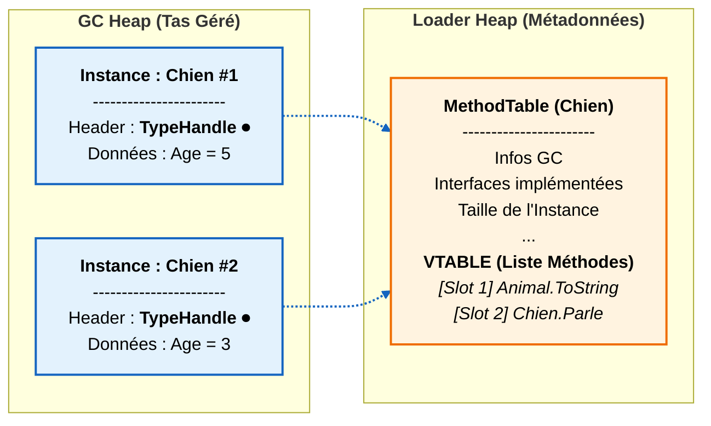
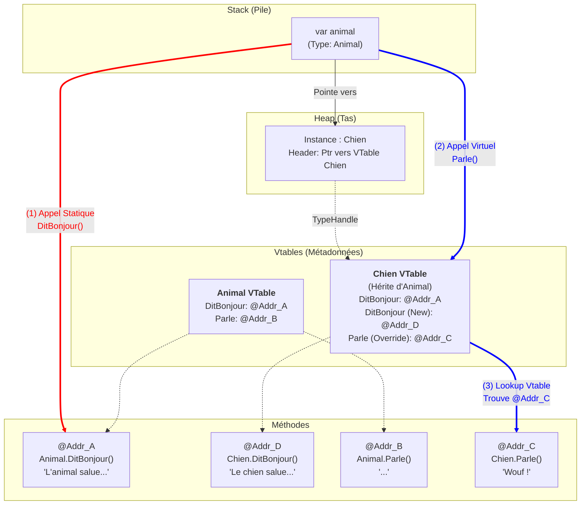



## Plongée dans le Polymorphisme C#

En C#, le polymorphisme est souvent résumé par "le bon code est exécuté pour le bon objet". Mais pour un développeur aguerri, il est crucial de comprendre la mécanique interne : comment le CLR (Common Language Runtime) décide-t-il quelle méthode appeler ?

Cet article décortique la différence entre un appel statique et un appel dynamique via les **Vtables**.

### 1. La situation : Le code

Prenons une classe de base `Animal` et deux implémentations : `Chien` et `Chat`.
Nous avons deux types de méthodes :
1.  `DitBonjour()` : Une méthode classique (non virtuelle) que nous allons masquer avec `new` dans les enfants.
2.  `Parle()` : Une méthode polymorphique (`virtual` / `override`).

```csharp
using System;
using System.Collections.Generic;

public class Animal
{
    // Méthode NON VIRTUELLE : L'adresse est résolue à la compilation
    public void DitBonjour() 
    {
        Console.WriteLine("L'animal vous salue (Méthode de base).");
    }

    // Méthode VIRTUELLE : L'adresse est résolue à l'exécution (vtable)
    public virtual void Parle()
    {
        Console.WriteLine("...");
    }
}

public class Chien : Animal
{
    // Masquage (shadowing) : Cette méthode existe, mais n'écrase pas celle du parent
    public new void DitBonjour()
    {
        Console.WriteLine("Le chien vous salue.");
    }

    public override void Parle()
    {
        Console.WriteLine("Wouf !");
    }
}

public class Chat : Animal
{
    // Masquage (shadowing)
    public new void DitBonjour()
    {
        Console.WriteLine("Le chat vous salue.");
    }

    public override void Parle()
    {
        Console.WriteLine("Miaou !");
    }
}

class Program
{
    static void Main()
    {
        // On stocke des enfants dans un tableau de parents
        // Le type déclaré du tableau est Animal[]
        Animal[] mesAnimaux = [ new Chien(), new Chat() ];

        // Les objets de mesAnimaux sont de type Animal (Chien ou Chat)
        foreach (Animal animal in mesAnimaux)
        {
            Console.WriteLine($"--- Instance réelle : {animal.GetType().Name} ---");
            
            // Cas 1 : Liaison Statique (Appel Non-Virtuel)
            // Le compilateur regarde le type de la variable 'animal'
            animal.DitBonjour(); 

            // Cas 2 : Liaison Dynamique (Appel Virtuel)
            // Le runtime regarde le type de l'objet en mémoire
            animal.Parle(); 
            
            Console.WriteLine();
        }
    }
}
```

### 2. Cas 1 : Appel Non-Virtuel (`DitBonjour`)

Lorsque le compilateur rencontre la ligne `animal.DitBonjour()`, il analyse le type de la **variable** `animal`.

* La variable est de type `Animal`.
* La méthode `DitBonjour` n'est **pas** virtuelle.
* **Conclusion du compilateur :** "Je sais exactement quelle méthode appeler. C'est `Animal.DitBonjour`. Peu importe ce qu'il y a réellement en mémoire, la version du code à exécuter est celle de la classe `Animal`." 

Peu importe que les classes `Chat` et `Chien` définissent une nouvelle version de la méthode `DitBonjour` (avec `new`), c'est bien celle de la classe de base `Animal` qui est appelée car l'adresse de destination est gravée dans le marbre lors de la compilation.

#### Exécution pas à pas (Liaison Statique)
1.  **Compilation :** Le compilateur C# génère une instruction IL qui désigne explicitement la méthode Animal.DitBonjour. Lors de la traduction en code machine par le JIT, cette instruction est transformée en un saut direct vers l'adresse mémoire du code, sans passer par aucune table.
2.  **Exécution :** Le processeur saute directement à cette adresse.
3.  **Résultat :** Même si l'objet est un `Chien`, c'est la méthode de l' `Animal` qui s'exécute. La méthode `Chien.DitBonjour` est totalement ignorée.

### 3. Cas 2 : Appel Virtuel (`Parle`) et la Vtable

Lorsque le compilateur rencontre `animal.Parle()`, il détecte le mot-clé `virtual`. Il comprend alors qu'il ne peut pas figer l'adresse de la méthode immédiatement à la compilation, car la variable `animal` pourrait pointer vers n'importe quelle instance dérivée (un Chat, un Chien, etc.) au moment de l'exécution.

Au lieu d'inscrire un saut direct vers une adresse de code fixe (comme pour `DitBonjour`), le compilateur met en place un mécanisme de **résolution dynamique**. Il demande au runtime d'aller chercher la bonne méthode en fonction de l'objet réel en mémoire. C'est ici qu'entre en jeu la **Vtable**.

#### Structure Mémoire d'un objet .NET
Chaque objet dans le tas (Heap) possède un en-tête caché contenant un **TypeHandle**. Ce pointeur dirige vers la **MethodTable** (la carte d'identité de la classe). Cette table contient la **Vtable** (Virtual Method Table) : un tableau de pointeurs vers les méthodes.



#### Exécution pas à pas (Liaison Dynamique)

Prenons le premier tour de boucle où l'objet est un **Chien**.

1.  **Déréférencement :** Le runtime suit la référence `animal` pour trouver l'objet dans le Tas.
2.  **Inspection (TypeHandle) :** Il lit l'en-tête de l'objet et comprend : "Ceci est une instance de `Chien`". Il va consulter la MethodTable de `Chien`.
3.  **Lookup dans la Vtable :**
    * La méthode `Parle` occupe un index fixe (disons le slot #4) dans l'héritage `Animal`.
    * Le runtime regarde dans le slot #4 de la table du `Chien`.
    * Comme `Chien` a fait un `override`, l'adresse stockée dans ce slot est celle de `Chien.Parle` (et non `Animal.Parle`).
4.  **Saut (Indirection) :** Le runtime récupère cette adresse (par exemple `0x3000`) et exécute le code.

## Schéma de fonctionnement

Le diagramme ci-dessous illustre la différence fondamentale. Remarquez comment `Chien.DitBonjour` (Address D) existe bien, mais est contourné par la flèche rouge.



**Légende du schéma**
* **Flèche Rouge (Liaison Statique) :** Le chemin est direct. Le compilateur a vu la variable de type `Animal` et a câblé directement l'appel vers le code `Animal.DitBonjour` (@Addr_A). Il ignore totalement que l'objet est un Chien et que la méthode `Chien.DitBonjour` (@Addr_D) existe.
* **Flèche Bleue (Liaison Dynamique) :** Le chemin passe par la Vtable. On part de l'objet -> on va voir sa Vtable (celle de la classe `Chien`) -> on récupère l'adresse spécifique dans le slot de `Parle` -> on exécute le code `Chien.Parle` (@Addr_C).

## Résumé
* **Non-virtuel (mot clé `new`) :** La méthode est déterminée par le **Type de la variable**. C'est rapide, rigide, et cela peut mener à appeler la méthode du parent même si l'enfant en a une "nouvelle".
* **Virtuel (mot clé `override`) :** La méthode est déterminée par le **Type de l'objet en mémoire** via une indirection (Vtable). C'est flexible et garantit le comportement polymorphique.
