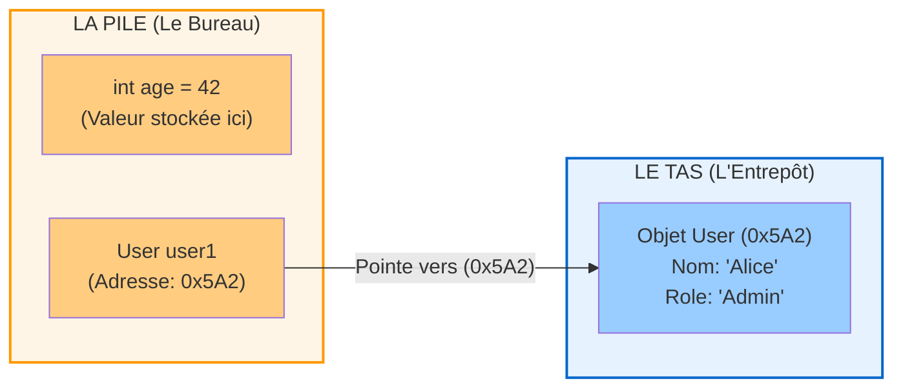
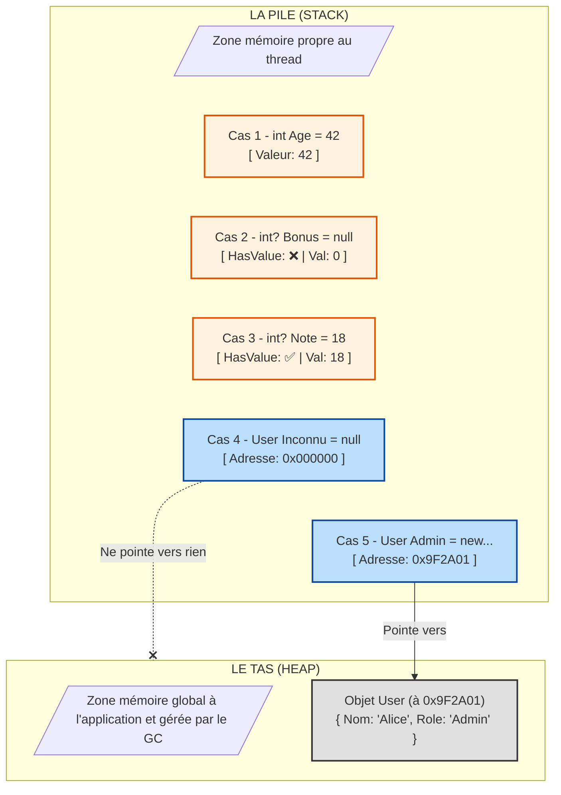



Si vous avez appris le développement avec des langages modernes comme C#, Java, Python ou JavaScript, la gestion de la mémoire est probablement une boîte noire pour vous. Vous créez une variable, et "magiquement", elle existe.

Pourtant, tôt ou tard, vous rencontrerez des concepts comme `StackOverflowException`, les fuites de mémoire, ou la différence subtile entre une **copie par valeur** et une **copie par référence**. Pire encore, la gestion des valeurs `null` peut devenir un cauchemar si on ne visualise pas ce qui se passe "sous le capot".

Aujourd'hui, nous allons démystifier deux zones de mémoire fondamentales : **la Pile (Stack)** et **le Tas (Heap)**.

## L'Analogie : Le Bureau et l'Entrepôt

Pour comprendre sans faire d'assembleur, imaginons votre programme comme un employé de bureau très occupé.



### La Pile (The Stack) : Votre plan de travail
Imaginez une pile de dossiers sur le coin de votre bureau.
* C'est votre espace de travail immédiat.
* C'est **très rapide** d'accès (c'est juste sous votre main).
* C'est **organisé** : vous traitez le dossier du dessus, et quand vous avez fini, vous l'enlevez (LIFO : *Last In, First Out*).
* L'espace est **limité** : si vous empilez trop de dossiers, la pile s'effondre (c'est le fameux *Stack Overflow*).

### Le Tas (The Heap) : L'entrepôt géant
Imaginez maintenant un immense entrepôt situé de l'autre côté de la rue.
* C'est un espace de stockage gigantesque et en désordre.
* C'est **plus lent** : pour récupérer quelque chose, il faut aller le chercher.
* Pour retrouver un objet, vous avez besoin de son adresse (un numéro d'allée et d'étagère). Sur votre bureau (la Pile), vous ne gardez que ce petit papier avec l'adresse inscrite dessus.


## 1. La Pile (The Stack) : Vitesse et Ordre

La Stack est utilisée pour l'exécution du thread courant. À chaque fois que votre code appelle une méthode, un nouveau bloc (une *stack frame*) est empilé.

C'est là que vivent les **Types Valeurs** (Value Types). En C#, ce sont les `int`, `double`, `bool`, `char`, et les `struct`.

**Caractéristiques :**
* **Nettoyage automatique :** Dès que la méthode est terminée (qu'on sort de l'accolade `}`), les données sont dépilées et disparaissent instantanément.
* **Taille fixe :** Une variable `int` prend toujours 32 bits.

> **Le piège :** Si vous passez une variable de la Stack à une autre méthode, on effectue une **copie complète** de la valeur. Modifier la copie ne modifie pas l'original.

## 2. Le Tas (The Heap) : Flexibilité et Désordre

Le Heap est utilisé pour stocker des données dont la durée de vie ne dépend pas directement de la méthode en cours, ou qui sont trop volumineuses.

C'est là que vivent les **Types Références** (Reference Types). En C#, ce sont les `class`, `string`, `object`, `arrays`.

Quand vous faites :
```csharp
var monUtilisateur = new User("Alice");
```

Deux choses se passent :
1.  L'objet `User` (avec toutes ses données) est créé dans l'**Entrepôt (Heap)**.
2.  Sur votre **Bureau (Stack)**, une petite variable `monUtilisateur` est créée. Elle ne contient pas l'objet, mais **l'adresse** (le pointeur) vers l'objet dans l'entrepôt.

**Caractéristiques :**
* **Nettoyage complexe :** Quand vous n'avez plus besoin de l'objet, il reste dans l'entrepôt. C'est le rôle du **Garbage Collector** (Ramasse-miettes) de passer régulièrement pour jeter ce qui n'est plus référencé.
* **Accès indirect :** Pour lire une donnée, le CPU doit lire l'adresse sur la Stack, puis aller chercher la donnée dans la Heap.

## Pourquoi est-ce vital pour les `Nullable` ?

C'est ici que la distinction devient cruciale pour comprendre le code moderne, notamment en C#.

### Cas 1 : Les Types Valeurs (Stack)
Un `int` (sur la stack) est une valeur brute. Il existe forcément (il y a des électrons dans la mémoire). Il ne peut pas être "rien".
* `int a = null;` // Impossible historiquement.

Pour avoir un entier "nul", on doit l'emballer dans un conteneur spécial (`Nullable<int>` ou `int?`). C'est comme mettre une boîte vide sur votre bureau avec une étiquette "Il n'Y a rien dedans".

### Cas 2 : Les Types Références (Heap)
Une `string` ou une `class` est manipulée via une adresse sur la Stack.
* Cette adresse peut pointer vers un objet réel dans le Heap `0x123456`.
* Ou elle peut être vide : `null` (ou `0x000000`).

C'est pour cela que les objets peuvent être `null` par défaut : la variable sur la stack existe, mais elle ne pointe vers rien.

### La confusion moderne (C# 8+)
Avec les "Nullable Reference Types" activés en C# récent, on écrit `string?`.
Attention à la nuance :
* **`int?`** : Change la structure en mémoire (ajoute un booléen pour dire "j'ai une valeur ou pas").
* **`string?`** : Ne change **rien** en mémoire (c'est toujours un pointeur). C'est uniquement une instruction pour le compilateur afin qu'il vous tape sur les doigts si vous oubliez de vérifier si c'est null avant de l'utiliser.

## En résumé



| Caractéristique | La Pile (Stack) | Le Tas (Heap) |
| :--- | :--- | :--- |
| **Analogie** | Pile de dossiers sur le bureau | Entrepôt de stockage |
| **Contenu** | Types Valeurs (`int`, `bool`, `struct`) + Pointeurs | Types Références (`class`, `string`, Tableaux) |
| **Gestion** | Automatique (fin de méthode) | Garbage Collector |
| **Vitesse** | Très rapide | Plus lent (allocation + accès) |
| **Problème type** | Stack Overflow (trop d'appels récursifs) | Out of Memory / Fragmentation |

Comprendre cette séparation vous aidera à mieux visualiser pourquoi modifier un objet dans une fonction modifie l'objet original (car on copie l'adresse, pas l'objet), alors que modifier un entier ne change que la copie locale.

---

## Prêt à valider vos acquis ?

Avez-vous tout retenu ? Les pièges du `null` et des références n'ont plus de secret pour vous ?

👉 **[Passez le Quiz : Testez vos connaissances sur la Stack et le Heap]()**
