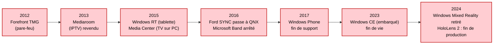



Commençons par les segments où Windows a fini par disparaître. Ils recouvrent deux réalités distinctes. Dans certains cas, Windows tenait une **position réelle** avant d'être supplanté : le smartphone (Windows Mobile culminait à ~42 % du marché américain des smartphones en 2007), le pare-feu d'entreprise, l'infoloisir automobile. Dans d'autres, il s'agit d'une **percée ratée** — Microsoft a tenté d'entrer sans jamais s'implanter : la tablette, la montre connectée, le casque de réalité virtuelle, le stockage en réseau. Dans les deux cas, les dates sont précises, car un abandon logiciel se date — à une fin de commercialisation, à une fin de support.

La frise ci-dessous rassemble ces retraits successifs sur une douzaine d'années.

## Les smartphones

Ici, il faut distinguer deux époques. Avant l'iPhone, Microsoft était un acteur sérieux du smartphone avec **Windows Mobile** (héritier de Pocket PC, sur base Windows CE), qui équipait des appareils HTC ou Dell tournés vers l'entreprise (courriel push, intégration Exchange). Windows Mobile atteint son pic en **2007**, culminant à environ **42 % du marché américain des smartphones** ; il figurait alors parmi les principaux systèmes du secteur, derrière le leader mondial Symbian (l'OS des Nokia). Il faut toutefois garder l'échelle en tête : le smartphone n'était encore qu'une niche — l'immense majorité des **1,15 milliard de téléphones vendus en 2007** étaient des téléphones classiques —, et sur l'ensemble du marché du téléphone, Windows restait marginal.

L'arrivée de l'**iPhone (2007)** puis d'**Android (2008)**, pensés pour le tactile grand public, balaie Windows Mobile en quelques années. Microsoft tente une relance avec **Windows Phone 7** (2010) : une rupture côté interface (le nouveau langage visuel « Metro ») et écosystème applicatif — incompatible avec les logiciels Windows Mobile — même si, techniquement, le noyau restait celui de **Windows CE**. Ce n'est qu'avec **Windows Phone 8** (2012) que Microsoft adopte le noyau **Windows NT**, partagé avec le PC. Mais la relance ne décolle jamais : le pic n'est que de **3,6 %** des ventes mondiales de smartphones au **troisième trimestre 2013** (IDC), quand Android dépasse déjà 80 %. Puis la chute : **0,3 % fin 2016**, et l'abandon en **2017**.

Aujourd'hui, le marché est un duopole : selon StatCounter, en juin 2026, **Android capte 69 % des systèmes mobiles dans le monde, iOS environ 31 %**. Fait notable, ces deux systèmes appartiennent à la **famille Unix** : Android repose sur un **noyau Linux**, et iOS sur **Darwin**, dont le noyau XNU marie un micro-noyau Mach et une couche BSD — un héritage plus complexe qu'il n'y paraît, que [je détaille dans l'article sur les licences permissives](/logiciel-libre/02-licences-permissives-freebsd/#apple--le-frankenstein-technologique). Windows a disparu du téléphone, remplacé entièrement par des OS bâtis sur des fondations Unix.

**Sources :**
- [StatCounter — parts de marché des OS mobiles dans le monde](https://gs.statcounter.com/os-market-share/mobile/worldwide)
- [Windows Mobile — pic de part de marché en 2007, ~42 % aux États-Unis (Wikipedia)](https://en.wikipedia.org/wiki/Windows_Mobile)
- [TechCrunch (données Gartner) — 1,15 milliard de téléphones vendus en 2007](https://techcrunch.com/2008/02/27/over-a-billion-mobile-phones-sold-in-2007/)
- [TheNextWeb (données IDC) — parts des OS smartphones au 3ᵉ trimestre 2013 : Android 81 %, Windows Phone 3,6 %](https://thenextweb.com/news/idc-android-hit-81-0-smartphone-share-q3-2013-ios-fell-12-9-windows-phone-took-3-6-blackberry-1-7)
- [Windows Phone 8 — passage du noyau Windows CE (WP7) au noyau Windows NT (Wikipedia)](https://en.wikipedia.org/wiki/Windows_Phone_8)

## Les tablettes

Même trajectoire, plus brève. En octobre 2012, Microsoft lance **Windows RT**, une variante de Windows 8 pour processeurs ARM, avec la première tablette Surface. L'échec est rapide : incompatibilité avec les logiciels Windows classiques, confusion pour les acheteurs. La Surface 2, l'un des derniers appareils sous Windows RT, est **abandonnée en janvier 2015**, sans chemin de mise à jour vers Windows 10. Le support s'éteint définitivement en janvier 2023.

Le marché de la tablette est aujourd'hui partagé entre **iPadOS** et **Android** ; Apple représente à lui seul près de 42 % des livraisons mondiales au dernier trimestre 2025 selon IDC. Windows subsiste à la marge sur des hybrides « 2-en-1 », qui relèvent davantage du PC portable que de la tablette.

**Sources :**
- [Windows RT — chronologie et abandon (Wikipedia)](https://en.wikipedia.org/wiki/Windows_RT)
- [Surface 2, dernier appareil Windows RT (Wikipedia)](https://en.wikipedia.org/wiki/Surface_2)
- [IDC — livraisons mondiales de tablettes, 4e trimestre 2025](https://www.idc.com/resource-center/blog/global-tablet-shipments-rise-1-9-in-4q25-as-seasonal-demand-offsets-cooling-replacement-cycle/)

## Les montres connectées

Microsoft a lancé le **Microsoft Band**, un bracelet connecté, en 2014, puis le Band 2 en 2015. La commercialisation cesse dès **octobre 2016**, et l'équipe est dissoute. Le coup de grâce vient le **31 mai 2019** : Microsoft ferme les services en ligne du Band, retire les applications et supprime les données, avec un programme de remboursement pour les derniers utilisateurs actifs. Le segment est aujourd'hui tenu par watchOS (Apple, en tête) et Wear OS de Google, ce dernier reposant sur Linux.

**Sources :**
- [Microsoft Band — historique et arrêt (Wikipedia)](https://en.wikipedia.org/wiki/Microsoft_Band)
- [Microsoft — fin des services Microsoft Health Dashboard, 31 mai 2019](https://support.microsoft.com/en-us/topic/end-of-support-for-the-microsoft-health-dashboard-applications-and-services-faq-ae78b810-5acb-6f00-bf5f-e0935aca84af)

## Les casques de réalité virtuelle et augmentée

En 2017, Microsoft pousse **Windows Mixed Reality**, une plateforme VR intégrée à Windows, avec des casques fabriqués par Acer, Asus, Dell, HP, Lenovo et Samsung. La plateforme est **dépréciée en décembre 2023**, puis purement et simplement **retirée de Windows 11 lors de la mise à jour 24H2**, fin 2024 : les casques concernés cessent alors de fonctionner.

Microsoft avait aussi son propre casque, mais de **réalité augmentée** : le **HoloLens** (première édition en 2016, HoloLens 2 en 2019), sous une variante de Windows, destiné à l'entreprise et à l'armée américaine (le programme IVAS). Même issue : la **production de HoloLens 2 s'arrête en octobre 2024**, sans successeur ; le support prendra fin en 2027 ; et en **février 2025, Microsoft confie le contrat militaire IVAS à Anduril**. Microsoft quitte donc la XR sur ses deux fronts, la VR grand public comme l'AR professionnelle.

Le marché est largement dominé par Meta (casques Quest, environ 75 à 80 % des livraisons, sous un dérivé d'Android), devant Apple (Vision Pro, sous visionOS) — dans les deux cas, pas de Windows.

**Sources :**
- [Windows Mixed Reality — dépréciation et retrait (Wikipedia)](https://en.wikipedia.org/wiki/Windows_Mixed_Reality)
- [Road to VR — Windows 11 24H2 retire le support WMR](https://www.roadtovr.com/windows-11-drops-wmr-support-24h2/)
- [Microsoft HoloLens — dates et plateforme (Wikipedia)](https://en.wikipedia.org/wiki/Microsoft_HoloLens)
- [TechCrunch — fin de production de HoloLens 2, sans successeur (1er octobre 2024)](https://techcrunch.com/2024/10/01/microsoft-hololens-2-discontinued-with-no-successor-in-site/)
- [Axios — le programme militaire IVAS confié à Anduril (février 2025)](https://www.axios.com/2025/02/11/anduril-microsoft-ivas-army-deal)
- [Counterpoint Research — marché mondial des casques VR, 1er semestre 2025](https://counterpointresearch.com/en/insights/global-vr-headset-market-in-h1-2025)

## Les téléviseurs et box TV

Microsoft a eu une plateforme de télévision sur IP pour les opérateurs — d'abord nommée **Microsoft TV IPTV Edition**, puis rebaptisée **Mediaroom** en 2007 — qui a équipé des offres de télévision par ADSL au milieu des années 2000. En France, **Club Internet** a ainsi lancé, en 2006, sa télévision par ADSL sur cette plateforme Microsoft, côté **décodeur TV** (et non côté modem internet). Microsoft **revend Mediaroom à Ericsson en 2013** (transaction close en septembre 2013) et sort du secteur. Côté grand public, **Windows Media Center** — le logiciel de télévision et d'enregistrement sur PC — n'est pas repris dans Windows 10 (annoncé en 2015) et disparaît.

Les téléviseurs connectés et boîtiers d'aujourd'hui tournent tous sur des systèmes dérivés de Linux : **Tizen** (Samsung), **webOS** (LG), **Android TV / Google TV**, **Roku OS** (Roku, un acteur américain du streaming TV), **Fire TV** (Amazon). Le leader varie selon la région — Roku aux États-Unis, Android TV / Google TV dans une grande partie du reste du monde — mais dans tous les cas, Windows n'a aucune présence sur ce segment.

**Sources :**
- [Ariase — la télévision par ADSL de Club Internet sur Microsoft TV (2006)](https://www.ariase.com/box/actualite/article-735-details-television-clubinternet)
- [Ericsson — clôture du rachat de Microsoft Mediaroom, septembre 2013](https://news.cision.com/ericsson/r/ericsson-closes-acquisition-of-microsoft-mediaroom,c2245704)
- [Windows Media Center — fin avec Windows 10 (Wikipedia)](https://en.wikipedia.org/wiki/Windows_Media_Center)
- [AppleWorld.Today — parts des OS de smart TV aux États-Unis (données Parks Associates, 2026)](https://appleworld.today/2026/04/roku-os-28-and-samsungs-tizen-os-23-account-for-the-largest-share-of-tv-operating-system-usage-in-the-us/)

## Les pare-feu réseau

Microsoft a proposé un pare-feu et proxy d'entreprise, d'abord sous le nom **ISA Server**, puis **Forefront Threat Management Gateway (TMG)**. En **septembre 2012**, Microsoft annonce l'arrêt du développement ; le produit n'est plus commercialisé à partir de décembre 2012, et le support étendu s'achève en avril 2020. Aucun successeur maison sur site n'est proposé.

Le marché s'est reporté sur des appliances fondées sur **FreeBSD** (les populaires pfSense et OPNsense) et sur des systèmes propriétaires (FortiOS de Fortinet, PAN-OS de Palo Alto Networks). C'est un cas net : Windows était présent, il ne l'est plus.

**Sources :**
- [Microsoft Forefront Threat Management Gateway — arrêt du produit (Wikipedia)](https://en.wikipedia.org/wiki/Microsoft_Forefront_Threat_Management_Gateway)
- [Microsoft Lifecycle — Forefront TMG 2010 : fin du support étendu le 15 avril 2020](https://learn.microsoft.com/en-us/lifecycle/products/microsoft-forefront-threat-management-gateway-2010)

## Les NAS (stockage réseau)

Microsoft a visé le stockage domestique avec **Windows Home Server** (2007), dont le support s'achève en **janvier 2013** ; son dernier avatar, **Windows Home Server 2011**, est resté supporté jusqu'en **avril 2016**. Le produit phare grand public sous ce système, le HP MediaSmart Server, avait déjà été abandonné fin 2010.

Le marché du NAS grand public et professionnel est aujourd'hui entièrement à Linux et BSD : **Synology DSM** et **QNAP QTS** reposent sur Linux ; **TrueNAS**, longtemps sous FreeBSD, est passé à Linux en 2022. Windows a quitté le stockage en réseau.

**Sources :**
- [Windows Home Server (v1, 2007) — fin de support en janvier 2013 (Wikipedia)](https://en.wikipedia.org/wiki/Windows_Home_Server)
- [Windows Home Server 2011 — fin de support en avril 2016 (Wikipedia)](https://en.wikipedia.org/wiki/Windows_Home_Server_2011)
- [HP MediaSmart Server — abandon (Wikipedia)](https://en.wikipedia.org/wiki/HP_MediaSmart_Server)
- [iXsystems — première version de TrueNAS sous Linux (2022)](https://www.truenas.com/blog/first-release-of-truenas-on-linux/)

## L'automobile

L'automobile offre un exemple concret d'un abandon de Windows au profit d'un concurrent nommément identifié. Les systèmes d'infoloisir **Ford SYNC**, dans leurs première et deuxième générations, reposaient sur **Windows Embedded Automotive** (Microsoft Auto). En décembre 2014, Ford annonce **SYNC 3**, déployé sur les modèles 2016 : il abandonne Windows au profit de **QNX**, un système temps réel propriétaire de BlackBerry. Les générations suivantes sont restées sous QNX.

Plus largement, le marché des systèmes d'exploitation automobiles est aujourd'hui dominé par **QNX** — fort de sa certification pour les fonctions critiques (freinage, direction), avec autour de 38 % du marché en 2025 d'après le cabinet Mordor Intelligence — et par **Android Automotive** sur l'infoloisir. Ni l'un ni l'autre n'est Windows ; et QNX n'est pas Linux, mais un système propriétaire de la famille Unix.

Microsoft n'a d'ailleurs jamais publié de date de fin de vie unique pour sa plateforme automobile (Windows Embedded Automotive) : elle s'est éteinte progressivement au fil des années 2010. Il ne faut pas la confondre avec le socle embarqué généraliste **Windows CE / Windows Embedded Compact**, dont la dernière version a atteint sa **fin de vie en octobre 2023** — un jalon qui concerne l'embarqué au sens large (terminaux industriels, bornes…), et non l'automobile en particulier.

**Sources :**
- [The Register — Ford abandonne Windows pour QNX (SYNC 3), décembre 2014](https://www.theregister.com/2014/12/12/ford_dumps_windows_for_qnx_in_new_incar_entertainment_unit/)
- [Windows Embedded Automotive — chronologie du produit (Wikipedia)](https://en.wikipedia.org/wiki/Windows_Embedded_Automotive)
- [The Register — Windows CE atteint sa fin de vie (30 octobre 2023)](https://www.theregister.com/2023/10/30/windows_ce_reaches_eol/)
- [Mordor Intelligence — marché des systèmes d'exploitation automobiles (part QNX ~38 %, à considérer comme estimation d'un cabinet)](https://www.mordorintelligence.com/industry-reports/automotive-operating-systems-market)
